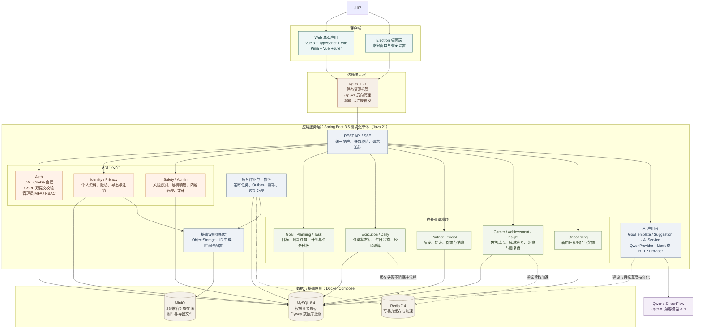

> 历史归档（截至 2026-09-07）。文中的计划、完成状态、分工和约定仅代表当时记录；当前范围以[新版 MVP 计划](../../01-requirements.md)为准。

# 更好的自己：系统技术架构图

> 本图依据当前代码库和 Docker Compose 部署配置整理，表示已经落地的系统边界与主要数据流。

## 主要链路

1. 用户通过 Web 端或 Electron 桌面端访问应用，统一进入 Nginx。
2. Nginx 托管前端静态资源，并将 `/api/v1` 请求和 AI SSE 流转发到后端。
3. Spring Boot 以模块化单体方式承载认证、成长业务、社交、AI、隐私和治理能力。
4. 所有核心业务数据写入 MySQL；Redis 只承担缓存和指标读取加速，故障时不改变主数据可靠性。
5. 附件和导出文件通过对象存储抽象层访问 MinIO，后续可替换为其他 S3 兼容服务。
6. AI 通过 `QwenProvider` 隔离模型供应商，当前支持 Mock Provider 和 Qwen HTTP Provider。
7. 定时任务负责指标重建、保留策略、过期处理和 Outbox 投递等后台工作。

## 部署映射

| Compose 服务 | 作用 | 对外端口 |
| --- | --- | --- |
| `nginx` | 前端静态资源、API 与 SSE 反向代理 | `80` |
| `backend` | Spring Boot 应用服务 | `8080`（Compose 内部及可选直连） |
| `mysql` | 关系型主数据库 | `3306` |
| `redis` | 缓存与加速 | `6379` |
| `minio` | S3 兼容对象存储 | `9000` / `9001` |

## 架构边界说明

- 当前后端是模块化单体，不是微服务集群；各业务模块在同一个 Spring Boot 进程内运行。
- MySQL 是系统的事实来源，Redis 中的数据可以重建或失效。
- AI 服务是可替换的外部依赖；自动化测试默认使用 Mock Provider，生产或本地联调可切换到真实模型 API。
- 管理员页面与普通用户端共享前端工程，但通过路由守卫、后端权限校验和 MFA 形成独立访问边界。
