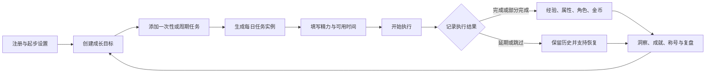
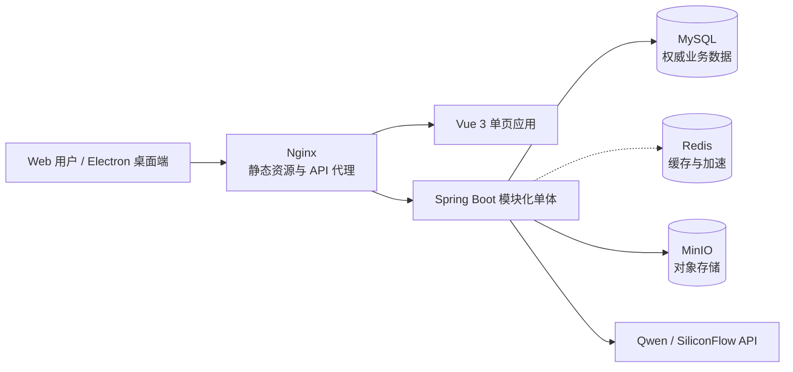

# “更好的自己”团队技术与功能讲解稿

> 适用场景：项目组内部讲解、答辩前统一认知、成员交接和演示排练。建议总时长 35 至 45 分钟，先讲产品闭环，再讲技术实现，最后现场演示和答疑。

## 一、开场：先用一句话说明项目

“更好的自己”是一个低压力、可恢复、有反馈的游戏化个人成长平台。它把用户的长期目标拆成可以重复执行的周期任务，再把每日真实行动转化为经验、属性、角色等级、成就、称号和伙伴反馈。

讲解时需要强调三个区别：

1. 它不只是待办清单，因为系统会记录执行状态、经验、属性和复盘数据。
2. 它不只是打卡工具，因为允许部分完成、延期、跳过和恢复，不会因中断扣除历史成果。
3. 它不只是聊天机器人，因为 AI 生成的是可编辑草稿，必须经过用户确认才能进入正式目标流程。

## 二、先讲清楚一条完整业务链路

建议先用一名学生准备考试的场景说明系统：

1. 用户注册并完成起步设置，选择“学生”成长方向。
2. 用户创建“四周复习高等数学”目标。
3. 用户在目标下添加“每周一、三、五复习 45 分钟”的周期任务。
4. 后端根据周期规则生成具体日期的任务实例。
5. 用户进入今日页面，填写当天精力和可用时间。
6. 系统给出“缩小任务、轻量推进或保持计划”的节奏建议。
7. 用户开始任务，最后选择完成、部分完成、延期或跳过。
8. 后端保存任务事件，计算经验、角色成长、五维属性和金币。
9. 用户在洞察页面查看本周有效行动、兑现率、趋势、成就和称号。
10. 用户在周复盘中记录事实、感受和下一步调整。



这条链路是项目的主干。好友、伙伴、AI 和管理员系统都是围绕这条主干提供辅助，而不是替代核心目标执行流程。

## 三、系统功能全景

| 功能模块 | 用户能做什么 | 对应页面 | 代表后端接口 |
| --- | --- | --- | --- |
| 账号与起步设置 | 注册、登录、管理员 MFA、选择初始成长方向 | `/auth`、`/onboarding` | `/api/v1/auth/*`、`/api/v1/onboarding/*` |
| 目标与周期任务 | 创建目标，直接添加一次性或每日、每周周期任务 | `/goals` | `/api/v1/goals`、`/api/v1/tasks`、`/api/v1/task-presets` |
| 今日执行 | 查看今天的任务，记录开始、完成、部分完成、延期、跳过和撤销 | `/today` | `/api/v1/daily-status`、`/api/v1/task-schedules/*` |
| 属性与角色成长 | 查看五维属性、成长角色等级与经验进度 | `/attributes` | `/api/v1/progress/roles`、`/api/v1/insights/attributes` |
| 洞察与复盘 | 查看行动趋势、兑现率、日历、成就、称号和周复盘 | `/insights` | `/api/v1/insights/*`、`/api/v1/achievements`、`/api/v1/titles`、`/api/v1/reviews/weekly/*` |
| AI 助手 | 流式对话、生成建议、生成可编辑目标草稿 | `/ai` | `/api/v1/ai/sessions/*`、`/api/v1/ai/suggestions`、`/api/v1/ai/goal-template` |
| 成长伙伴 | 选择伙伴、切换素材、互动、获取好感度和金币反馈 | `/partners`、`/desktop-pet` | `/api/v1/partners/*` |
| 好友与聊天 | 申请好友、查看有限成长概况、私信、群聊和未读提醒 | `/friends`、`/friends/chat` | `/api/v1/friends/*` |
| 个人与隐私 | 佩戴称号、开启独自升级、修改偏好、导出数据和注销账号 | `/profile`、`/settings` | `/api/v1/me/*`、`/api/v1/privacy/*` |
| 管理后台 | 管理用户和管理员、查看安全事件、审计记录与指标 | `/admin` | `/api/v1/admin/*`、`/api/v1/admin/metrics` |

需要说明：用户端已经改成“在目标下直接添加周期任务”。后端仍保留 `weekly_plan` 和周计划接口，用于兼容任务实例生成、周复盘和已有数据，但不再要求用户先手动创建周计划才能添加任务。

## 四、总体技术架构

项目采用前后端分离、单仓库、模块化单体后端和容器化部署。



详细架构图见：[系统技术架构图.md](./系统技术架构图.md)。

### 4.1 为什么选择模块化单体

当前规模下，用户、目标、任务、经验、成就和社交数据之间事务关系较多。将它们放在一个 Spring Boot 进程中有三个好处：

- 开发和部署成本低，一个月内更容易完成完整闭环。
- 跨模块操作可以使用本地事务，例如完成任务时同时更新经验、角色和金币。
- 模块仍按 `auth`、`goal`、`execution`、`ai`、`social` 等包拆分，后续有真实并发压力时再按边界拆服务。

它不是微服务。Docker Compose 中虽然运行多个容器，但其中只有一个业务后端容器，其他容器是数据库、缓存、对象存储和反向代理。

## 五、前端技术怎么讲

### 5.1 Vue 3 与 TypeScript

前端使用 Vue 3 单文件组件开发页面，TypeScript 为接口数据、组件状态和工具函数提供类型检查。每个功能放在独立模块目录，例如：

- `frontend/src/modules/goals`：目标与周期任务。
- `frontend/src/modules/today`：今日状态和任务执行。
- `frontend/src/modules/ai`：AI 对话和目标草稿。
- `frontend/src/modules/friends`：好友、私信和群聊。
- `frontend/src/modules/partners`：伙伴、Rive 动画与桌宠。

### 5.2 Vite、Vue Router 与 Pinia

- Vite 负责开发服务器和生产构建，页面模块通过动态导入实现按路由加载。
- Vue Router 管理用户页面、管理员页面和登录保护。
- Pinia 当前主要管理登录用户、外观设置和桌宠状态等跨页面数据。
- 路由守卫会先加载当前用户；未登录用户进入 `/auth`，普通用户不能进入 `/admin`。

### 5.3 统一 API 客户端

`frontend/src/shared/api/client.ts` 对浏览器 `fetch` 做了统一封装：

1. 所有业务请求统一添加 `/api/v1` 前缀。
2. 请求携带 Cookie，不把访问令牌放入前端本地存储。
3. 写请求自动从 Cookie 读取 CSRF Token 并放入请求头。
4. 接口返回 `401` 时尝试刷新会话，然后只重试一次原请求。
5. 后端错误被整理为统一的错误码和中文提示。

### 5.4 视觉和多端能力

- ECharts 用于趋势图和属性雷达图。
- Rive 与本地素材用于成长伙伴动画和降级展示。
- Lucide 提供统一图标。
- 桌面宽屏使用侧边导航，移动端使用底部主导航和“更多”面板。
- Electron 复用同一套 Vue 页面，并增加透明置顶桌宠窗口。

当前 Electron 已具备运行骨架和桌宠窗口控制，但还需要补充安装包构建、图标注入、代码签名和自动更新后，才能作为正式 Windows 或 macOS 安装包发布。

## 六、后端技术怎么讲

### 6.1 Spring Boot 3.5 与 Java 21

后端使用 Spring Boot 3.5 和 Java 21。典型请求链路是：

```text
Controller 接收和校验请求
        ↓
Service 执行业务规则与事务
        ↓
JdbcTemplate / Redis / ObjectStorage / QwenProvider
        ↓
ApiEnvelope 返回统一数据结构
```

业务代码目前以 `JdbcTemplate` 和显式 SQL 为主，方便直接控制查询、锁、事务和数据所有权。项目依赖中保留了 JPA Starter，但当前核心领域并未使用 JPA 实体仓库作为主要访问方式。

### 6.2 后端模块边界

| Java 包 | 核心职责 |
| --- | --- |
| `auth` | 注册、登录、JWT、刷新令牌、CSRF、密码和 MFA |
| `goal` | 目标、任务定义、周期规则、任务模板与实例生成 |
| `execution` | 任务状态机、任务事件、经验计算、幂等和撤销 |
| `daily` | 每日精力、可用时间和节奏建议 |
| `career`、`achievement`、`insight` | 角色成长、成就称号、趋势指标和复盘 |
| `ai`、`safety` | 对话、目标草稿、模型适配和风险处理 |
| `partner` | 伙伴资料、互动、好感度、金币和购买 |
| `social` | 好友关系、私信、群聊与未读统计 |
| `identity`、`privacy` | 资料偏好、独自升级、导出、保留和注销 |
| `admin` | 用户治理、权限、提示词版本、安全事件和审计 |
| `shared` | 统一响应、错误、ID、时间、对象存储和 Outbox |

## 七、核心业务为什么这样设计

### 7.1 任务定义、任务实例和任务事件分离

这是项目最重要的数据设计之一：

- **任务定义 `user_task`：** 描述“做什么”，包括标题、时长、难度、角色和周期规则。
- **任务实例 `task_schedule`：** 描述“哪一天做”，同一周期任务可以生成多个日期实例。
- **任务事件 `task_event`：** 描述“实际发生了什么”，例如开始、完成、部分完成、延期或撤销。

这样设计后，修改未来任务不会覆盖过去的执行事实，经验和洞察也可以根据事件重新计算。

### 7.2 周期任务

`RecurrenceExpander` 负责解析受控的周期规则，当前支持：

- `FREQ=DAILY` 或 `FREQ=WEEKLY`
- `INTERVAL`
- 每周执行日 `BYDAY`
- `COUNT` 或 `UNTIL`

只支持系统明确实现的规则，遇到不支持或不完整的规则直接返回 `INVALID_RRULE`，避免错误生成大量任务。

### 7.3 任务状态机

任务不能随意从任意状态跳到任意状态：

- `PLANNED` 可以开始、完成、部分完成、延期、跳过或取消。
- `IN_PROGRESS` 可以完成、部分完成、延期或取消。
- 完成后进入 `DONE`，部分完成进入 `PARTIAL`，延期进入 `DEFERRED`。
- 撤销不是直接删除原记录，而是写入 `REVERSED` 事件，再反向更新经验、角色进度和金币。

状态机把业务规则放在后端，不能通过修改前端按钮绕过。

### 7.4 幂等与一致性

任务事件和 AI 建议采纳等关键写操作使用 `Idempotency-Key`。如果用户重复点击或网络重试，后端会返回第一次操作的结果，而不是重复增加经验或创建重复任务。

完成任务时，任务状态、事件记录、属性经验、角色经验和金币在同一数据库事务中处理。事务提交后再清理 Redis 缓存，避免缓存先变化而数据库回滚。

### 7.5 成就和称号

成就条件由数据库中的 JSON 配置描述，条件评估器支持有效行动、兑现率、恢复次数、连续行动、总经验和角色等级等类型。读取成就列表时会惰性计算新条件，满足后写入解锁记录，并发放关联称号。

称号定义包含文字、Lucide 图标和头像框样式。用户可以佩戴或卸下，当前佩戴结果会出现在个人资料中。

## 八、认证、安全与隐私

### 8.1 用户认证

- 密码使用 Argon2 哈希，不保存明文密码。
- 登录后后端签发访问令牌、刷新令牌和 CSRF Token Cookie。
- 后端采用无状态 Spring Security 过滤链校验 JWT。
- 刷新令牌只以哈希形式保存，刷新时进行轮换；检测到旧令牌重放会撤销整个令牌族。
- 普通管理员需要 MFA；发布提示词等敏感操作还要求最近 15 分钟内完成过 MFA。

本地开发管理员账号仅在 Spring `local` Profile 和本地管理员开关同时开启时生效，具体凭据不写入共享文档，也不能用于生产服务器。

### 8.2 CSRF 与权限

访问令牌存放在 Cookie 中，因此所有非安全方法都执行双提交 CSRF 校验：Cookie 中的 Token 必须与 `X-CSRF-Token` 请求头一致。

后端会再次校验当前用户身份、资源归属、好友关系或管理员权限。前端隐藏按钮只是体验优化，不是最终安全边界。

### 8.3 隐私能力

- 独自升级开启后，其他用户无法通过新搜索发现该用户。
- 用户可以导出自己的数据，下载地址具有有效期。
- 用户可以删除指定 AI 会话或记忆，并设置 AI 数据保留期。
- 账号注销具有冷静期，期间可以撤销；真正删除由后台任务处理。
- 附件和导出文件通过对象存储抽象访问，不直接写入前端服务器目录。

## 九、AI 功能怎么讲

### 9.1 Provider 抽象

AI 层没有把业务直接绑定到某一家模型服务，而是定义 `QwenProvider` 接口：

- `MockQwenProvider` 用于自动化测试和无网络演示。
- `QwenHttpProvider` 调用 Qwen 或 SiliconFlow 提供的 OpenAI 兼容接口。

模型、地址、Key 和超时通过服务器环境变量配置。API Key 只能放在后端服务器，不能写入 Vue 或 Electron 安装包。

### 9.2 两类结果

- **流式对话：** 后端使用 SSE 逐段返回内容，Nginx 关闭代理缓冲并延长读取时间。
- **结构化结果：** 目标草稿和任务建议要求模型返回规定结构，后端再验证并转换为系统对象。

### 9.3 用户确认与安全降级

AI 不能直接替用户创建正式目标。用户先查看、修改标题、日期、时长、难度和周期，再确认写入。

输入和输出都会经过安全检查。普通场景正常生成；高风险内容停止一般建议，改为固定的支持信息和求助方向。模型超时或不可用时，核心目标和任务功能仍能手工使用。

## 十、数据与基础设施

### 10.1 MySQL

MySQL 8.4 是权威数据源，保存账户、目标、任务、事件、成长、AI、伙伴、社交、隐私和审计记录。数据库结构通过 Flyway 迁移文件按版本升级，部署时自动检查和执行未应用的迁移。

### 10.2 Redis

Redis 7.4 用于短期缓存和读取加速，例如每日状态和洞察概览。代码将 Redis 视为可丢弃层：Redis 不可用或缓存过期时重新从 MySQL 读取，不能让缓存成为唯一事实来源。

### 10.3 MinIO

MinIO 提供 S3 兼容对象存储，用于附件和数据导出文件。后端通过 `ObjectStorage` 接口访问，因此未来可以替换为其他 S3 兼容云存储。上传和下载可以使用短期预签名地址，对象默认启用服务端加密参数。

### 10.4 后台任务

Spring 定时任务负责：

- 展开或清理过期任务实例。
- 重建洞察指标。
- 处理数据保留和账号注销。
- 投递 Outbox 事件。

自动化测试环境会关闭定时任务，避免测试结果受后台调度影响。

## 十一、部署与桌面 APP

Docker Compose 编排五个服务：

| 服务 | 作用 |
| --- | --- |
| `nginx` | 托管前端文件，代理 `/api/v1` 和健康检查 |
| `backend` | 运行 Spring Boot 业务服务 |
| `mysql` | 保存权威业务数据 |
| `redis` | 提供缓存和加速 |
| `minio` | 保存附件和导出文件 |

Docker 不是必须条件，但它可以固定各服务版本并简化部署。用户电脑不需要安装 Docker；Docker 只安装在运行服务的云服务器上。

完整的多用户版本建议使用云服务器，因为账号同步、好友聊天、管理员后台、数据备份和 AI Key 都需要中心服务。Electron APP 本质上是客户端，通过 HTTPS 调用同一个云端后端。

2 核 2 GB 服务器适合演示和少量用户，但需要限制 Java、MySQL、Redis 和 MinIO 内存并配置 Swap；较稳定的正式环境建议至少 2 核 4 GB。生产环境还必须配置域名、HTTPS、防火墙、备份和监控，并关闭本地管理员直登。

## 十二、测试与质量保障

| 测试类型 | 工具 | 验证内容 |
| --- | --- | --- |
| 后端单元测试 | JUnit | 状态机、经验、周期规则、成就条件和安全规则 |
| 后端集成测试 | Spring Boot Test、Testcontainers、Rest Assured | MySQL 迁移、真实接口、认证、数据所有权和事务 |
| 前端组件测试 | Vitest、Vue Test Utils | 表单、路由、按钮状态、错误处理和组件行为 |
| 端到端测试 | Playwright | 注册、目标、任务执行、AI、伙伴、好友和响应式流程 |
| 部署验证 | 健康检查、Smoke 脚本 | Nginx、后端、数据库、缓存和对象存储是否连通 |

讲测试时不要只说“写了测试”，需要说明测试保护了什么风险，例如重复点击不能重复加经验、非好友不能读取资料、普通用户不能进入管理员接口、AI 超时不能伪装为成功。

## 十三、六名成员建议讲解分配

| 成员 | 建议讲解内容 | 建议时长 |
| --- | --- | ---: |
| 杨旭光 | 项目目标、总体架构、Spring Boot 模块化单体、核心业务链路与系统集成 | 7 分钟 |
| 丁恩鹏 | 用户流程、Vue 前端、路由与状态管理、目标和今日页面演示、响应式设计 | 6 分钟 |
| 牛一渊 | AI Provider、SSE 流式响应、结构化目标草稿、安全降级与 API Key 保护 | 5 分钟 |
| 吕雅萍 | 视觉规范、伙伴动画、成就称号、移动端一致性与交互反馈 | 5 分钟 |
| 张十全 | MySQL 数据结构、Flyway、任务事件模型、幂等、自动化测试与验收 | 6 分钟 |
| 陈益新 | 好友社交、独自升级、隐私治理、管理员后台、Docker/Nginx 和服务器部署 | 6 分钟 |

每个人讲自己的主责模块，但必须能回答上下游问题。例如前端负责人要知道接口如何刷新会话，AI 负责人要知道结果如何进入目标表单，测试负责人要知道核心业务不变量是什么。

## 十四、推荐现场演示顺序

1. 使用普通账号登录，展示桌面端与移动端一致的导航。
2. 进入目标页面，新建一个目标并添加每日或每周周期任务。
3. 进入今日页面，填写精力和时间，展示节奏建议。
4. 对任务执行“开始”和“完成”，观察经验和金币反馈。
5. 打开属性和洞察页面，查看角色、趋势、成就与称号。
6. 打开 AI 助手，输入普通学习需求，展示流式响应和目标草稿。
7. 打开伙伴页面，切换种类和素材并进行一次互动。
8. 打开好友或群聊页面，展示未读提示和受限成长信息。
9. 打开个人页面，展示称号和独自升级开关。
10. 最后使用管理员账号进入治理控制台，展示指标、用户、安全和审计分区。

演示前准备两个普通账号和一个正式管理员演示账号。不要在公开演示中展示真实邮箱、API Key、服务器密码、安全事件正文或本地弱密码。

## 十五、队友常见问题与回答

### 15.1 为什么不直接做微服务？

当前团队和用户规模不需要承担服务发现、分布式事务和多套部署的成本。模块化单体已经有明确边界，更适合一个月开发和早期验证，未来出现独立扩容需求时再拆分。

### 15.2 为什么任务要分成定义、实例和事件？

因为“每周复习三次”是一条定义，“本周三晚上八点复习”是一次实例，“实际完成了 60%”是事实事件。分开后才能正确处理周期、延期、历史统计和撤销。

### 15.3 Redis 挂了系统还能用吗？

核心功能应该还能使用，只是部分读取变慢。MySQL 是权威数据源，Redis 仅用于缓存和加速。

### 15.4 AI 为什么必须由后端调用？

为了保护 API Key、执行统一安全检查、记录会话、控制超时和成本，并避免用户绕过业务规则直接创建数据。

### 15.5 为什么管理员要 MFA？

管理员可以管理用户、发布内容和读取治理数据，账号被盗的影响远高于普通用户，因此需要第二因素和敏感操作的近期验证。

### 15.6 电脑 APP 是否需要云服务器？

单机版理论上不需要，但完整项目的账号同步、社交、AI、管理员和备份都需要中心服务。推荐 Electron 作为客户端，云服务器运行后端和数据服务。

### 15.7 当前项目还有哪些未完成项？

- Electron 正式安装包、签名和自动更新。
- 生产环境 HTTPS、域名、备份恢复和监控告警的长期运行验证。
- 更大规模真实用户试用和性能数据。
- 未成年人公开运营所需的进一步内容与合规机制。
- 通知渠道和运营能力的进一步完善。

主动说明这些边界比宣称“所有能力已经完成”更可信，也便于团队确定下一阶段优先级。

## 十六、最后一分钟总结话术

“这个项目的核心不是把现实生活包装成游戏，而是让用户能把目标真正落到今天，并允许现实中的中断和调整。技术上，我们用 Vue 构建多端界面，用 Spring Boot 模块化单体承载业务，用 MySQL 保存事实数据，用 Redis 加速读取，用 MinIO 管理文件，用 Qwen Provider 接入 AI，再通过 JWT、CSRF、MFA、数据归属校验和自动化测试保证系统边界。当前版本已经跑通目标、周期任务、执行、成长反馈、AI、伙伴、社交、隐私和治理流程，下一步重点是桌面安装包、生产安全和真实用户验证。”
