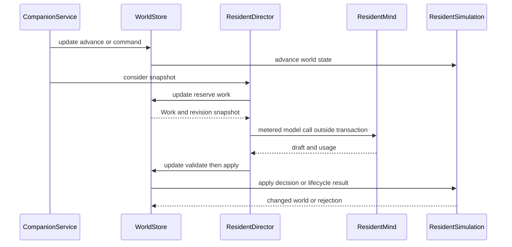

## 结论：先固定边界，再移动代码

当前小镇并不是一个可随意按文件切块的单体：`ResidentSimulation`、`ResidentDirector`、`CompanionWorld`、`QwenResidentMind` 各自都同时承载了真实行为和跨层约束。安全的拆分顺序应是：**先把已有的权威状态、一次 attempt 的提交条件和对应测试变成明确契约，再提取纯计算或单一流程阶段**；不要一次性把模拟、编排、prompt 与存储改成一套新框架。

特别要保留的事实如下：

- `CompanionWorld` 是运行中世界结构和修订号的载体；`CompanionRules.advance()` 在同一世界对象上推进用户化身规则与 `ResidentSimulation.advance()`。居民记忆虽在运行时临时挂在 `w.memories`，持久化权威却是按 owner 分目录的文件，MySQL 的 `state_json` 不保存它们。 [^world] [^worldstore] [^memory]
- 模型只能提出答案。`ResidentDirector` 先在 `WorldStore.update()` 中预约工作、记录 resident revision / intent revision 和上下文，再在事务外调用 `ResidentMind`，最后回到 `update()` 验证时效、证据和版本，交由 `ResidentSimulation` 或 `ConversationLifecycle` 落地。过期或冲突结果可被拒绝，而不是以锁延长模型调用。 [^director-flow] [^decision]
- 规则已收窄模型的合法选择，但没有把 prompt 当作授权边界：`Context.decisionOptions` 将动作、地点、房间和目标绑定成一个合法叶子，`ResidentDirector.applyDecision()` 仍重验选项、证据和域层前置条件。 [^context] [^decision]

图示为当前 attempt 的预约、事务外思考和回写验证边界；它是后续抽取编排流程时必须保持的时序。

## 热点不是同一种问题

| 热点 | 当前耦合的职责 | 不可破坏的权威/不变量 | 首个可保持行为的 seam |
|---|---|---|---|
| `ResidentSimulation` | 6 秒步进、离线补算、计划完成、移动、占用、对象/项目/服务/对话/记忆/事件、动作执行与重试控制 | 仅域规则改变物理世界；动作在 resident revision 与 intent revision 均匹配时才可应用；`none` 是成功的安静结果而非拒绝 | 先提取只读的 eligibility / option 计算和不依赖 I/O 的命令处理器；保留现有静态入口作为适配门面 |
| `ResidentDirector` | 工作优先级、预算、并发预约、上下文装配、模型调用、失败退避、结果应用、用量和 outcome hook | 模型 I/O 不持有数据库锁；同一 resident 不能有两个在途调用；一个世界的预约/提交序列化 | 抽取 `Reservation`、`ModelInvoker`、`ResultApplier`，由现有类继续编排并调用它们 |
| `CompanionWorld` | 可序列化状态、运行时队列、修订号、空间/居民/项目/记忆关联和旧存档自修复字段 | 世界 JSON 兼容性；`revision` 是写回开关；不引入第二份占用、活动或记忆真相 | 先用按子域的只读 view 和 construction helper 隔离消费者；不能先把字段迁移到多份可写 aggregate |
| `QwenResidentMind` | 多种 call type 的中文指令、JSON schema、输入 DTO、供应商调用、用量映射 | 每次 schema 与本次可用选项一致；模型仅见单个居民视角和其允许的记忆/感知；输出仍须域层验证 | 逐个 call type 提取 `PromptSpec` 或 prompt compiler，保留同一 DTO、schema 和 `ResidentMind` 方法 |
| `JdbcWorldStore` + `FileMemoryStore` | 行锁事务、世界 JSON 编解码、记忆装载/保存、文件与 SQLite 索引 | 文件是记忆权威，SQLite 是索引；只允许按 owner 读取；世界回滚不自动回滚文件记忆 | 先显式抽出 `WorldSnapshotCodec` 与 memory hydration/persist 协议，并以故障测试记录现有非原子性 |

### `ResidentSimulation`：领域行为密集，先按“读/写”切而非按名词搬家

该类是最大的热点：`advance()` 负责初始化、自修复、离线时间截断以及最多十个 6 秒 step；每一步又串联咖啡馆、花园、对话、居民计划完成、感知、相遇、occasion、承诺和旧对象同步。`applyDecision()` 同时做版本/证据/动作合法性校验，并根据动作改写计划、位置、服务、对话、记忆和事件。 [^simulation-advance] [^decision]

这意味着把诸如 `CafeService`、`DoorService`、`TownPlaces` 已经独立的规则继续向外抽取是合理的，但不能把 `applyDecision()` 机械按 action 分散到一组可直接写 `CompanionWorld` 的服务：它目前正是“模型草案到权威状态”的二次校验门。

**推荐 seam：`DecisionEligibility` + `DecisionCommandHandler`。**

1. 先从 `availableActions()`、`availableDecisionOptions()` 及其使用的只读谓词提取一个无 I/O 的 option 计算器，输出仍为现有 `DecisionOptionView` 所需的完整叶子组合。
2. 再用一个内部命令对象封装 `residentId`、两种 revision、已解析的 option、reason、speech、evidence 与 `now`；旧的 `ResidentSimulation.applyDecision(...)` 只做参数适配并委托给 handler。
3. handler 仍接收**同一个**可变 `CompanionWorld`，仍由一次 `WorldStore.update()` 包围；在此阶段不引入 event sourcing、异步 domain event 或第二个 state repository。

这个 seam 的契约是：拒绝不得改变权威世界；成功必须保留原有的 revision、事件、记忆、计划和位置后果；`none` 仍是 applied outcome，并设置安静期限而不是触发 rejection backoff。 [^decision]

应先跑的回归集包括 `CompanionRulesTest` 的重复 advance 幂等性、取消后旧 revision 不能落地、提案只是 idea、证据引用仍存在，以及 `ResidentSimulation` 相关的空间/服务/对话专向测试。至少还要保留“容量满时等待而不叠人”的断言，因为位置占用是域规则的真实约束。 [^rules-test]

### `ResidentDirector`：预约、思考、提交三段已有天然 seam

`ResidentDirector` 的大文件不是单纯 prompt 调度：它按对话、summary、encounter、occasion、day plan、explain、普通 decision、reflection、venture 和 promise 等优先级选择一个 `Work`；在预约时累计预算、设置 `thinking`、写入必要时间戳并增加 world revision；模型返回后按 call type 走不同 apply 分支。 [^director-flow]

并发边界已经清晰：同一用户世界可以有多个居民同时思考，数量受 `parallelism` 限制；但 `thinking` 键按 world + resident 排除该居民的重复在途请求，且预约发生在 `store.update()` 内。模型网络调用在预约事务提交后发生，结果回写再次通过 `store.update()` 串行化。 [^director-flow] [^parallel-test]

**推荐 seam：先引入不可变的 `ReservedWork` 与两个端口。**

- `WorkReservation.reserve(world, now, backgroundPreferred)`：仅负责从权威世界选择并预约，返回不可变工作描述或空。它必须是唯一能增加预算、设置 `thinking` 和移动相应 asked marker 的入口。
- `ModelInvoker.invoke(ReservedWork)`：只把工作路由到 `ResidentMind` 的 metered 方法，不接触 `WorldStore`。
- `WorkResultApplier.apply(world, work, result, now)`：执行时效、证据、revision、conversation operation 与领域 apply；返回已应用/拒绝/失败等 outcome，供现有 listener 与 usage 记录使用。

第一步只将私有方法和 `Work` 迁入协作对象，`ResidentDirector` 仍持有 executor、退避状态和对外 `consider()` API。这样能够保持“预约一定在事务内、I/O 一定在事务外、提交一定回到事务内”的行为，不会把并发语义意外散落到新类。

回归护栏应覆盖：模型调用期间没有事务、取消 intent 后迟到答案被丢弃、所有 call type 的 90 秒结果时效、缺失能力不消耗网络失败退避，以及 usage/outcome 的调用类型与动作记录。并发修改必须额外运行 `ResidentDirectorParallelTest`：至少两个居民可同时思考、单居民不可重入、并发数不超过 cap。 [^director-test] [^parallel-test]

> `OutcomeListener` 是现有测试/离线 harness 可挂接的观察点，而不是完整 trace 模型。若未来需要 `AgentAttempt` trace 或 OpenTelemetry，应作为**候选未实现设计**：先让它消费这个稳定 outcome seam，不能声称已集成或替代现有审计。

### `CompanionWorld`：序列化边界比字段归属更优先

`CompanionWorld` 是公开可序列化的可变状态树，包含 world revision、居民状态、空间/位置、对象、项目、对话、pending 队列、预算和多类诊断历史。若把它拆成多个可独立持久化的 aggregate，最先失去的将是当前 `JdbcWorldStore.update()` 的“读取一份世界、运行 operation、revision 变化才写回”语义。 [^world] [^worldstore]

因此第一阶段不要移动字段或替换 JSON 格式，而应建立下列低风险边界：

- 为模型组装和 API 投影使用只读 view / mapper，避免新代码继续直接扫描整棵 state tree；`ResidentDirector.perspective()` 是最直接的消费者。
- 为新增加的物理机制建立专属规则组件和列表，沿用现有 `DoorService`、`CafeService`、`TownPlaces` 的方式；不要急于用多态 `WorldObject` 层级替换已存档的扁平 record。
- 新字段仍在 `CompanionWorld`，并为旧 save 的空值/空集合行为添加恢复测试；只有确认读写路径和 JSON 兼容性后，才考虑把某个子结构封装为 value object。

这里的硬契约是避免双真相。现有 `positionUses` 就是从 position occupants、活动时间和 object holder 推导，而非另存一份“谁在用什么”的可写状态；同样的原则应适用于任何新投影。 [^world]

### 模型 prompt / 适配：按能力拆，不按供应商重写

`ResidentMind` 已是适配边界：其默认能力方法抛出 `UnsupportedOperationException`，metered 变体默认返回无 usage 的结果，因而旧 fake 和装饰器可继续编译。`QwenResidentMind` 为 decision、turn、summary、react、consider、day plan、explain、reflect、venture 和 promise 构造不同的 instruction、输入记录和 JSON schema，并由 provider 返回结构化 JSON。 [^mind] [^qwen]

最有价值的 seam 不是立即引入新 agent runtime，而是把每一种调用抽成独立的 `PromptSpec<Request, Result>`：它提供 scene、instruction、输入适配、schema 和 result type。`QwenResidentMind` 继续作为把 `PromptSpec` 交给 `QwenProvider`、反序列化并附加 `Usage` 的薄适配器。这样可单独修改一个 prompt，而不改变 `ResidentMind`、`ResidentDirector` 或域层。

其中两个契约不可放松：

1. decision schema 必须从当前 `decisionOptions` 的 choice id 动态生成，不能回退成静态动作/地点笛卡尔积；选择回写时仍要匹配该 snapshot 的 option。 [^qwen] [^decision]
2. `Context` 必须继续是单一居民视角：记忆按 owner，附近人物/物品按同房间；内部数值、其他人的私有关系、用户 Todo 文本都不进入模型契约。 [^mind] [^director-test]

相应测试应包含动态 enum 与 option 绑定、decorator 的能力转发反射测试、prompt 的双侧选择平衡测试，以及 `ResidentDirectorTest` 对用户文本和内部 gauges 缺席的断言。候选的 Pi agent runtime 只能在这些 `PromptSpec` 契约稳定后作为**未实现替换方案**评估；当前代码没有该 runtime 集成。

### 世界/记忆存储：先承认跨存储故障语义

`JdbcWorldStore` 以 `sys_user ... for update` 串行化同一用户的 update，读 world JSON 后逐 owner 水合记忆；保存时先 `MemoryStore.save()`，临时清空 `w.memories` 再编码 world JSON。文件记忆是权威，SQLite 只镜像元数据索引；`MemoryStore` 没有“读取全世界记忆”的接口，读取必须指定 owner。 [^worldstore] [^memory]

这提供了有效 seam，也暴露了必须保留的失败语义：世界 JSON 回滚并不会回滚已经写出的记忆文件。不要在未定义恢复策略前宣称这里是跨 MySQL/文件/SQLite 的原子事务。

**渐进拆分建议：**

1. 抽出 `WorldSnapshotCodec`，只负责 JSON 编解码及“编码时排除 memories”的临时置换；以 round-trip 和旧 save fixture 测试保护格式。
2. 抽出 `MemoryHydrator` / `MemoryPersister`，明确输入为用户、resident owners 和运行时 memory list；保持逐 owner 读取与 append-or-replace 写语义。
3. 增加故障注入测试，分别覆盖 memory save 失败、world encode 失败、world SQL update 失败后的可观察状态；随后才根据产品要求选择补偿、outbox 或恢复任务。该选择目前不是已实现机制。

这条路径保留存储层隔离和文件权威，不会把 memory 为了“方便查询”重新塞回 world JSON，或将 SQLite 误写成第二真相。

## 分阶段实施与验收清单

| 阶段 | 可提交的最小改动 | 不变的公共边界 | 必跑验证 |
|---|---|---|---|
| 0：表征 | 为现有难分支补小范围 characterization test，不移动行为 | `CompanionService`、`WorldStore`、`ResidentMind`、world JSON | `CompanionRulesTest`、`ResidentDirectorTest`、`ResidentDirectorParallelTest` |
| 1：纯读 seam | 提取 option/eligibility、prompt spec、world view | 既有 DTO 和 `availableActions` / `decisionOptions` 输出 | 合法 option 绑定、room visibility、内部/用户信息不泄漏 |
| 2：流程 seam | 提取 reservation、invocation、result apply 协作者 | `consider()` 和事务外模型 I/O 时序 | 迟到/冲突丢弃、预算/退避、并发 cap 与单居民互斥 |
| 3：持久化 seam | 提取 codec 与 hydration/persist 协议 | `WorldStore.update()` 锁和 revision 写回条件 | owner 隔离、文件 round-trip、跨存储故障表征 |
| 4：小域命令 | 将一个动作簇迁至 command handler，旧入口委托 | `ResidentSimulation.applyDecision()` 的结果与副作用 | 该动作簇的 domain test 加全套 Director apply 回归 |

每一步都应保持一次 commit 只改变一个变量：例如只更换 prompt assembler，或只迁移 `close_cafe` 一簇 action，不能同时替换 prompt、DTO、执行器和存储。实验运行还应冻结同一 world seed、模型快照和地图等变量；否则行为变化无法归因于拆分本身。 [^decisions]

## 修改路由

| 想改变什么 | 从哪里开始 | 先确认什么 |
|---|---|---|
| 新触发/优先级/冷却 | `ResidentDirector.reserve()` 与 `ResidentSimulation` 的 trigger/queue 规则 | 是否为 passing moment，是否已有 `thinking`、TTL、预算和消费语义 |
| 新动作或合法性 | `ResidentSimulation.availableDecisionOptions()` 与 `applyDecision()` | option 是否是完整合法叶子；提交时能否再次验证 revision、位置、证据和权限 |
| 模型上下文或 prompt | `ResidentDirector.perspective()`、`ResidentMind.Context`、`QwenResidentMind` | owner/room 限知、内部值和用户文本不泄漏，schema 与 input 同步 |
| 新世界状态 | `CompanionWorld` 加字段及对应领域组件 | JSON 兼容/旧 save 修复、单一权威和 revision 写回 |
| 记忆格式或检索 | `MemoryStore`、`FileMemoryStore`、`JdbcWorldStore` | 文件权威、owner-scoped read、索引可重建、失败语义 |
| 并发/模型吞吐 | `ResidentDirector` executor 与 `WorldStore.update()` | 只并行思考，预约和提交仍串行；不能双问同一 resident |

[^world]: `CompanionWorld` 定义其可序列化世界状态、revision、运行时 memory list、空间和居民状态：`repo://backend/src/main/java/com/betterself/growth/town/companion/domain/CompanionWorld.java#L9-L35`。
[^simulation-advance]: 模拟推进的初始化、离线截断与步进控制流：`repo://backend/src/main/java/com/betterself/growth/town/companion/domain/ResidentSimulation.java#L164-L247`。
[^decision]: 域层动作提交的 revision、intent、证据与合法性校验，以及 `none` 的 applied 语义：`repo://backend/src/main/java/com/betterself/growth/town/companion/domain/ResidentSimulation.java#L2568-L2646`；`repo://backend/src/main/java/com/betterself/growth/town/companion/domain/ResidentSimulation.java#L2575-L2601`。
[^rules-test]: 当前规则测试覆盖重复推进、取消/证据、提案和容量等待：`repo://backend/src/test/java/com/betterself/growth/town/companion/domain/CompanionRulesTest.java#L10-L16`；`repo://backend/src/test/java/com/betterself/growth/town/companion/domain/CompanionRulesTest.java#L51-L71`；`repo://backend/src/test/java/com/betterself/growth/town/companion/domain/CompanionRulesTest.java#L110-L132`。
[^director-flow]: Director 在事务内预约、事务外调用、回到 update 应用，并维护 `thinking`：`repo://backend/src/main/java/com/betterself/growth/town/companion/application/ResidentDirector.java#L174-L314`；`repo://backend/src/main/java/com/betterself/growth/town/companion/application/ResidentDirector.java#L768-L803`。
[^context]: `perspective()` 组装两层记忆、可见范围和完整 decision options：`repo://backend/src/main/java/com/betterself/growth/town/companion/application/ResidentDirector.java#L805-L875`。
[^parallel-test]: 并发测试验证多居民同时思考、单居民不重入和 cap：`repo://backend/src/test/java/com/betterself/growth/town/companion/application/ResidentDirectorParallelTest.java#L48-L134`。
[^director-test]: Director 测试验证模型 I/O 在事务外、迟到取消丢弃、用户文本/内部字段不泄漏：`repo://backend/src/test/java/com/betterself/growth/town/companion/application/ResidentDirectorTest.java#L32-L56`；`repo://backend/src/test/java/com/betterself/growth/town/companion/application/ResidentDirectorTest.java#L163-L244`。
[^mind]: 模型能力接口、默认缺能力语义和 `Context` 契约：`repo://backend/src/main/java/com/betterself/growth/town/companion/application/ResidentMind.java#L7-L23`；`repo://backend/src/main/java/com/betterself/growth/town/companion/application/ResidentMind.java#L292-L349`。
[^qwen]: Qwen 适配的动态 decision schema 及结构化调用：`repo://backend/src/main/java/com/betterself/growth/town/companion/adapters/QwenResidentMind.java#L228-L262`。
[^worldstore]: 世界行锁、revision 写回、memory hydrate/persist 的实现与非原子性说明：`repo://backend/src/main/java/com/betterself/growth/town/companion/adapters/JdbcWorldStore.java#L18-L30`；`repo://backend/src/main/java/com/betterself/growth/town/companion/adapters/JdbcWorldStore.java#L40-L84`。
[^memory]: owner-scoped memory port 与文件/SQLite 权威关系：`repo://backend/src/main/java/com/betterself/growth/town/companion/application/MemoryStore.java#L7-L34`；`repo://backend/src/main/java/com/betterself/growth/town/companion/adapters/FileMemoryStore.java#L18-L38`。
[^decisions]: 已定的并行提交、动态合法选项、两层记忆和实验变量控制意图：`repo://docs/04-decisions.md#L387-L401`；`repo://docs/04-decisions.md#L342-L344`。
