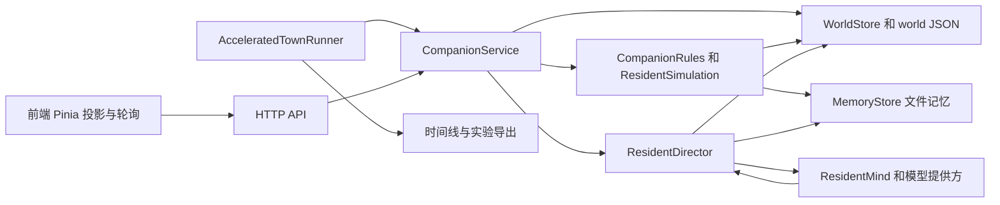
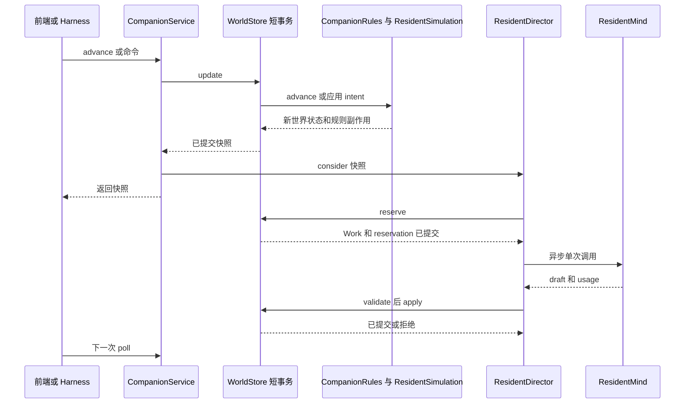

小镇不是一次请求内完成的“模型驱动写库”。它由短事务推进确定性世界，再由 `ResidentDirector` 在事务外完成可能很慢的 `ResidentMind` 调用，并以版本、证据和合法选项把结果重新提交。浏览器的轮询和 `AcceleratedTownRunner` 都是同一应用服务的驱动器：前者投影给用户，后者以可控时钟和内存存储产出可审计实验。

## 稳定边界总图

该图只标出稳定职责边界：模型 I/O 位于提交事务之外，`WorldStore` 在读写时协调世界 JSON 与记忆文件。

## 两种驱动与入口

### 在线 HTTP 与前端投影

`CompanionController` 以当前认证用户的 `id` 调用 `CompanionService`，提供读取、入住、推进、提交/取消 intent 以及当天模型用量接口。`join` 会校验名称和时区、创建世界并调用 `director.consider`；`advance` 在存储更新中刷新 `modelConversationsEnabled`、执行 `CompanionRules.advance`，随后也只触发一次异步考虑。`submit` 校验请求 id、kind、priority、时长与 Todo 所有权；相同 id 且载荷相同可重试，载荷不同则冲突。取消和提交本身是规则写入，不等待模型。

前端 `useTownWorld` 是街道条与完整小镇页共享的 Pinia 单例，服务端快照才是动作、记忆、结果的权威。它每 15 秒（可配置）在页面可见时调用 `advance`，可见性恢复和 today/tasks 数据变更也会刷新；同一页面多个消费者通过引用计数共用一条定时器。快照只在同一世界中 revision 不倒退时替换本地投影，并按事件 id 向订阅者仅发出新事件。因此一次 `/advance` 的响应是规则推进后的快照；异步模型结果稍后提交，下一轮读取或轮询才会投影它。

### 加速实验 Harness

`AcceleratedTownRunner` 用 `MutableClock`、`InMemoryWorldStore`、`InMemoryModelUsage` 和同一个 `CompanionService`/`ResidentDirector` 组装一次运行。循环推进模拟时钟，按 tick 调用 `service.advance`，并可在固定模拟偏移注入与真实点击同形的 `CompanionService.Command`。模型开启时，Harness 在模型调用可能尚未完成的 staleness 窗口内放慢真实时间，避免模拟时钟使回复过期；结束时关闭 director、冻结请求审计，再导出结果。

这使控制组不是另一套业务逻辑：`ruleOnly` 传入 disabled mind，模型开启配置则可调 tick、每日预算、总 wire 请求预算、输入 token 阈值及 `COMPANION_RUN_PARALLELISM`。实验目录约定保存问题、配置、种子和命令；大体积且含第三方输出的原始 data 不入 Git，整理后的结论进入 `results/`。

## 一次世界推进的控制流

该时序展示规则提交、模型调用和模型结果提交是三个分离阶段，而不是把网络调用包在数据库事务中。

### 1. 规则推进与感知扇出

`CompanionRules.advance` 防止时间倒退，处理离线摘要、专注结束、待办 intent、环境，再委托 `ResidentSimulation.advance`；后者初始化/协调世界，并以最多十个、每步六秒的近期步骤推进居民生活。离线间隔超过 900 秒时不补跑长历史或补发模型调用，而是调和需要、保留最多 24 秒近期生活并结束活动谈话。规则层负责可重复的物理/社会状态：计划完成、移动、空间占用、项目、事件与候选 occasion/encounter。

每个步骤中的 `perceive` 会为未行走、未睡眠的居民更新项目知识并见证同地点的人；记忆写入是按观察者分别发生的，而不是共享“全镇知道”。记忆容量也按 owner 限制，反思或 belief 以 supersession 标记旧观点，而非由模拟删除。这是 perception fan-out 和 memory write 的分界：规则可以记录观察到的事实，模型只能提供经验证后才可能保存的解释、反思或选择理由。

### 2. trigger selection、reservation 与上下文组装

`CompanionService` 把刚提交的快照交给 `ResidentDirector.consider`。若 mind 未启用、世界为空/旧 simulation version，或失败退避未到期，director 不调度。否则它检查活动模型谈话、居民决策冷却、待处理遭遇和 occasion；真实筛选发生在 `reserve` 的 `WorldStore.update` 内。

`reserve` 有明确优先级：活动谈话 turn、谈话 summary、面对面 encounter、瞬时 occasion、日计划、受限认知工作、对近期行为的 explanation、普通 decision，随后才是 reflection、venture 和 promise 等低优先级工作。它使用“等待最久”的居民排序和轮转打破平局；一个世界可有最多 `parallelism` 个 worker，但 `thinking` 以 `worldId|residentId` 保证同一居民只有一个未完成调用。reservation 同时记账调用数、序列、状态与必要的冷却，并在短事务提交后才调用模型。

`perspective` 组装的是单个居民的视角：同室邻居、可见物、定性知觉、候选合法 action/精确 decision option、日计划线索和该居民自己的记忆。普通决策记忆分为自述账户与“自上次被询问以来”的原始工作集；用户 intent/Todo、全局版本和内部数值不进入 `ResidentMind.Context`。这既控制 prompt 大小，也避免将其他居民的私有状态或用户自由文本带入 NPC 调用。

### 3. 模型、验证与 commit

worker 取得 `Work` 后会立刻链式尝试调度下一条可用工作，但网络调用发生在 reservation 提交之后。调用按 kind 路由至 `decideMetered`、对话、summary、day plan、reaction、consider、explain、reflect、venture 或 promise 变体；若返回 usage，独立记录 token 消耗，即使回复之后因过期而不能应用。

结果提交回另一个 `store.update`。所有模型结果超过 90 秒都会被丢弃；普通 decision 还必须选择提供过的 action 与同一条精确 option、引用仅来自该次上下文的 evidence，并通过 `ResidentSimulation.applyDecision` 的 resident revision 和 world intent revision 乐观并发检查。换言之，并行思考不会以全局 `modelSequence` 决定有效性；冲突的语义是“版本过期，拒绝这份结果”。被拒绝的普通 decision 会累积该居民的退避，连续三次后最多退避 15 分钟。

模型异常不会回滚已经运行的规则计划。一般失败会退还同一预算日的调用、累计失败并设置指数退避；不支持的能力被区别处理：必要的队列项目被中性消费或标记当天不可用，其他 capability 会被 director 记为不可用，以免每个 tick 重复提出同一个不支持的问题。无论成功、拒绝、失败还是不支持，`OutcomeListener` 都在应用点收到 call type、resident、action 和 outcome，供 Harness 而非 UI 文案进行准确审计。

## 持久化与一致性边界

`JdbcWorldStore.update` 先 `select ... for update` 锁定用户行，从而串行化同一用户的首次入住和后续世界写入；仅当 world revision 变化才更新 `town_companion_world.state_json`。它读取世界时按 resident owner 水合记忆，持久化时先把记忆交给 `MemoryStore`，再暂时移除 `w.memories` 后编码 JSON。因此 world JSON 不含记忆，记忆文件是其权威来源；代价是文件记忆写入不随数据库事务回滚。不要把这一边界误改成“世界回滚必然回滚记忆”。

`FileMemoryStore` 将每位居民的每条记忆保存为独立 Markdown 文件，并用临时文件原子移动避免半写入；部署应配置并挂载 `app.town.companion-memory-root`（容器通过 `COMPANION_MEMORY_ROOT`），本地空配置才落到 `target/companion-memory`。模型不直接写文件：它只返回 draft，写入仍由 simulation 和验证路径掌握。

## 运行参数与观测

生产 director 的主要参数为：

| 参数 | 默认值 | 作用 |
| --- | ---: | --- |
| `app.town.companion-model-daily-budget` | `100000` | 单世界本地日模型调用上限 |
| `app.town.companion-mind-pool-size` | `8` | 常驻异步 worker 数 |
| `app.town.companion-mind-queue-size` | `64` | executor 队列容量，满时拒绝 dispatch |
| `app.town.companion-model-decision-throttle-seconds` | `12` | 同一居民普通 decision 的最小间隔 |
| `app.town.companion-mind-parallelism` | `6` | 同一世界并发模型调用上限 |
| `app.town.companion-model-enabled` | `true` | 是否让 mind 参与考虑 |

`/api/v1/town/companion/usage` 是按用户本地日期和 call type 汇总的只读 token/调用量视图，不承担费用计算。Qwen 与 DeepSeek 的装配可分别配置；DeepSeek 缺少端点、密钥或模型时会成为 unavailable provider，不阻止以主 provider 启动。

Harness 导出 `manifest.json`、timeline、usage、模型逻辑调用及 wire 请求、`model-application-outcomes.json`、按 action 的审计、盲测题/答案分离、metrics、norms 和可续跑的 `world-snapshot.json`。分析并发运行时，应以 outcome listener 的应用结论而非 `modelStatus` 文案或 tick 抽样推断结果。

## 修改与测试清单

- 改 HTTP/前端时，保持“服务器权威、revision 不回退、intent id 重试”的语义；不要在前端模拟居民结果。
- 改 trigger 或 prompt 时，分别检查 `reserve` 的优先级、每居民 `thinking` 排他和 `perspective` 的数据最小化；不得把 user text 或内部量表加入 context。
- 改 action schema 时，同时维护候选 option 与 `applyDecision` 的验证；action、place、room、target 不是可任意拼接的字段。
- 改持久化时，明确测试 world 与 memory 两个写入边界，尤其是异常期间的记忆行为。
- 改模型并行/过期逻辑时，运行 `ResidentDirectorParallelTest`，并以 `ResidentDirectorTest` 覆盖“模型在事务外、晚到/取消结果被丢弃、过期结果不落地、失败不破坏计划、上下文不泄漏、outcome 观测”。
- 改实验指标或导出时，使用同 seed、同模型和一次只变一个变量的模型/纯规则对照；保留 manifest 中的并发度与预算，避免把不可比运行混在一起。

## 相关页面

- [状态所有权与并发边界](companion-state-ownership-and-concurrency.md)
- [小镇概念模型](../concepts/companion-town.md)
- [行动合法性与世界提交](../workflows/action-legality-and-world-commit.md)
- [居民尝试循环](../workflows/resident-attempt-loop.md)
- [触发与调度目录](../workflows/resident-trigger-and-scheduling-catalog.md)
- [实验 Harness 与消融](../testing/companion-experiment-harness-and-ablations.md)
