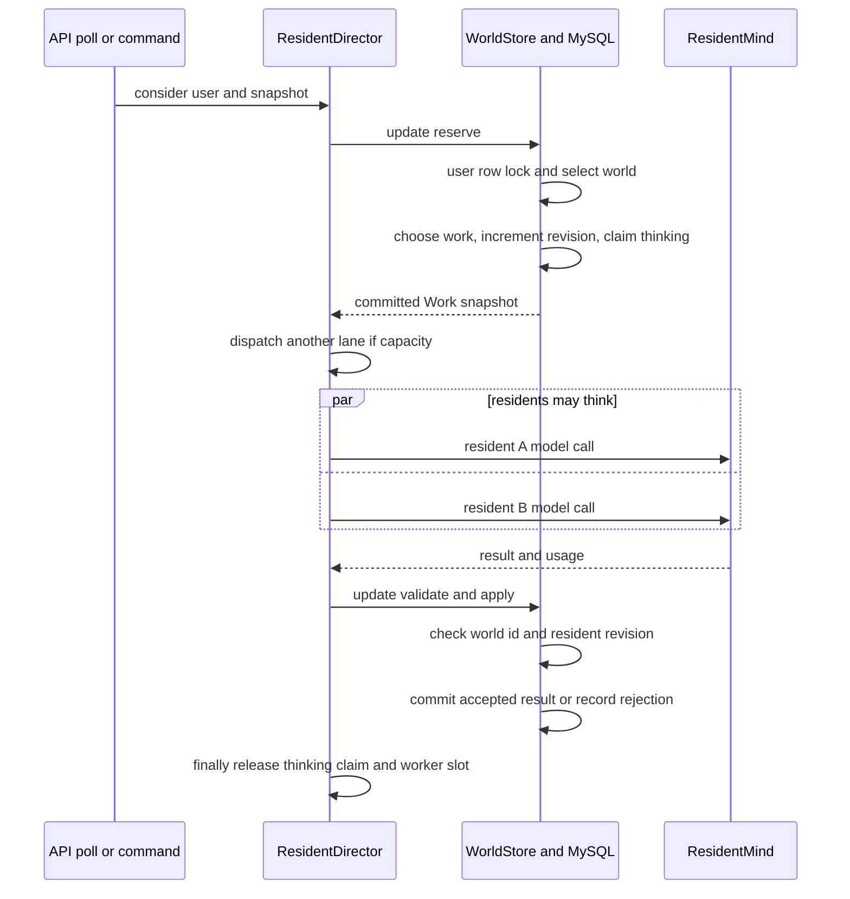

# 小镇状态所有权、持久化与并发提交

小镇的服务端才是行为、记忆与结果的裁决者；但它不是单一文件或单一数据库表。`CompanionWorld` 在领域层仍是一张完整的运行时对象图，`JdbcWorldStore` 在读写边界把居民 `memories` 拆出/补回。因而必须区分**领域对象中暂时可见**、**持久化权威来源**与**前端投影**，不能把任一缓存或索引误当成世界状态。

相关设计可参阅：[运行总览](companion-harness-overview.md)、[持久化与 API 合约](persistence-and-api-contracts.md)、[事件、感知、记忆与信念](../concepts/events-perception-memory-and-belief.md) 与 [居民尝试循环](../workflows/resident-attempt-loop.md)。

## 所有权总表

| 状态或产物 | 权威来源与粒度 | 主要写入者 | 并发控制 | 重启、缺失与删除影响 |
|---|---|---|---|---|
| 小镇世界（地点、居民状态、意图、对话、事件、`revision`、模型预算等） | MySQL `town_companion_world` 的每用户一行 `state_json`；`CompanionWorld` 是其内存反序列化形态 | `CompanionService` 的 join/advance/命令路径和 `ResidentDirector` 的 reservation/apply 路径，经 `WorldStore.update` 修改 | `JdbcWorldStore.update` 先以 `select ... for update` 锁定该用户的 `sys_user` 行；同一用户首次加入也被串行化。仅当 `w.revision` 改变才写回 JSON | 进程重启从 JSON 还原；找不到世界且无 `initial` 时为 `COMPANION_NOT_JOINED`。账户删除删除该行；前端随后应丢弃本地投影。 |
| 居民记忆 `Memory` | 每条文件 `<root>/u<userId>/<residentId>/<memoryId>.md`；文件才是权威，按居民物理隔离 | `JdbcWorldStore.persist` 调用 `MemoryStore.save`，实际由 `FileMemoryStore` 写文件；模型输出经规则校验后进入世界并在持久化时落盘 | 世界更新在数据库事务内串行，但文件写入不是该 MySQL 事务的一部分；单文件以临时文件加 `ATOMIC_MOVE` 避免半写文件 | 新 `FileMemoryStore` 从文件重建 owner cache；格式坏的单文件被跳过。人工修改会在冷缓存/重启后被读到。账户删除应删除 `u<userId>` 目录。 |
| 记忆 SQLite 元数据 | `<root>/index.db` 的 `memory` 表，仅镜像 metadata | `FileMemoryStore.indexUpsert`；删除用户时清理其索引行 | 与文件写入是两个独立操作；当前读取走进程内 cache/文件，并不查询索引 | 索引不是第二份真相，更不能视为权威世界状态；它丢失或为空时可从文件重建，代价是扫描。删除索引不会删除记忆文件。 |
| 前端小镇状态 | 浏览器中 Pinia `useTownWorld` 的 `world` ref，是 API `Snapshot.world` 的共享 UI 投影 | `load`、`join`、`intend`、`cancel` 收到服务端 `Snapshot` 后由 `accept` 赋值 | 同一 store 的 `refreshing`/`busy` 防止本标签页重复请求；只接收同一 world 且 `revision` 不低于当前版本的快照 | 刷新/重开页面必须重新加载服务端；切换账号会清空。若 `advance` 回报 `COMPANION_NOT_JOINED`，投影清空并回到加入界面；它绝非权威世界状态。 |
| 模型对话 transcript 与会话操作状态 | `CompanionWorld.conversations` 内的 `turns`、状态、版本和 pending operation，随 MySQL JSON 保存 | `ConversationLifecycle.reserveTurn` 标记 pending；验证通过的 `applyTurn` 追加模型发言及规则效果 | reservation 与提交都在 `WorldStore.update` 内；`turnVersion`、operation id、`intentRevision` 和超时验证拒绝过期/不匹配结果 | 重启由 JSON 恢复；未完成 operation 会受 45 秒超时或 intent revision 变化处理。对话文本是世界存档的一部分，而不是独立的模型供应商日志。 |
| 模型 token usage | MySQL `town_companion_model_usage`，粒度为用户、当地日期、call type 的累加计数 | `ResidentDirector` 在模型调用返回后（即使结果过期不能 apply）调用 `ModelUsageRecorder`；`JdbcModelUsage` 以 upsert 累加 | 独立 JDBC upsert；不参与世界 JSON 的行锁/版本提交 | 可按当天读取汇总；未测得 token 的调用不写行。它是成本观测账本，不是可回放 transcript，现有隐私导出也不包含该表。 |
| 隐私导出 ZIP | 对象存储中的 `exports/<userId>/<publicId>.zip`；导出任务元数据在 `data_export_job` | `ExportService.create` 读取当时的 SQL 世界 JSON 和按 owner 的文件记忆，打包后上传 | 创建使用幂等键且每用户 24 小时限一次；读取 MySQL 与文件并无共同快照事务 | ZIP 是创建时的快照，不会跟随后续世界/记忆变化；到期任务删除对象并标记 `EXPIRED`。导出含 `town_experience.json` 的世界和记忆，不等同于完整运维备份。 |

`CompanionWorld.memories` 因此是一个刻意的领域层接缝：读世界 JSON 后，`JdbcWorldStore.hydrate` 逐个 resident/ avatar 从 `MemoryStore.byOwner` 补入；写回前，`persist` 先保存记忆，临时将该列表置空后编码 JSON，最后恢复内存引用。MySQL 的 `state_json` 不承载记忆。

## 写入与恢复边界

### 世界 JSON 与记忆文件不是原子事务

`JdbcWorldStore.update` 的 SQL 事务覆盖用户行锁、读取/创建/更新世界 JSON；但 `persist` 在该事务中先调用文件记忆存储，再编码/更新 MySQL。文件写入与 SQLite upsert 也各自独立。代码没有跨 MySQL、文件系统和 SQLite 的两阶段提交或补偿日志。

这产生实际的运维语义：

- MySQL 更新随后失败/回滚时，已写入的记忆文件不会随着世界 JSON 回滚；下次成功读世界时它仍可能被 hydrate。
- 文件已写、SQLite 更新失败时，记忆文件仍是可恢复的权威，索引可重建；反过来，不能从 SQLite 恢复被删除的文件内容。
- 账户删除同样跨边界：删除服务先删除世界 SQL 行，再在 SQL 事务外调用 `companionMemories.deleteUser`。该文件删除被设计为幂等，但 SQL 成功与磁盘清理之间仍应监控、重试和核验；不要把“世界行消失”当作记忆目录一定已经清空。
- 备份、恢复和事故排查必须把 MySQL 世界表、配置的 memory root 卷及其 `index.db` 作为一组处理；恢复时以文件重建索引，以世界 JSON 重建其余小镇状态。文件 root 未显式配置时本地默认位于 `target/companion-memory`，生产容器应显式配置并挂载持久卷。

`FileMemoryStore` 对单个 `.md` 使用临时同目录文件和 `ATOMIC_MOVE`，仅保证该文件不会因中途崩溃成为半写入文件；这不提升为跨文件/数据库原子性。手工编辑也有明确边界：缓存已加载的进程不会自动监听文件变化，新的 store 实例或冷 cache 才会从磁盘看见编辑结果。

## 并发模型：并行思考，串行 reservation/commit

模型网络调用慢，世界写入短。`ResidentDirector` 因而将一次工作拆成三段：短事务保留工作、事务外调用 `ResidentMind`、短事务校验并提交。`parallelism` 是单个用户/世界可同时在途的 worker 上限；线程池大小和队列大小则是执行资源上限，二者不是同一概念。

图示的是模型 I/O 可并行、而 reservation 和世界提交必须经短 `update` 事务串行的流程。

### reservation 的不变量

1. `reserved` 在受 `WorldStore.update` 保护的事务里增加 `modelCallsToday`、`modelSequence` 和世界 `revision`，并以 `worldId|residentId` 放入 `thinking`。同一个 resident 在 call 完成的 `finally` 前不得再被选中；所有候选分支（turn、summary、遭遇、occasion、反思、普通决策等）都检查该集合。
2. `workersByUser` 只控制并行槽位，是优化；真正防止同一居民重复提问的是 `thinking`。无工作、异常和提交失败路径都会在 `finally` 释放槽位与 claim，避免永久卡住。
3. 并发回复不按全局到达顺序提交。每份 `Work` 携带世界 id、resident revision、intent revision、预约时间等身份信息；各 `apply*`/`proposeDecision` 会拒绝 resident revision 或相关 intent revision 不匹配的结果，超过 90 秒的模型结果也视为过期。冲突策略是**丢弃过期结果**，而非持锁等待模型。
4. 提交路径无论业务结果是否成功都会增加世界 `revision`，以确保“消费了待处理 occasion/遭遇、退款或失败记账”等纯 bookkeeping 不会被 `JdbcWorldStore` 的“revision 未变则不写”优化丢掉。

对话还有更细的 operation 保护：保留 turn 时写入 `pendingOperationId`、speaker、`turnVersion` 与 `pendingIntentRevision`；`applyTurn` 只接受仍匹配的 pending operation。会话超过 operation timeout、场景/intent 变化或结果过期时，生命周期会释放/失败该 operation，而不是把旧话强行写入新场景。

### 模型成本与导出不是提交的一部分

模型调用返回后，只要报告了 usage，`ResidentDirector` 就记录 usage，**即使**该回复后来因 revision 或年龄而被拒绝，因为 token 已经花出去了。`JdbcModelUsage` 以 `(user, day, call type)` 聚合，适合回答当天成本和类型分布，不保存逐调用正文或可重放序列。

`ExportService` 则在请求时读取 `town_companion_world.state_json`，再从文件存储逐 owner 收集记忆，写入 `town_experience.json` 后上传 ZIP。它没有为两种来源持有共同锁，也未导出 `town_companion_model_usage`；因此导出可能跨越一次并发世界/记忆提交边界，且不能作为 usage 审计或事务一致性快照。需要严格取证或恢复时，应使用协调后的基础设施备份，而非用户导出。

## 前端投影与 API 时序

Pinia store 聚合街道条与 `/town` 页的消费者，避免每个组件各自轮询；它每 15 秒在可见标签页调用 `advance()`，并在可见性恢复或 today/tasks 数据变化时刷新。`accept` 以世界 id 和 `revision` 抵御乱序读取：旧 revision 不会覆盖本标签页已持有的新 revision。该保护只解决浏览器展示顺序，不能替代服务端行锁、reservation 或 revision 校验。

提交 intent 时，前端在暂时网络故障后复用同一 UUID；服务端对相同 id 的相同 payload 返回现有 intent，对同 id 不同 payload 返回冲突。这是命令幂等边界，而不是把 Pinia 变成写模型。

## 测试与变更检查

- `FileMemoryStoreTest` 验证重启后从 `.md` 恢复、按用户与 owner 隔离、旧文件兼容、坏文件跳过、人工编辑可在新 store 被读取，以及账户删除同时清目录与 SQLite 行。
- `ResidentDirectorParallelTest` 让多个模型调用阻塞，验证同一世界中不同居民可同时思考、同一居民不会在途重复、`parallelism` 上限有效，并验证饱和时仍保留一个反思 lane。其测试 store 的 `synchronized update` 明确模拟生产 JDBC 行锁所需的 reservation 串行性。

修改本模块时，至少复查：新增的所有候选选择分支是否跳过 `thinking` resident；任何改变世界但未改变业务对象的 apply/failure 分支是否递增 `w.revision`；以及涉及记忆的变更是否承认文件、SQLite、MySQL 与导出的非原子边界。
