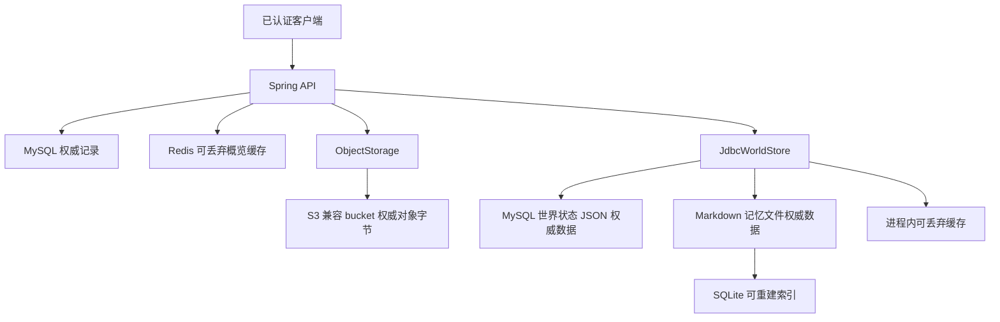
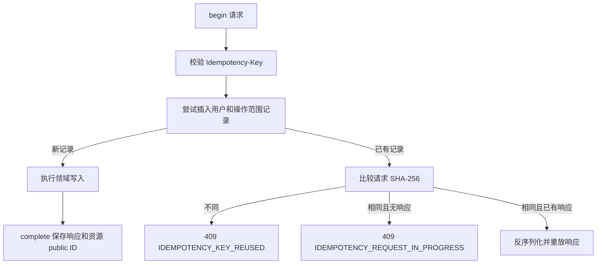
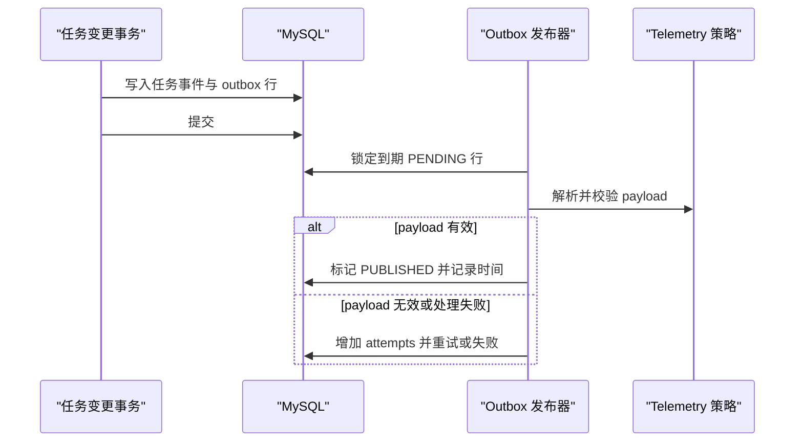

## 架构定位：数据的权威性与可恢复性

后端是围绕 **MySQL 系统记录库**构建的无状态 Spring 应用。Flyway 已启用，迁移位置为 `classpath:db/migration`；Hibernate 的 schema generation 已禁用（`ddl-auto: none`）。模式通过外键、唯一键、检查约束、JSON 列和 UTC 时间戳把所有权与生命周期规则固化到数据库中。用户范围内的目标、排期、事件、会话和偏好等记录关联 `sys_user`；对外暴露的记录通常另有 ULID 风格的 `public_id`，内部连接使用数值 ID。

| 存储 | 作用 | 权威性与恢复预期 |
| --- | --- | --- |
| MySQL 与 Flyway 迁移 | 产品、认证、隐私、运维和小镇世界的事务状态 | **权威数据。** 必须备份并按迁移演进，不能以缓存替代。 |
| 伴侣记忆 Markdown 文件 | 小镇居民记住的内容 | **记忆的权威数据。** 部署必须挂载持久化存储。 |
| 伴侣文件旁的 SQLite `index.db` | 为后续文件查询准备的元数据索引 | **可重建。** 可由记忆文件重建；当前读取在磁盘加载后使用进程缓存。 |
| Redis | 五分钟洞察概览缓存及失效通知 | **可丢弃的加速层。** 未命中、陈旧值、序列化故障或 Redis 故障均回退到 MySQL。 |
| 进程内对象 map | 默认对象存储实现 | **可丢弃的开发/测试存储。** 重启即丢失。 |
| S3 兼容 bucket（常为 MinIO） | 附件与隐私导出归档 | 保存对象字节；MySQL 保存对象键、状态、校验和与到期元数据。 |



该图展示权威边界：MySQL 世界 JSON 和伴侣文件是彼此独立的权威数据；Redis、SQLite 索引和进程内存可丢失，并可重建或重新填充。修改功能时，应将事务性领域决策放在 MySQL，将缓存设计为可丢失；伴侣记忆变更的回滚语义则不同于世界存档。相关背景见[系统概览](/openwiki/architecture/system-overview.md)、[认证与所有权](/openwiki/concepts/authentication-and-ownership.md)和[伴侣小镇](/openwiki/concepts/companion-town.md)。

## 数据库所有权、迁移与幂等写入

`application.yml` 默认连接 MySQL，并从 `db/migration` 执行 Flyway。生产环境的主机、数据库和凭据由环境变量提供；模式变更应新增有序迁移文件，而不是依赖 Hibernate。

所有权是横切不变量。已认证控制器取得 `CurrentUser`，将内部用户 ID 传给服务；查询和变更通常以 `user_id` 限定。例如，附件关联会先按当前用户 ID 查询附件和目标任务事件；导出查询与下载也同时按 `user_id` 和 public ID 查询。因此，知道某个有效 public ID 不会获得跨账户权限。

### `Idempotency-Key`

可安全重试的变更端点（例如任务事件、快速任务、AI 建议采纳和数据导出）经由 `IdempotencyService` 使用 `Idempotency-Key`。持久化表 `idempotency_record` 的唯一性边界是 `(user_id, operation, idempotency_key)`，因此密钥不会跨用户或操作混用。`begin` 要求密钥非空且最长 120 个字符，并将按键排序后的 JSON 请求计算 SHA-256，记录 24 小时的 `expires_at`。



该图描述重试决策：同一用户、同一操作且请求内容相同的已完成调用才会重放响应。

具体结果如下：

- 新密钥插入记录，调用可以继续；
- 相同密钥但请求哈希不同，返回 `IDEMPOTENCY_KEY_REUSED`（409）；
- 相同请求尚未存储响应，返回 `IDEMPOTENCY_REQUEST_IN_PROGRESS`（409）；
- 已完成的相同请求反序列化并返回已存响应，`complete` 保存该响应及产生的 public ID。

调用方应在恰当的事务工作流中放置领域写入与完成动作。到期值用于生命周期/清理记录；该服务本身不删除过期行，因此不能假定到期会自动让密钥重新可用。

## API 信封、错误与请求关联

成功的控制器响应通常使用 `ApiEnvelope<T>`：

```json
{
  "data": {},
  "requestId": "01…",
  "timestamp": "2026-...Z"
}
```

`RequestIdFilter` 在控制器之前建立请求 ID：仅接受符合 26 字符 ULID 模式的 `X-Request-ID`，将有效值规范为大写；否则生成新 ID。它将该值写入请求属性、响应头和日志 MDC。`ApiEnvelope` 的时间戳来自注入的 `Clock`，使时间相关行为可测试。

`GlobalExceptionHandler` 对应用异常、校验失败、不可读请求体、缺失资源、不支持的方法和未预期异常返回相同外层信封。内嵌的 `ApiError` 包含 `status`、稳定的机器可读 `code`、面向用户的 `message` 和不可变 `details` map。校验错误使用 `VALIDATION_FAILED` 和 `fields` map；405 包含 method/path 详情并保留 HTTP `Allow` 头。未预期异常会连同请求 ID、方法、路径和异常类型写入日志，但客户端只收到通用 `INTERNAL_ERROR`，不暴露异常细节。

注意，Spring Security 的未认证和禁止访问处理器使用 `sendError(401/403)`，客户端不能假定这两类安全失败也有应用信封。

## Redis 仅作缓存，不作权威来源

洞察概览采用 cache-aside：`InsightService` 先读取 Redis 键 `insights:overview:v2:<userId>`；未命中或任意 Redis/JSON 故障时从 MySQL 构建概览，再尽力将序列化结果写回五分钟。任务事件变更在**事务提交后**使该键失效；每日状态保存也尝试失效，但 Redis 不可用时不会让权威保存失败。因此，短暂的缓存故障最多会在 TTL 内暴露旧概览，不能拒绝写入或丢失 MySQL 数据。

新增 Redis 用途前，先定义权威查询与可接受的陈旧窗口；在加速层边界捕获故障，并在需要正确性时仅于成功提交后失效。不要把所有权判定、一次性变更状态或产品记录的唯一副本放进 Redis。

## 对象存储、附件与隐私导出

`ObjectStorage` 抽象 `put`、`get`、预签名下载/上传和删除。默认 `memory` provider 将字节数组复制到并发 map，并返回内部 API 上传/下载 URL；适合本地使用，但不持久。设定 `app.object-storage.provider=s3` 会创建 `S3ObjectStorage`；它使用 endpoint、region、bucket 和访问凭据，启用适合 MinIO 兼容端点的 path-style 调用，在启动时确保 bucket 存在，并为直接写入和签名上传请求 AES256 服务端加密，生成限时 S3 预签名 URL。

附件走“元数据先行”流程：`POST /api/v1/attachments/presign` 校验受限的 MIME 类型/扩展名组合和最大 10 MiB 大小，创建用户范围内的 MySQL `attachment` 行，再为 `attachments/<userId>/<publicId>.<extension>` 返回 15 分钟上传 URL。关联操作验证附件归属、未删除、扫描状态为 `CLEAN`，并验证目标任务事件归属。仅上传对象字节不会使附件可用。可见代码中没有将 `PENDING` 变为 `CLEAN` 的扫描 worker，部署必须提供相应处理，否则关联无法成功。

隐私导出同步生成 `exports/<userId>/<publicId>.zip`，以 SHA-256 校验并写成 `READY` 的 MySQL 导出任务。归档包含 profile、goals、task events、role progress、世界 JSON，以及从文件记忆存储加载的伴侣记忆。导出创建具备幂等性，并限制每位用户 24 小时一次；下载要求归属匹配、任务为 `READY` 且未过期，随后提供 15 分钟预签名 URL。对象保留 24 小时；保留任务删除到期对象并将任务标记为 `EXPIRED`。因此，尽管大对象字节在对象存储中，MySQL 状态仍是访问控制和生命周期的关口。

## 伴侣世界与文件记忆

`town_companion_world` 是每用户一行的 MySQL 存档，保存 `state_json`，并以级联删除外键关联 `sys_user`。`JdbcWorldStore` 在创建或更新前以 `FOR UPDATE` 锁定该用户的 `sys_user` 行，从而串行化同一用户并发的首次加入和更新；仅当领域 revision 变化时才更新世界行。

记忆有意排除在 `state_json` 外。读取时，`JdbcWorldStore` 从存档发现居民和 avatar ID，并逐 owner 通过 `MemoryStore` 填充世界记忆列表；持久化时先写入记忆存储，临时清空内存列表编码 JSON，随后恢复调用方可见的列表。由此可知：回滚或恢复 MySQL 世界记录**不会**回滚记忆文件。

`FileMemoryStore` 的每条权威记忆文件位于：

```text
<companion-memory-root>/u<userId>/<residentId>/<memoryId>.md
```

文件包含小型 frontmatter 风格头和可读文本。用户和 owner 的物理分区隔离；ID 必须匹配安全的单路径段模式，无效 ID 会被忽略或读取为空，不能成为路径。写入会创建父目录、写入同目录临时文件，再原子替换目标，避免崩溃后留下不完整的权威记忆。新进程会从文件重建每 owner 缓存；手工编辑造成的畸形文件会被跳过，不会阻止小镇加载。该存储跨重启保留 supersession 元数据，并将缺少该字段的旧文件视为未 superseded。

同目录的 `<root>/index.db` 是 SQLite 元数据索引，主键为 `(user_id, owner_id, id)`，并有 owner/time 索引。每次文件变化后更新索引，删除用户时清理其索引行；它不是权威数据，丢失后可扫描文件重建。空白的 memory-root 在本地开发/测试中默认使用 `target/companion-memory`；部署容器必须设置 `COMPANION_MEMORY_ROOT` 并挂载持久卷。

账户删除显式处理这两个持久化域：删除伴侣世界行后调用 `MemoryStore.deleteUser`，递归移除用户记忆目录并删除 SQLite 索引行。该文件操作不在 SQL 事务内，但设计为幂等；跨两个持久化域的失败需要运维处理，不能将其误认为原子事务。

## 异步与定时边界

定时任务受 `app.scheduling.enabled` 控制，默认 `true`，并共用四线程 Spring 调度池。这样慢任务不会独占默认的单调度线程，但这不是持久化外部队列。生产环境应运行经协调的调度拓扑，因为每个应用实例都可能执行这些计划任务。



该图展示已实现的 outbox 边界：变更时持久记录运维事件意图，定时 worker 校验并完成该行；在可见实现中它并未向外部消息 broker 发送消息。

### Outbox 语义

任务执行在任务事件和产品分析记录的同一流程中写入 `outbox_event`。行包含 public ID、聚合与事件身份、JSON payload、可用时间、状态、尝试次数、发布时间和错误码。`OutboxPublisher` 每隔 `app.outbox.delay-ms`（默认 5 秒）在事务中以 ID 顺序选取最多 100 条已到期 `PENDING` 行，并使用 `FOR UPDATE SKIP LOCKED` 锁定；随后解析 JSON 并执行 `TelemetryPolicy.validate`。

有效 payload 会标记为 `PUBLISHED`。任意异常会增加 `attempts`、写入 `INVALID_PAYLOAD`，并保持 `PENDING`；数据库表达式在观察到此前四次尝试后，于第五次失败将其置为 `FAILED`。`SKIP LOCKED` 允许并发发布事务避免选中同一行，但不能将此实现描述为向消息 broker 投递：可观察到的“发布”只是校验与状态转换。

### 其他维护任务

- `ScheduleExpiryJob` 按 `app.execution.expiry-delay-ms` 运行（默认 60 秒），以 `SKIP LOCKED` 锁定到期 `PLANNED` 排期，条件更新为 `EXPIRED`，且仅当条件更新获胜时插入零经验事件，从而避免并发执行产生重复过期事件。
- `MetricRebuildJob` 按 `app.insights.rebuild-cron` 运行（默认 03:25），根据 task-event 历史重算用户维度经验/等级和角色进度；它是派生 MySQL 投影的修复/对账边界，不会创造新活动。
- `RetentionJob` 按 `app.privacy.retention-cron` 运行（默认每小时第 10 分钟），脱敏到期 AI message/memory 内容、使导出对象到期，并处理冷静期已过的删除请求；删除路径还会标记附件元数据为已删除并匿名化用户。

## 变更与验证清单

1. **模式变更：** 新增 Flyway 迁移，并使所有权键、约束和索引匹配查询路径；不要依赖 `ddl-auto`。
2. **新 API：** 每次读取和变更都经由 `CurrentUser.id()` 限定；适用时返回 `ApiEnvelope`，使用稳定的 `ApiException` 代码，并保留请求关联。在发布前决定重试客户端是否需要 `Idempotency-Key`。
3. **新大对象：** 在 MySQL 保存归属对象键和生命周期状态；预签名或读取前执行访问控制，并定义删除/到期行为。不能把内存 provider 当作生产持久化方案。
4. **新缓存：** 说明 MySQL 回退、TTL/可接受陈旧度和提交后失效策略。Redis 故障不得破坏权威写入。
5. **新伴侣状态：** 明确它属于可回滚的世界 JSON，还是独立且可读的记忆文件；保持用户/owner 分区与账户删除清理。
6. **新定时工作：** 明确事务和多实例并发语义；对 claim-and-process 使用锁定/条件更新，并在共享调度池下配置。

已有聚焦测试覆盖关键接缝：`ApiEnvelopeTest` 固定信封时间戳/请求 ID 行为；`GlobalExceptionHandlerTest` 校验 405 信封与 `Allow` 头；`FileMemoryStoreTest` 验证重启存活、物理隔离、手工编辑、向后兼容的 supersession 字段、畸形文件容错与按用户删除；`RetentionPolicyTest` 固定导出、下载和删除时长。变更失败、所有权、持久化或重试语义时，应在相同边界补充聚焦测试。
