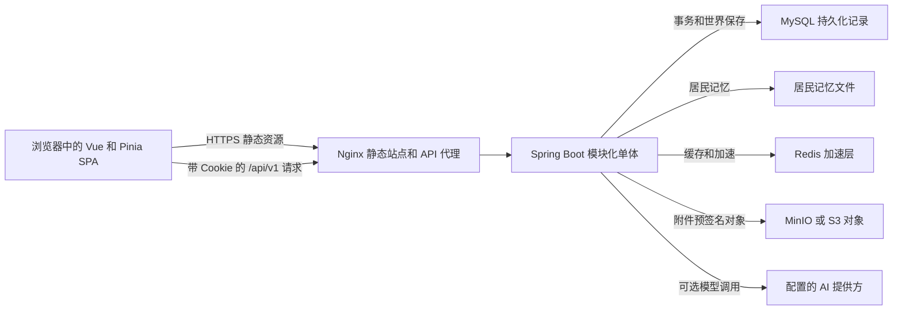
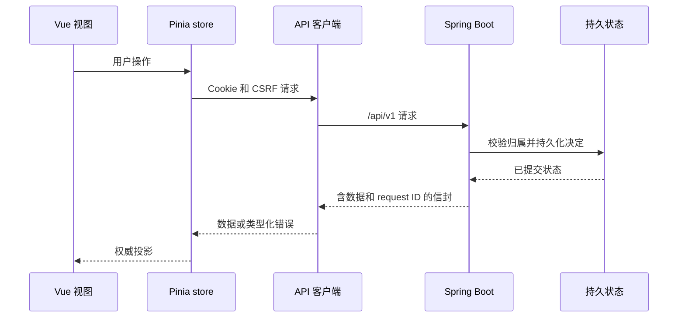

# 系统概览与运行时边界

Lamplit 是一个在浏览器中使用的个人成长产品，其中的 `/town` 是可持续运行的小镇陪伴体验：用户可与一个化身共同专注，居民则保有需求、计划、关系和记忆。系统采用**模块化单体**，而不是一组独立部署的微服务：一个 Vue/Pinia SPA 经由 `/api/v1` 调用一个 Spring Boot 后端。MySQL 是关系型产品数据的系统记录，Redis 是可丢弃的加速层，MinIO 提供本地 S3 兼容对象存储。小镇居民记忆另有文件存储；记忆文件而非世界 JSON 是居民记忆的权威来源。

## 运行时地图与权威状态

*浏览器负责渲染和协调交互；后端作出并持久化产品决定。MySQL 是关系数据的权威，记忆文件是居民记忆的权威。*

Pinia 是内存中的客户端投影，不是第二个数据库。刷新、第二个标签页、被拒绝的请求或异步模型结果都不能让客户端自行制造业务结果。陪伴世界的响应带有 `revision`；共享 store 只接受同一世界中不早于当前版本的快照。UI 可以立即给出交互反馈，但最终采用服务端返回的世界、意图状态、记忆和行动。

## 入口与 HTTP 边界

前端入口 `frontend/src/main.ts` 创建 Vue 应用和唯一的 Pinia 实例，恢复外观偏好，安装路由并挂载 `App`。路由组件按需加载。全局导航守卫会先加载认证 store：匿名用户访问非公开路由会被导向 `/auth`，非管理员访问 `/admin` 会被导向 `/today`，已登录用户访问 `/auth` 则按角色回到相应入口。主要用户旅程包括 Today、小镇、目标、伙伴、好友与会话、属性、洞察、AI、个人资料和设置；`/town/debug` 是脱离 `UserLayout` 的开发调试视图。

普通浏览器 API 请求统一通过同源 `fetch` 客户端：路径前缀为 `/api/v1`，携带 Cookie，GET 禁用缓存；不安全方法将可读的 CSRF Cookie 放入 `X-CSRF-Token`。遇到一次 `401` 时，客户端会调用刷新端点并仅重试原请求一次。成功与应用错误使用 `{ data, requestId, timestamp }` 信封。后端 `RequestIdFilter` 接受有效的 ULID 形式 `X-Request-ID`，否则生成新值；它把该值回传给客户端、放入日志 MDC，并使未预期异常可按该标识追踪，同时客户端得到稳定的错误信封。

Spring Security 的会话策略为无状态，但会话材料由 Cookie 承载。后端写入 HttpOnly 的访问和刷新 Cookie，以及供双重提交校验读取的 CSRF Cookie；刷新 Cookie 的路径限制为 `/api/v1/auth`。安全链放行注册、登录、MFA 验证、刷新、密码恢复和健康检查，其他请求须认证；JWT 过滤器与自定义 CSRF 双重提交过滤器参与链路。前端路由守卫只是体验层，授权与资源归属检查必须留在服务端。

## 控制流：服务端确认，客户端投影

*写入由服务端决定并持久化后，SPA 才采用返回的投影。*

小镇展示了这条边界。`GET /api/v1/town/companion` 读取当前用户世界；加入、推进、提交意图和取消意图都返回新的视图，另有只读的 `/usage` 返回该用户当天按调用类型统计的模型 token 用量。`focus` 意图只能关联调用者拥有且仍有效的任务。意图 ID 仅可在内容完全相同的情况下幂等复用；若同一 ID 对应不同内容，服务端以冲突拒绝。前端在网络瞬断后保留未确认意图的 ID，因此重试不会重复创建意图。

小镇 store 只有一个由当前 Pinia 实例共享的世界。它在至少有一个消费者时每 15 秒推进一次；页面隐藏时跳过轮询，重新可见时立即刷新，Today 或任务数据变动也会触发刷新。消费者引用计数确保持续显示的街道区域和 `/town` 页面不会建立重复定时器。账户切换会清空旧世界并忽略其在途响应；若服务端说明世界不存在，store 放弃本地快照，使下一轮改为读取加入状态而非无限推进已删除的世界。

`JdbcWorldStore` 在读取或创建世界前以 `select ... for update` 锁定用户行，因此同一用户的更新（包括并发首次加入）被串行化。每个用户在 MySQL 中有一行世界保存，领域规则递增其 revision。居民思考可以异步发起，但写入仍经由该存储边界串行化；过期的 worker 或浏览器响应不能覆盖较新的状态。前端的陈旧 revision 测试，以及领域规则对取消意图、证据归属和重复推进的测试，保护这一约束。

## 按能力组织的领域边界

后端具有认证与身份、引导、成长规划和目标、任务执行与每日状态、洞察、成就与职业、伙伴、社交连接、AI、隐私与安全、管理和小镇等能力。SPA 在页面中组合这些能力，而不必一一对应 Java 包。例如，小镇可把专注安排关联到真实任务，却不拥有任务完成语义：执行域的 `TaskStateMachine` 单独定义允许迁移，并拒绝终态任务上的第二次事件。完成小镇专注也不会自动完成真实任务。

小镇内部的预期依赖方向是 `interfaces → application → domain`：HTTP 控制器和调度入口调用用例；应用层编排领域规则与端口；adapter 实现数据库、文件和模型集成；领域层不依赖 HTTP、持久化或框架时间。这使规则可注入时间进行确定性测试，也使外部集成失败不成为业务规则的定义者。

小镇是专门领域，而非任务 API 的视觉外壳。规则层处理时间、需求、地点与位置占用、路径和行动，并在改变世界前验证行动；模型用于规划、对话、反应和反思。模型调用不应持有长数据库事务。无模型或模型调用失败时，居民按既有计划继续生活，不以一条虚构的兜底台词替代；取消的意图、过期 resident revision 或不属于该居民的记忆证据也不能被异步结果应用。真实任务内容不会自动进入居民对话或记忆。

## 状态、耐久性与生命周期

- **MySQL：**Flyway 在启动时启用，Hibernate 的 schema 生成关闭。它存储账户、规划与执行数据、会话及其他产品记录，也存储小镇不含记忆的 `state_json`。世界表以 `user_id` 为主键，并在账户删除时级联删除。
- **陪伴记忆：**每条用户/居民/记忆对应配置根目录下的 Markdown 文件。文件存储在旁维护可重建的 SQLite 元数据索引和进程内缓存，但文件才是权威。读取世界时会从文件 hydrate 记忆；保存时先写入文件、再从 `state_json` 剥离记忆。因此 MySQL 世界保存回滚不会回滚已经写入的记忆文件。备份、导出和删除流程必须把该独立耐久存储纳入范围；部署必须为 `COMPANION_MEMORY_ROOT` 提供持久挂载，避免容器替换导致居民失忆。
- **Redis：**与 MySQL 一同配置，但作为可丢弃的加速层而非真相来源。
- **对象存储：**创建附件时，后端在认证用户名下记录元数据并返回有效期 15 分钟的预签名上传 URL。关联附件到任务事件时，会同时验证调用者对附件和任务事件的归属，并要求附件扫描状态为 `CLEAN`。
- **浏览器持久化：**外观 store 仅在 `localStorage` 保存呈现偏好；账户和业务状态从 API 加载。

`app.scheduling.enabled` 可关闭全部调度，启用时任务共享大小为四的调度池。当前调度任务包括排期过期、洞察指标重建、隐私保留以及 outbox 发布。排期过期任务用 `skip locked` 处理到期计划并生成事件；outbox 每次锁定最多 100 条可用的待发布记录，校验遥测 payload，成功则标记 `PUBLISHED`，失败会增加尝试次数，达到限制后标记 `FAILED`。这些是后端维护工作，不应由浏览器标签页独立模拟。

## 运维与扩展点

`GrowthApplication` 是唯一 Spring Boot 入口，并排除了 Spring Security 默认的 user-details 自动配置，以使用应用自身的认证安排。`application.yml` 默认监听 `8080`，配置 MySQL、Redis、Flyway、health/info 暴露、安全 token 生命周期、对象存储、调度和 AI。AI 默认使用 mock 提供方；要调用 Qwen，须在未提交的环境文件中配置 `QWEN_PROVIDER=qwen`、URL、模型和有效 API key。陪伴域可配置 DeepSeek 作为隔离的后备路由；调用类型的路由列表按顺序尝试提供方。模型是外部能力，而不是耐久业务权威。

Compose 启动 MySQL、Redis、MinIO、backend 和 Nginx。Nginx 提供构建后的 SPA，代理 `/api/v1` 与 `/actuator/health`，为 API 禁用代理缓冲和缓存，并用 `try_files` 支持 SPA history 路由；`/assets/` 使用不可变长缓存，`index.html` 不缓存。Compose 对数据库、Redis、JWT、MFA 和对象存储等敏感配置使用环境变量要求值；先运行 `docker compose --env-file .env.local -f deploy/compose.yaml config` 再依赖本地容器配置。

验证应分层进行：`./mvnw test` 覆盖领域规则、API 信封与错误、任务迁移及陪伴生命周期/并发；`pnpm lint && pnpm test --run && pnpm build` 检查 SPA 行为和构建产物；`./scripts/verify-global-flow.sh` 是本地端到端数据流门禁，覆盖认证/CSRF、同意持久化、目标—周计划—任务实体化、任务迁移与撤销、AI SSE 与危机兜底、建议幂等采用、ZIP 导出、归属隔离、删除冷静期及取消、数据库不变量、Redis 健康和敏感日志扫描。

## 安全变更清单

1. 先判定新行为是客户端投影、服务端决定还是外部集成；只有服务端可持久化决定。
2. 复用 API 信封、request-id 和错误约定；将刷新重试与多标签竞争视作常态失败模式。
3. 即使 SPA 隐藏不可用操作，也要在应用层和数据库边界验证资源归属。
4. 修改小镇状态时，保留按用户串行化、revision 感知的客户端接纳、幂等意图提交以及任务完成与小镇专注的边界。
5. 修改陪伴记忆时，将挂载的文件根目录与 MySQL 同等视为耐久数据；不要在 `state_json` 重建第二个记忆权威。
6. 在受影响的规则、归属、竞争或契约边界新增聚焦测试，并运行相应的后端/前端测试；跨领域变更还应运行全局数据流验证。
