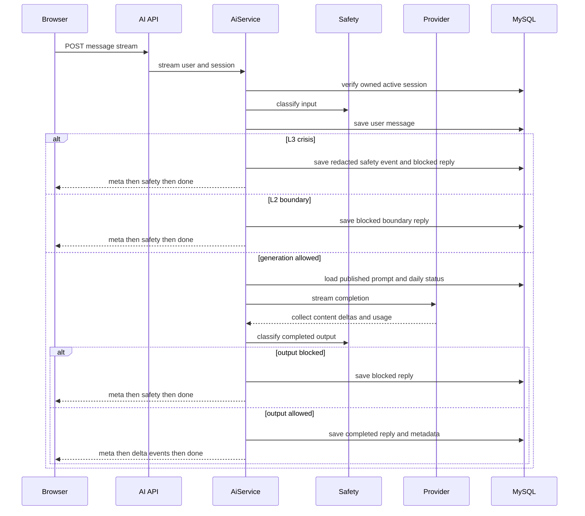
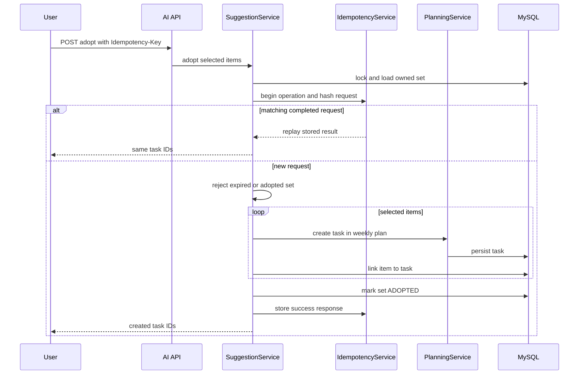

## 范围与入口

AI 功能是面向特定场景的、需要认证的辅导界面，而不是独立的通用聊天机器人。`AiController` 在 `/api/v1/ai` 下提供会话创建和查询、会话消息读取、SSE 聊天、目标模板草案生成，以及任务建议集的生成、读取和采纳。会话场景限定为 `STUDY`、`FITNESS`、`CAREER` 和 `EMOTIONAL_SUPPORT`；会话查询始终按当前用户及活动会话范围约束。

| 需求 | 端点 | 结果 |
| --- | --- | --- |
| 开始或继续辅导 | `POST /sessions`、`GET /sessions`、`GET /sessions/{sessionId}/messages` | 为用户创建有效期 90 天的活动会话；返回按顺序的消息历史，以及最多 30 个活动会话摘要 |
| 向教练提问 | `POST /sessions/{sessionId}/messages:stream` | `text/event-stream`：`meta`、零或多个 `delta`、最后 `done`；被拦截时以 `safety` 代替增量内容 |
| 将对话转成目标草案 | `POST /goal-template` | 从会话中的已完成消息生成可编辑的结构化目标草案 |
| 将目标提示转成任务 | `POST /suggestions`，随后 `GET /suggestions/{setId}` | 绑定活动目标的、经验证且短期有效的建议集 |
| 落实选中的建议 | 携带 `Idempotency-Key` 的 `POST /suggestions/{setId}/adopt` | 新建的规划任务及其公共 ID |

Vue 的 AI 页面在首次发送时延迟创建会话，挂载时加载历史；用户切换会话、重置或卸载页面时，会中止当前浏览器流。页面显示 Markdown 格式的助手回复、临时“思考中”状态、模型元数据和安全提示；流失败时提供手动创建任务的后备路径。

## 会话生命周期与 SSE 语义

`ai_session` 持有用户、场景、状态、时间戳和过期时间。`ai_message` 保存用户或助手内容、风险等级和完成状态；发生模型调用时还保存模型、提供商请求 ID、令牌数和延迟。历史查询排除软删除消息；会话列表只含 `ACTIVE` 会话，并按最近消息或活动时间排序。

上图展示了应用级流的实际边界：HTTP 提供商可递送内容块，但 `AiService` 会先收集全部内容块、校验拼接后的输出并持久化，之后才发出应用级 `delta` 事件。因此，客户端应把 `meta` 视为首个正常事件，拼接 `delta.text`，并把 `done.status` 当作最终的已持久化结果；不能假设令牌会随提供商产生而立即转发给浏览器。控制器的超时默认是 `PT130S`，可通过 `app.ai.stream-timeout` 配置。前端从 `meta` 记录模型，在收到增量后逐步渲染；将 `safety` 显示为危机响应，并显示 `error` 事件或传输失败所对应的错误。

在调用提供商前，消息必须为 1–4,000 个字符。服务会在分类和生成前记录用户消息，并加载该场景最新的已发布提示词；没有已发布提示词会产生 `AI_PROMPT_UNAVAILABLE`。若用户有每日状态，系统会将精力、可用时间和节奏建议追加至系统提示词，让辅导回复优先适配当前节奏。

## 安全、记录与保留

输入和模型输出都会经过安全分类。现有规则分类器将普通内容设为 `L0`，情绪困扰词设为 `L1`，诊断或处方请求设为 `L2`，危机或伤害信号设为 `L3`。`L0` 和 `L1` 可继续生成，`L2` 与 `L3` 不可生成。L2 请求会得到固定的专业服务边界回复；L3 请求会绕过模型，解析最新已发布的危机响应策略，写入脱敏的 `ai_safety_event`，并返回获批的回复和行动项。未通过安全检查的模型输出同样会被边界回复替代。

消息写入时根据用户 `user_preference.ai_retention_days` 确定过期时间；该值为 null 时默认保留 30 天。定时隐私保留任务默认每小时执行，将过期消息内容替换为 `[EXPIRED]`、标为 `FAILED` 并软删除。危机安全事件单独保留 180 天，且只保存 `[REDACTED]`，不会保存触发内容摘录。跨领域的删除与保留模型见 [隐私与保留](/openwiki/concepts/privacy-and-retention.md)。

## 提供商抽象与运维

`QwenProvider` 是扩展边界：辅导使用 `stream`，目标模板和建议使用 `generateStructured`；需要基于提供商进行分类的消费者也可使用 `classify`。当 `app.ai.provider` 缺失或为 `mock` 时，默认使用 `MockQwenProvider`，它返回确定性的内容块和结构化样例。因此，集成和浏览器验收流程可自包含：使用模拟提供商的验收测试不会调用外部模型。

设定 `app.ai.provider=qwen` 会选择 `QwenHttpProvider`。它在启动时校验非占位的 API key、基础 URL 和模型，向配置的基础 URL 追加 `/chat/completions`，并发送 OpenAI 兼容的认证请求。重要配置由 `QWEN_*` 环境变量提供，包括端点、密钥、固定模型、普通和流式超时、JSON 模式、思考风格及默认思考开关。提供商仅在已配置时，才将通用思考开关映射为 Qwen 的 `enable_thinking` 或 DeepSeek 的 `thinking` 对象；调用方不需要了解厂商的线协议。

对于结构化调用，提供商请求 JSON（除非禁用 JSON 模式）、在必要时移除代码围栏，并最多发起一次 JSON 修复请求；仍无效则报告 `AI_INVALID_JSON`。`WireRequestBudget` 可限制真实的外发请求，修复或后备客户端也可共享该预算。对提供商 SSE，它解析 `data:` 块、收集内容和用量、拒绝空的成功流，并将 HTTP 失败规范化为 `AI_PROVIDER_AUTH_FAILED`、`AI_PROVIDER_RATE_LIMITED` 和 `AI_PROVIDER_REQUEST_REJECTED` 等安全的应用错误码；提供商响应体不会暴露给用户。

## 生成草案与建议

### 目标模板交接

目标模板要求会话归当前用户所有、未删除，且至少有一条未删除的已完成消息。服务取最新 12 条已完成消息（查询后反转为时间顺序），将拼接对话限制为 12,000 个字符，完成安全检查后请求单个 JSON 对象。解析会拒绝缺少必填文本、未知维度或无效任务数组；同时将已知维度别名归一化，并把时长限制在 14–84 天、起步任务时长限制在 5–60 分钟、难度限制在 1–3。

该草案不是服务端目标。UI 允许用户编辑草案，将它存入 key 为 `better-self:ai-goal-draft` 的 `sessionStorage`，再跳转至 `/goals?source=ai`。目标模块只消费一次这份存储内容并预填目标表单；只有用户保存目标后，才会将每个起步任务提交至常规任务 API。这保留了 [成长规划与执行](/openwiki/concepts/growth-planning-and-execution.md) 所述的用户确认边界。

### 建议生成与采纳

生成建议需要非空提示词、归用户所有的活动目标，以及允许生成的输入安全判定。模型被要求给出 1–5 个条目；服务端还会校验每个任务时长为 5–60 分钟、难度为 1–3，权重仅能对应用户的活动维度且总和为 1–30，并拒绝落在用户静默时段内的建议本地时间。有效建议集以 `CONFIRMED` 状态保存，并带有模型和请求元数据，30 分钟后过期。

上图展示了建议采纳在行锁和幂等记录保护下创建规划任务的过程。

省略 `itemPublicIds` 表示采纳全部条目；选中的 ID 会使用请求提供的周计划和活动日期字段创建任务。采纳前会锁定建议集行。幂等键必填，作用域为 `ADOPT_SUGGESTIONS:{setId}`，保存 24 小时，并对规范化请求计算哈希：相同键且相同请求会重放已保存结果；相同键但不同请求会冲突；原请求仍在执行也会冲突。过期集会变为 `EXPIRED` 并返回 `410`；已采纳的集合以新键请求时会冲突。这使重试客户端不会重复创建计划任务。

## 变更与测试指南

- 修改 API 事件名或顺序时，必须同时检查浏览器 SSE 客户端和 `AiFlowIT`。该集成测试在 `app.ai.provider=mock` 下断言 `meta` 先于 `delta`、`delta` 先于 `done`，并验证所有者隔离、危机场景、模板访问和重复采纳的安全性。
- 扩展安全规则应格外谨慎：它们同时影响输入和输出、是否调用提供商、被拦截消息的持久化，以及 L3 策略路径。危机回复必须继续由策略支持，且摘录必须脱敏。
- 提供商改动应保留在 `QwenProvider` 边界之后。`QwenContractTest` 在不调用真实提供商的前提下，覆盖 OpenAI 兼容请求构建、提供商 SSE 与用量解析、JSON 修复上限、共享请求预算、思考开关翻译、空流拒绝和错误脱敏。
- 即使模型支持 schema，也要保留结构化验证层：`GoalTemplateNormalizeTest` 覆盖维度别名和范围限制；建议验证则在创建规划数据前执行用户特定维度与静默时段检查。
- UI 测试覆盖将危机回复作为文本而非注入标记进行渲染、流错误后备、历史续聊、从“思考中”到首个增量的切换、可编辑草案渲染，以及单次 `sessionStorage` 交接。Playwright AI 验收测试会注册用户，并使用配置的测试提供商验证获得非空助手回复。

完整的端到端引导流程见 [AI 引导规划](/openwiki/workflows/ai-guided-planning.md)。提供商与对象存储的部署边界见 [AI 与对象存储](/openwiki/integrations/ai-and-object-storage.md)。
