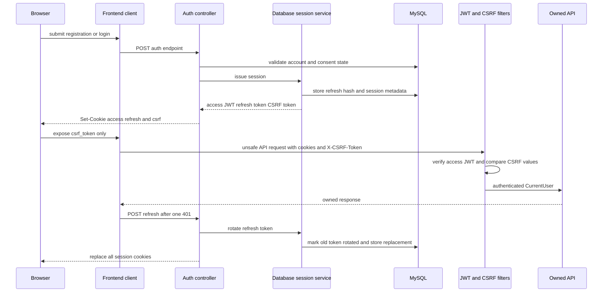

## 范围与安全模型

应用是无状态的 Spring Security API：它通过 Cookie 中的访问 JWT 进行身份验证，同时在 MySQL 中持久化刷新会话状态，以支持刷新令牌轮换和撤销。身份验证回答**谁在发起请求**；所有权和权限检查回答该身份**是否可以操作这条记录或特权能力**。公开资源 ID 只是标识符，并不授予权限。

请求的主要身份是 `CurrentUser(id, role)`。`JwtAuthenticationFilter` 验证签名后的访问令牌，查询账户当前状态，并且仅为 `ACTIVE` 用户设置该主体。`DELETION_PENDING` 账户只允许访问 `/api/v1/privacy/deletion`，以便查看或取消删除请求。无效、过期、格式错误、不活跃或缺失的凭据不会留下安全上下文；随后 Spring Security 会为需要身份验证的路由返回 401。健康检查和明确公开的认证端点是默认 `anyRequest().authenticated()` 策略的例外。

这是一套分层模型，而不只是路由规则：

1. 安全过滤器从 `access_token` 建立主体。
2. 控制器接收 `@AuthenticationPrincipal CurrentUser`，而不是接受调用方提供的用户 ID。
3. 服务和 SQL 必须将 `user.id()` 传入每个用户自有数据的查询和变更——通常是在 `WHERE user_id = ?` 中同时使用公开 ID。
4. 管理操作还要检查角色到权限的策略；敏感提示词的发布和回滚要求近期完成 MFA 验证。

例如，目标控制器的每个方法都会把主体 ID 和路径中的 `goalId` 交给服务；隐私导出访问也会在返回状态、内容或下载前同时传入两个 ID。这是新增端点必须采用的形态：不要先按 `public_id` 查询再授权，也不要信任 JSON、查询参数或 URL 中的 `userId`。持久化/API 契约页面还在数据库和对象存储边界说明了同一规则。

## 注册、同意与账户初始化

`POST /api/v1/auth/register` 会校验邮箱、12–200 个字符的密码、显示名、过去的出生日期、IANA 时区和三个同意字段。服务会单独解析时区，以去除首尾空白并转小写的方式规范化邮箱，拒绝重复的规范化地址，并要求 `TERMS`、`PRIVACY`、`AI` 都使用完全匹配的当前版本（目前为 `2026-07`）。UI 会勾选三个复选框并提交这些版本，但服务端才是权威：缺少同意或提交旧版本会得到 `CURRENT_CONSENTS_REQUIRED`。

注册是事务性的。它创建一个使用 Argon2 密码哈希的 `ACTIVE` `USER`，随后为每一种类型写入一条已授予的同意记录，并初始化归属的默认数据：用户偏好、通知偏好、系统维度和角色进展。模式通过规范化邮箱以及 `(user_id, consent_type, version)` 的唯一键、指向 `sys_user` 的外键和受约束的同意类型来强化该生命周期。注册除要求出生日期在过去外不设年龄门槛；集成测试明确覆盖未满 18 岁的用户。

之后，用户可通过 `GET` 和 `POST /api/v1/me/consents` 自助管理同意。该接口仅接受 `TERMS`、`PRIVACY` 或 `AI` 的当前版本；撤回会设置 `granted=false` 和 `withdrawn_at`，重新授予则清除撤回时间并更新 `recorded_at`。这些记录按用户隔离、可审计，而不是由一个匿名布尔值替代。关于隐私选择如何约束保留内容，参见[隐私与保留](/openwiki/concepts/privacy-and-retention.md)。

## 凭据、Cookie 与 CSRF 生命周期

该图展示正常的凭据签发、基于 Cookie 的身份验证、双重提交 CSRF 校验，以及一次性刷新令牌轮换。

### 会话签发与 Cookie

注册、普通用户登录、MFA 验证成功和刷新都会经由 `CookieFactory` 签发 Cookie；令牌值不会出现在 JSON 用户视图中。

| Cookie | 作用域与有效期 | 脚本访问 | 用途 |
| --- | --- | --- | --- |
| `access_token` | `/`，访问令牌 TTL（默认 `PT30M`） | HttpOnly | 携带内部用户 ID 和角色的已签名 JWT。 |
| `refresh_token` | `/api/v1/auth`，刷新令牌 TTL（默认 `P7D`） | HttpOnly | 不透明且由数据库支持的续期凭据。 |
| `csrf_token` | `/`，刷新令牌 TTL | 可读 | 浏览器客户端镜像到 `X-CSRF-Token` 的值。 |

三者均使用 `SameSite=Lax`；`SECURE_COOKIES` 控制 `Secure` 属性，默认 `false`，因此生产部署必须针对 HTTPS 正确设置。刷新 Cookie 更窄的路径使其不会随一般 API 请求发送。登出和全部登出都会使三个浏览器 Cookie 失效；登出仅在提供的当前刷新记录属于已验证用户时撤销它，全部登出则撤销该用户所有仍有效的记录。

访问 JWT 使用必填且至少 32 字节的 `JWT_SECRET` 进行 HMAC 签名，将用户 ID 放入 subject、将角色放入 claim，并在配置的访问 TTL 后过期。尽管角色来自令牌，每个请求仍会在 MySQL 中检查账户状态。因此角色变更会在下次签发访问令牌时生效；禁用账户或将其标记为待删除会阻断原本有效的访问令牌，前述删除路由例外除外。

### 刷新轮换与恢复

刷新令牌是随机数据；MySQL 只保存其 SHA-256 哈希，以及用户、家族 ID、截断后的设备标签、哈希化的 IP/用户代理、签发时间和过期时间。刷新操作锁定匹配行，拒绝缺失、未知、过期、已撤销或已轮换的值，在同一令牌家族内标记旧行已轮换并创建替代行。重复使用已轮换或已撤销的刷新令牌会被视为重放：服务撤销整个家族并返回 `REFRESH_REPLAY_DETECTED`。前端 API 客户端在请求中携带 Cookie，并在一次 401 后（刷新请求自身除外）尝试一次 `POST /auth/refresh`，再重试原请求。

密码重置不会泄露活跃账户是否存在：忘记密码端点始终报告 `ACCEPTED`，持久化的仅是 32 字节随机重置令牌的哈希。重置要求令牌未消费、未撤销且未过期；成功后消费该令牌、撤销同用户的其他重置令牌、变更 Argon2 哈希，并撤销全部会话。已认证的密码变更还会验证当前密码并撤销全部会话；其控制器会清除本地 Cookie。因此任一路径之后，客户端都必须重新登录。

### CSRF 双重提交

Spring 内置 CSRF 支持已关闭，改由放在 JWT 身份验证之后的 `CsrfDoubleSubmitFilter` 实现。除 `POST /api/v1/auth/register`、`/login`、`/mfa/verify`、`/refresh`、`/password/forgot` 和 `/password/reset` 外，每一种不安全方法都必须同时提供 `csrf_token` Cookie，并以常量时间比较其字节与 `X-CSRF-Token`；否则在到达控制器前就以 403 拒绝。`GET`、`HEAD`、`OPTIONS` 和 `TRACE` 是安全方法，不需要该请求头。

浏览器客户端读取 `csrf_token`，对其进行 URI 解码，并以 `credentials: 'include'` 将它添加到所有非安全请求。仅依赖 Cookie 身份验证不足以执行变更：该值必须能由同源前端代码取得并回显到请求中。任何非浏览器或新增客户端都必须实现此契约；公开认证路由仍然豁免，使首次获取 Cookie 和在访问 JWT 过期时刷新恢复成为可能。

## 特权访问与 MFA

密码正确但角色不是 `USER` 的登录会返回 `{ "status": "MFA_PENDING" }`，且不会写入会话 Cookie。`POST /api/v1/auth/mfa/verify` 会再次验证凭据，拒绝普通用户，解密管理员已存储的密钥，校验其 TOTP 代码，记录 `mfa_verified_at`，然后才签发会话。MFA 密钥静态加密使用 Base64 解码后恰好 32 字节的 `MFA_ENCRYPTION_KEY`、AES-GCM 和每次新的 nonce；TOTP 校验器允许相邻一个时间周期以处理时钟偏差。

角色本身不是权限。`AdminAuthorizationService` 将 `ADMIN`、`CONTENT_OPERATOR` 和 `SAFETY_OPERATOR` 映射为明确权限，受保护的服务方法调用 `require`。提示词发布和回滚调用 `requireRecentMfa`，即要求 `CONTENT_PUBLISH` 权限且 `mfa_verified_at` 不超过 15 分钟；发布还要求另一名活跃 `ADMIN` 充当审核者并记录审计事件。新的特权端点必须在服务边界选择并强制其权限，不能依赖前端导航或 `/api/v1/admin` 前缀。

### 引导与仅本地的例外机制

启动时，`AdminBootstrapRunner` 仅在没有活跃管理员且同时配置 `ADMIN_BOOTSTRAP_EMAIL` 和至少 12 个字符的 `ADMIN_BOOTSTRAP_PASSWORD` 时创建首个活跃 `ADMIN`。它创建或接受 TOTP 密钥，持久化前进行加密，并记录注册密钥和 `otpauth` URI——操作人员必须将引导日志视为敏感信息，并在正常使用前注册/轮换密钥。引导配置不完整时启动失败；完全没有引导值时只记录警告而不创建账户。

`LocalAdminBootstrapRunner` 被限制在 `local` profile。提供 `LOCAL_ADMIN_LOGIN_ENABLED=true` 和用户名/密码时，它会创建或重置一个本地 `ADMIN` 账户；同一 profile 下，只允许这个已配置 `ADMIN` 直接登录，绕过常规的 MFA 待验证响应。这仅为开发便利而存在，绝不能在生产环境启用。

## 所有权不变量与变更清单

用户隔离是一项全系统不变量：

- 将 `CurrentUser.id()` 视为个人记录、派生数据、AI 会话/消息/记忆、导出、附件、伙伴状态和偏好的唯一所有者键。将它从控制器传至服务再传至 SQL。
- 对通过公开 ID 定位的对象，查询或更新时必须同时使用公开 ID 和所有者 ID。零行结果应遵从该功能不泄露信息的“缺失/禁止”行为；绝不能退回为未限定范围的查询。
- 关联两个自有对象时，必须在关联前验证两者的所有权。例如，附件关联会在主体 ID 下检查附件和目标任务事件。
- 管理员跨用户访问使用角色/权限检查，并保留特权状态变更的审计要求。不要把“已认证用户”误认为“已获授权用户”。
- 保留账户状态闸门：已停用身份不能使用陈旧 JWT，`DELETION_PENDING` 只享有狭窄的删除路由例外。

`e2e/ownership.spec.ts` 确定了外层闸门：它断言匿名请求代表性的目标、AI 会话消息和导出路径时会得到 401。这是必要条件但并不充分：新建自有资源时，有针对性的服务/集成测试应创建两个用户，并证明其中一人无法读取、变更、关联、下载或删除另一人的公开 ID。测试选择参见[验证策略](/openwiki/testing/verification-strategy.md)，删除状态处理参见[账户生命周期](/openwiki/workflows/account-lifecycle.md)。

## 有针对性的验证与运维

带有 security 标签的集成测试使用 MySQL Testcontainers，并覆盖容易被意外削弱的接缝：注册的原子默认数据与响应中不含令牌值、CSRF 的拒绝和接受、未满 18 岁注册、加密管理员 MFA 签发，以及刷新重放导致的家族撤销。`MfaSecretCipherTest` 还验证了加密往返和篡改拒绝。Playwright 全局流程验证 UI 在提供全部三项同意前不能进入引导流程。

部署前，请提供强壮且彼此不同的 `JWT_SECRET` 与 Base64 `MFA_ENCRYPTION_KEY`，在 HTTPS 后启用 `SECURE_COOKIES`，并根据配置的默认值决定访问、刷新和重置 TTL。避免记录原始访问、刷新、重置或 MFA 凭据。变更同意版本时，应同时更新后端常量和客户端负载，并规划如何让现有用户通过已认证的同意端点完成提示；只修改 UI 会导致注册被拒绝。
