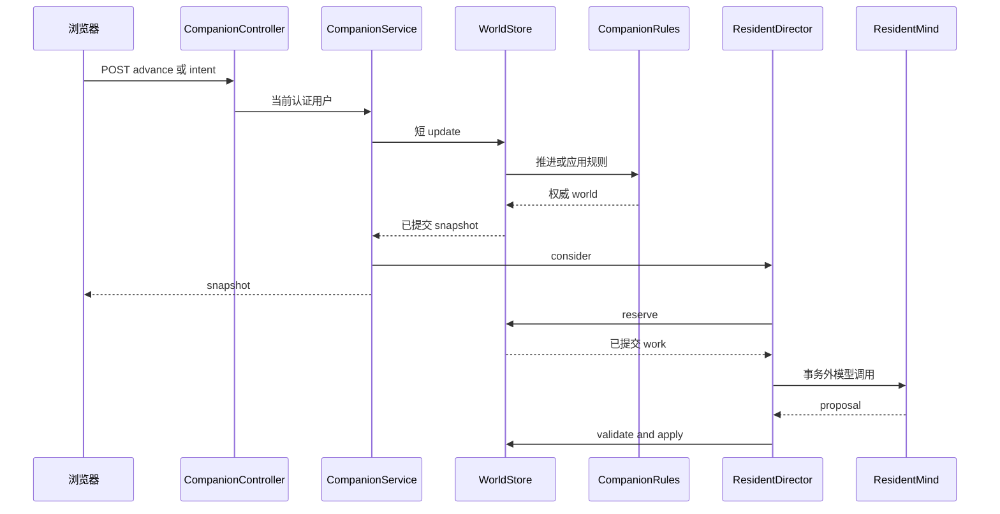

# 多 Agent 小镇：边界与专题入口

`Companion Town` 是每个已认证用户各自拥有的、持久化的服务端小镇；不是共享多人世界，也不是浏览器本地游戏。一次入住创建 avatar（`self`）以及 **25 个 NPC residents**，avatar 不计入该人数。重复入住返回已有存档而不重建它。[^world] [^population] [^http-it]

本页只给出系统边界和入口。规则细节、resident attempt、调度、持久化、记忆与实验方法应在相应专题维护；不要把本页重新扩展成实现清单。

## 一眼分清：谁可以写什么

小镇的关键不是“LLM 驱动”，而是**规则裁决、模型提案**：`ResidentMind` 可以针对给定居民视角提出行动、发言或解释；它不能直接写 `CompanionWorld`、文件记忆、Todo 或前端状态。模型返回后仍须经过服务端版本、证据、选项和物理合法性校验，才可能由规则提交。[^director] [^validation]

| 层次 | 可以表达的内容 | 权威写入者 | 不可跨越的边界 |
| --- | --- | --- | --- |
| 物理事实与规则结果 | 时间、地点、占用、行动结果、环境、项目与事件 | `CompanionRules`、`ResidentSimulation` | 不把动机、评价或猜测写成事实 |
| 公开言说 | 已接受的 conversation turn | `ConversationLifecycle` 的验证/应用路径 | 不把模型草稿当作已说出口的话 |
| 个人记忆 | 某个 owner 亲历、听闻或种子经历 | 规则产生或验证后持久化 | 不能成为全镇共享知识 |
| 个人信念/反思 | 居民对经历形成的可变解释 | 验证后的模型提案，附可用证据 | 不等同物理事实，可被 supersede |
| 用户真实任务 | Todo 内容与完成状态 | 既有任务模块与用户 | 小镇只校验关联 Todo 的归属，绝不自动完成或泄露任务文本 |
| 前端投影 | 画面、面板、轮询和即时反馈 | Pinia/Phaser/DOM | 不在客户端创造权威行动、记忆、结果或坐标 |

`Memory` 在持久化上按用户和 owner 分隔为 Markdown 文件；SQLite 仅是可重建的元数据索引。`JdbcWorldStore` 读入世界时按 owner hydrate，保存时先写记忆、再把不含 memories 的 world JSON 写入 MySQL。因此记忆文件与 world JSON 没有跨存储原子事务：备份、恢复和注销清理都必须覆盖 memory root。[^memory]

## 用户、API 与前端入口

`CompanionController` 位于 `/api/v1/town/companion`，从 `@AuthenticationPrincipal CurrentUser` 取用户 ID；客户端不能指定世界或用户。`CompanionService` 是 HTTP 用例边界。[^api]

| 用户动作 | API | 语义 |
| --- | --- | --- |
| 查看 | `GET /` | 返回 `{ joined, world }`，不推进世界 |
| 入住 | `POST /join` | 校验显示名和 IANA timezone；仅在无存档时创建世界，并触发异步考虑 |
| 推进 | `POST /advance` | 用服务器时钟推进确定性规则，再触发异步考虑 |
| 提交意图 | `POST /intents` | 校验请求及 focus Todo 所有权，写入 avatar intent |
| 取消意图 | `DELETE /intents/{id}` | 仅通过规则取消 pending/active intent |
| 查看用量 | `GET /usage` | 返回调用者当地日期、按 call type 汇总的模型 token/调用量；只读 |

`WorldStore.update` 是服务端世界转移闸门。JDBC 实现先 `select ... for update` 锁定用户行，因而同一用户的首次入住和后续 mutation 串行；只有 `revision` 改变时才写回 world JSON。[^world]

`useTownWorld` 是街道条和完整小镇视图共用的一份 Pinia 投影。它仅接收同一 world 且 `revision` 不倒退的 snapshot；可见时每 15 秒调用 advance、可见性恢复和 today/tasks 变化时刷新，并以消费者计数共用一条轮询计时器。`CompanionView.vue` 将返回的 world 映射为 Phaser 场景和 DOM 阅读面板，而非在本地运行模拟。[^frontend]

*规则提交、模型调用与模型结果提交是分离阶段；浏览器获得的是提交时的快照，稍后的模型结果由下一次读取或轮询投影。*

## 生命周期与不可突破的约束

- **时间与离线。** `CompanionRules.advance` 只接受晚于 `updatedAt` 的时间；它处理 focus/intent、居民模拟和环境更新。长时间离开只留下有界的回归摘要与近况，而不补演无限离线历史。[^advance]
- **意图、取消与专注。** 请求 ID 对相同载荷幂等，冲突复用返回 `INTENT_ID_REUSED`，pending intent 最多 20 条；`focus` 必须关联调用者拥有的 active Todo。取消或新意图改变 `intentRevision`，使迟到提案失效。focus 到点只结束小镇中的专注并提示由用户确认 Todo，绝不代勾真实任务；avatar 的无指令延续来自最近一次未取消的用户意图（及睡眠规则），而不是让模型编造用户现实生活。[^intents] [^focus]
- **异步安全。** `ResidentDirector` 在短 `store.update` 中 reserve，一次网络调用在事务外执行，再经另一次 update apply。一个世界可在 `parallelism` 上限内让不同 residents 同时思考，但 `worldId|residentId` 的 `thinking` claim 禁止同一居民重复在途，且所有写入仍串行；daily budget、executor pool/queue、每居民 decision throttle 与每世界 parallelism 都可配置。[^director] [^parallel]
- **上下文有界且按 owner 隔离。** 普通 decision 的 resident context 由至多 12 条仍有效的 self account（不足部分以 seed 填充）和至多 10 条“自上次被询问后”的原始经历组成；二者都只属于当前 resident，避免反思挤掉新近体验或其他居民的私有信息。[^recall]
- **失败关闭。** 过 90 秒、resident/intent revision 不匹配、引用不属于该居民或不在提供给本次调用的记忆切片、未选择精确合法 option 的结果都不可提交；`ResidentSimulation` 会再次检查地点、房间、目标、资源和占用等约束。模型 token 已消耗时，即使结果随后被拒绝，usage 仍应记录。[^validation]
- **对话不是自由写入。** model conversation 需匹配 operation ID、speaker、turn/intent version、共处地点及 45 秒窗口；只有通过验证的 utterance 才会追加，并分别写入说者 observed 与听者 heard 的记忆。离开、超时或重复空转等情况可以由确定性规则结束。[^conversation]

## 已实现、已决定、候选方案

### 当前已实现

上述 API、每用户存档与行锁、25 名 NPC、规则推进、异步 `ResidentDirector`、owner-scoped 文件记忆、共享 Pinia 投影和 Phaser/DOM 展示均已在当前代码或集成测试中存在。`CompanionV2HttpIT` 以真实 TCP、认证与 MySQL 验证未入住读取、入住后的 25 人/地点/房间、advance 后 reload，以及重复 join 不覆盖初始 avatar。[^http-it]

### 已决定但不应误称为新写入通道

模块依赖方向是 `interfaces → application → domain`；domain 不触碰数据库、HTTP、文件系统或自行读取时间。模型只读取受限的居民上下文并提出结果，规则负责可重复的世界事实和最终执行。[^modules]

### 候选或实验性工作

任何新的 resident cognition、prompt、触发器、记忆检索策略、指标或模型供应商路由，在有可运行实现和测试前都只是候选。不得以候选设计绕过 `WorldStore.update`、owner scope、证据验证、合法 action option 或 Todo 隐私边界。实验应复用应用服务与规则，而不是另造一套“更快但不同语义”的模拟。

## 专题导航

| 需要回答的问题 | 专题页 |
| --- | --- |
| HTTP/poll、加速 Harness、模型提交如何串联 | [小镇 Harness 总览与稳定边界](../architecture/companion-harness-overview.md) |
| world JSON、记忆文件、前端投影分别谁说了算 | [小镇状态所有权、持久化与并发提交](../architecture/companion-state-ownership-and-concurrency.md) |
| 入住、advance、intent、focus 与取消的端到端约定 | [Companion intents and focus](../workflows/companion-intents-and-focus.md) |
| 感知、公开事件、owner memory、belief 的概念区分 | 本页的“谁可以写什么”；专题页待补充 |
| resident context、bounded knowledge 与 evidence slice | 本页的异步安全约束；专题页待补充 |
| attempt loop、trigger priority、对话与 action commit | Harness 总览中的相关 workflow 链接 |
| 种子人口、空间与社会图 | `ResidentSeed`、`TwentyFiveResidentsTest`；应在种子专题维护 |
| 可重放实验、对照、指标和导出 | Harness 总览中的实验 Harness 链接 |

## 变更时先跑什么

- HTTP、加入、地图 wire shape 或 reload：`CompanionV2HttpIT`。[^http-it]
- 意图、focus、取消、离线与 avatar 延续：`CompanionRulesTest` 与 workflow 对应测试。[^advance]
- 并行模型、reservation、过期和调度公平性：`ResidentDirectorParallelTest`。[^parallel]
- 对话、发言写入、摘要和 owner context：`ResidentDirectorDialogueTest`。[^conversation]
- 文件恢复、owner 隔离与记忆索引：`FileMemoryStoreTest`；检索/信念的改动另跑 `CompanionRecallTest`。[^memory]

[^api]: `CompanionController` 和应用服务入口：repo://backend/src/main/java/com/betterself/growth/town/companion/interfaces/CompanionController.java#L9-L22；repo://backend/src/main/java/com/betterself/growth/town/companion/application/CompanionService.java#L24-L63
[^world]: `CompanionWorld` 的可序列化状态与 revision：repo://backend/src/main/java/com/betterself/growth/town/companion/domain/CompanionWorld.java#L9-L31；JDBC 行锁、创建和 revision 写入：repo://backend/src/main/java/com/betterself/growth/town/companion/adapters/JdbcWorldStore.java#L40-L61
[^population]: 种子扩展人口：repo://backend/src/main/java/com/betterself/growth/town/companion/domain/ResidentSeed.java#L125-L145；25 名 NPC、关系和住房断言：repo://backend/src/test/java/com/betterself/growth/town/companion/domain/TwentyFiveResidentsTest.java#L29-L94
[^http-it]: 真实 HTTP/认证/持久化集成验证：repo://backend/src/test/java/com/betterself/growth/town/companion/interfaces/CompanionV2HttpIT.java#L30-L99
[^modules]: 分层、时间输入、规则/模型/前端边界：repo://docs/02-modules.md#L7-L16；repo://docs/02-modules.md#L20-L29；repo://docs/02-modules.md#L60-L74
[^advance]: 单调推进、离线和 focus 完成：repo://backend/src/main/java/com/betterself/growth/town/companion/domain/CompanionRules.java#L32-L55
[^intents]: 校验、幂等、Todo ownership 与上限：repo://backend/src/main/java/com/betterself/growth/town/companion/application/CompanionService.java#L34-L52；规则优先级/取消：repo://backend/src/main/java/com/betterself/growth/town/companion/domain/CompanionRules.java#L57-L71
[^focus]: Todo 完成边界与 avatar fallback：repo://backend/src/main/java/com/betterself/growth/town/companion/domain/CompanionRules.java#L40-L46；repo://backend/src/main/java/com/betterself/growth/town/companion/domain/CompanionRules.java#L113-L165
[^director]: reserve、事务外模型 I/O 与配置：repo://backend/src/main/java/com/betterself/growth/town/companion/application/ResidentDirector.java#L13-L20；repo://backend/src/main/java/com/betterself/growth/town/companion/application/ResidentDirector.java#L74-L114
[^parallel]: thinking claim、world parallelism 与回收：repo://backend/src/main/java/com/betterself/growth/town/companion/application/ResidentDirector.java#L50-L67；repo://backend/src/main/java/com/betterself/growth/town/companion/application/ResidentDirector.java#L127-L138；测试：repo://backend/src/test/java/com/betterself/growth/town/companion/application/ResidentDirectorParallelTest.java#L48-L158
[^validation]: 结果年龄/版本/证据校验与规则执行合法性：repo://backend/src/main/java/com/betterself/growth/town/companion/application/ResidentDirector.java#L986-L1010；repo://backend/src/main/java/com/betterself/growth/town/companion/domain/ResidentSimulation.java#L2571-L2646
[^recall]: owner-only self account 与 working set：repo://backend/src/main/java/com/betterself/growth/town/companion/domain/CompanionRecall.java#L119-L173；director context 组装：repo://backend/src/main/java/com/betterself/growth/town/companion/application/ResidentDirector.java#L805-L846
[^conversation]: conversation operation、turn 应用和确定性结束：repo://backend/src/main/java/com/betterself/growth/town/companion/domain/ConversationLifecycle.java#L69-L114；repo://backend/src/main/java/com/betterself/growth/town/companion/domain/ConversationLifecycle.java#L175-L265
[^memory]: 文件权威、owner path、SQLite 索引与原子文件移动：repo://backend/src/main/java/com/betterself/growth/town/companion/adapters/FileMemoryStore.java#L18-L38；repo://backend/src/main/java/com/betterself/growth/town/companion/adapters/FileMemoryStore.java#L67-L99；repo://backend/src/main/java/com/betterself/growth/town/companion/adapters/FileMemoryStore.java#L106-L179；hydrate/persist seam：repo://backend/src/main/java/com/betterself/growth/town/companion/adapters/JdbcWorldStore.java#L64-L84
[^frontend]: 共享 store、revision guard 与 polling：repo://frontend/src/modules/companion/companion.store.ts#L9-L14；repo://frontend/src/modules/companion/companion.store.ts#L60-L98；repo://frontend/src/modules/companion/companion.store.ts#L130-L171；视图的场景职责：repo://frontend/src/modules/companion/CompanionView.vue#L161-L178
