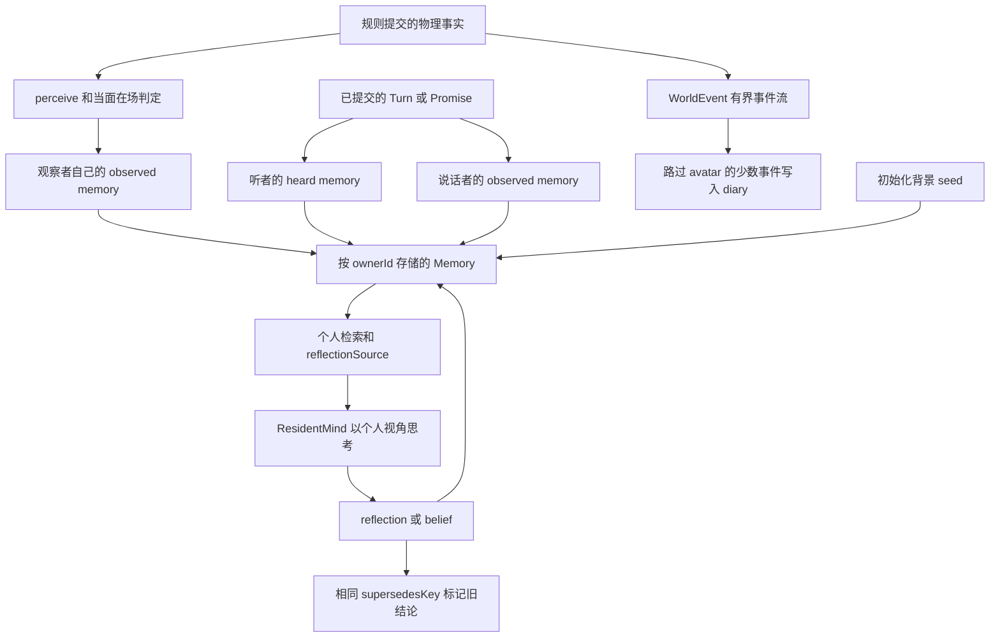

# 从事件到感知、记忆与信念

## 核心边界：同一件事不等于同一段记忆，更不等于同一项信念

系统有四个不可互换的层次：

| 层次 | 权威与内容 | 不应被误读为 |
| --- | --- | --- |
| 物理/制度事实 | `CompanionWorld` 的居民位置、对象、项目、承诺及规则提交的 `WorldEvent` | 某人知道、在意或认可该事实 |
| 公开言说 | 已提交的 `Conversation.turns` 与承诺的 `what`；说话是可被在场者听见的行为 | 说话者真实动机，或听者必然接受 |
| 个人记忆 | `Memory(ownerId, sourceId, sourceType, ...)`；每条只属于一个 `ownerId` | 全镇共享知识或客观记录 |
| 个人解释/信念 | `reflection` 是一次性解释，`belief` 是居民以 `supersedesKey` 标出的持续看法 | 规则从重复次数计算出来的真相 |

`WorldEvent` 是世界变更的有界公共事件流（最多保留 80 条），记录 `type`、地点、参与者、文本、项目和可选位置；它不是模型直接可见的“世界总览”。`ResidentMind` 的契约明确规定模型只看一名居民的视角，而不看 world aggregate、用户 intents 或 Todos。模型收到的 `Context` 也只带该居民可见的同室人、同房间对象、其已知项目/地点、个人记忆和已证明合法的行动选项。

上图展示事实、言说和各自记忆的扇出：共享的是发生的事情，不是“全员同一认识”。

## 从事实到个人感知

### 世界事件与直接观察

`ResidentSimulation.step` 每个模拟步先推进世界，再为每个居民执行 `perceive`。`perceive` 不为步行或睡眠者写观察；它会更新同地点项目的已知状态，并只在状态改变、观察者足够留意且并非贡献者时写一条 `observed` 记忆。随后 `witnessPeople` 处理“谁在这里、在做什么、坐在哪里”。

目击不是无条件复制：仅同一 room、未处于 `walk`/`travel`/`sleep`/`away` 的人属于在场者。敏感度低于阈值的居民不留痕；中等敏感度只记地点和“没留意具体做什么”，高敏感度才记位置和活动。活动文案来自固定映射表，而不是对方 `label`；因此观察记下的是可见事实，不能把对方私人的理由、用户输入或动机带入观察者记忆。

为了既保留重复行为形成模式的材料、又不让“谁在场”淹没人生记忆，系统同时用场景签名和每对人两小时最小间隔去重；离开房间会清掉当前签名，回来后才可成为新的观察。每位居民的记忆上限为 200；若 `who-was-here` 超过 40% 配额，目击记忆优先被逐出，之后才按 raw、`seed`/`reflection`、`belief` 的耐久层级裁剪。该裁剪是容量策略，不是在判定某条记忆真假。

### 当面言说与承诺：相同事实的不同视角

模型对话的每一个已校验并提交的 `Utterance` 都会先写 `Turn`，再扇出两条原始记忆：说话者得到 `observed` 的“我对 X 说”，听者得到 `heard` 的“X 当面说”。对话结束后，每名参与者可基于自己那组 turn memory 写一条 `reflection` 式 recollection；摘要必须引用该参与者的 turn memory。模型不可用时，生命周期会中性结束而不凭规则编造台词，避免伪造“说过的话”再被居民当作证据。

承诺同样先是结构事实：创建时要求双方同室、清醒且非途中，记录 `byId`、`toId`、地点、到期时间和当时在场 witness。承诺人得到 `observed`，被承诺人和 witness 分别得到 `heard`。到期并经过宽限后，规则只比较承诺人是否位于约定地点，写入 `came` 或 `did_not_come` 的事实性记忆；承诺人、对象和 witness 都可以随后被问及各自怎么看。`Promise.outcome` 不使用“守约”“背叛”之类解释性字段。

## Memory：来源、所有权、证据链

`Memory` 的所有权是硬边界：检索、反思材料和模型输出引用的 evidence id 都必须属于当前 `ownerId`。未来时间的记忆也不会被取回。`sourceId` 表示来源对象，不改变所有权：例如我听到别人说话，记忆仍属于“我”。

| `sourceType` | 层级 | 写入含义 |
| --- | ---: | --- |
| `seed` | raw 0 | 初始化的背景；是基础自述材料，不是当前事件 |
| `observed` | raw 0 | 本人做过或看见的事，包括自己的公开说话和世界观察 |
| `heard` | raw 0 | 当面听到的言说或承诺 |
| `reflection` | 1 | 居民对经历、行为或谈话的个人解释；可以不完整、错误或自利 |
| `belief` | 2 | 居民自己认定能替代某个既有话题的持续看法 |

`evidenceIds` 是可追溯性约束，不是把文本变成客观事实的认证。`applyReflection` 要求至少一个真实且由该居民拥有的记忆；`applyExplanation` 也拒绝引用他人记忆。应用层还在调用 `apply*` 前检查引用 id 位于实际提交给模型的那一段 `MemoryView` 中：普通决策/对话使用 `Context.memories`，反思使用专门的 `reflectionSource`，谈话摘要使用该参与者的 turn memories。过期结果或 resident revision 不匹配的结果被拒绝，而非覆盖更新后的世界。

## 检索：把“我是谁”与“刚发生什么”分开

`CompanionRecall` 仅检索该居民、时间不晚于 `now` 且未被 supersede 的记忆。普通 `retrieve` 以词和中文双字切分计算相关性，并将相关性作为 recency、importance、layer 基础分的乘子；没有问题的开放浏览则不施加相关性乘子。`reflection` 且 `sourceId == ownerId` 的自我陈述最多占结果的一半，其他槽位不足时才回填，避免居民只不断读回自己最近的理由。

构建 `ResidentMind.Context` 时，`ResidentDirector.perspective` 不使用一个混合排名窗口，而是合并两份有界材料：

1. **自述文档**：最多 12 条，先取未 superseded 的 `belief`（最近确认在前），再用最早的 `seed` 背景补齐。`reflection` 和普通 raw 事件不在此列。
2. **小工作集**：最多 10 条，只取 `seed`/`observed`/`heard` 这类 raw 记忆，且取自 `lastAskedAt` 之后、按时间倒序排列的内容。首次被问时 `lastAskedAt` 为 null，因此返回最近 raw 记忆；之后该边界由实际派发问题移动，不是按计时器切窗。

对话 turn 与 summary 是该水位线的特例：它们不推进 `lastAskedAt`，使对话扇出的 raw 记忆能留到下一次真正决策时进入工作集；当轮对话则直接看 transcript。反思的开放材料 `reflectionSource` 则通过无 query 的 `retrieve` 从该居民记忆中取最多 20 条，仍排除 superseded 结论。

## 从反思到可修订信念

规则只决定“是否值得回看”：`needsReflection` 排除 avatar，要求距上次反思至少三小时，并要求自上次反思以来的非目击 raw 重要性达到阈值，或跨入新的本地日期且出现日常提示。它不统计重复次数并替居民宣布模式；模型在 `ReflectRequest.source` 中自行浏览材料，也能看到自己仍有效的至多五条 `StandingBeliefView` 和可被信念覆盖的 habit key。

模型返回 `ReflectDraft` 时：

- `supersedesKey == null` 写入 `reflection`，即一次性想法；
- 非空 key 写入 `belief`，并先把**同一 owner、相同 key、尚未 superseded** 的旧结论标记为 `superseded=true`；旧记录不删除，供审计“以前怎么想”，但不再经普通检索或反思材料返回；
- key 是居民给出的标签；规则只对本居民 habit key 做允许校验。回传既有 belief 的 key/text 是为了让居民能选择复用而不是不断造近义 key，方向和文本仍由居民决定。

因此，`belief` 是居民基于自己可访问证据形成的、可撤回的解释层，而不是世界事实层的缓存。

## 规则反射先发生，动机只能事后形成

habit 或其他规则驱动的无意识行为通过 `recordDeed` 进入 `ResidentState.unexplainedDeeds`。`Deed` 只含 action、地点、面向旁观者的 note 和时间，规则不得写 motive，也不会立刻把 deed 当记忆；队列达到三件才值得请求 `ResidentMind.explain`，且最多保留八件，最旧的未解释 deed 会脱落。

`ExplainDraft` 是第二阶段：居民可以只覆盖部分 deed，并以自己的话说明；应用成功后，所列 deed 从队列移除，说明作为 `reflection` 写入其记忆并更新 `thought`。这条解释可能失真，正因如此不能倒灌到 `Deed` 或 `WorldEvent` 作为原因。若 mind 不支持 `explain`/`reflect`，director 将能力标为 unavailable，不把它计入模型故障退避，也不让规则代写动机或反思。

## 修改与验证要点

- 新增事件时，先决定它是世界结构事实、公开言说还是私人记忆；不要把 `WorldEvent` 文本直接复制为所有居民的知识。
- 新增可见性规则时，使用地点/room、活动和在场时刻等可观察条件；不要通过关系分值、私有 `label` 或别人的 `thought` 让居民“看见”不可见状态。
- 新增模型输出时，明确它能引用哪一组 `MemoryView`，并在提交路径同时做 prompt-slice 校验、owner 校验和 revision 校验。
- 不要把 `reflection` 自动升级为 `belief`，也不要为了修订而删除旧结论；应使用同一 `supersedesKey`。
- 重点回归测试包括：`WitnessPeopleTest` 断言目击事实、敏感度、去重及不泄露理由；`WitnessRetrievalTest` 验证目击材料可进入 `reflectionSource` 且说明拥挤窗口的边界；`CompanionRecallTest` 覆盖所有权、未来时间、层级、self account 和 working set；`ResidentReflectionTest` 验证触发、证据、supersession 与容量；`DeedExplanationTest` 固化“规则无动机、解释才成为记忆”的两阶段模型；`ResidentExplainReflectDispatchTest` 验证这些能力实际经 director 派发与提交。
