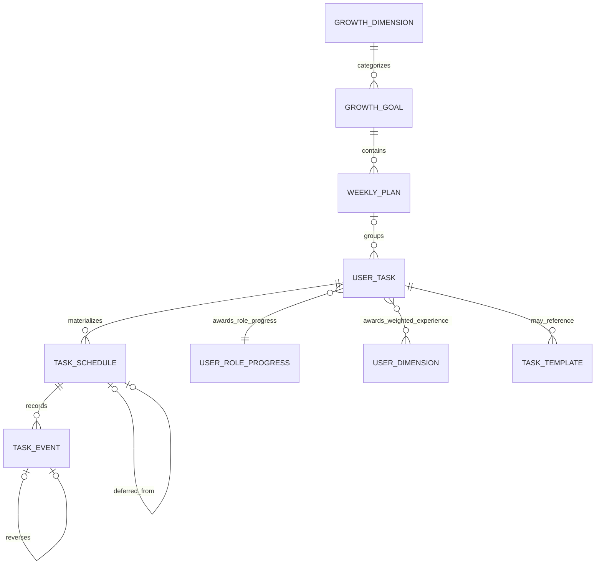
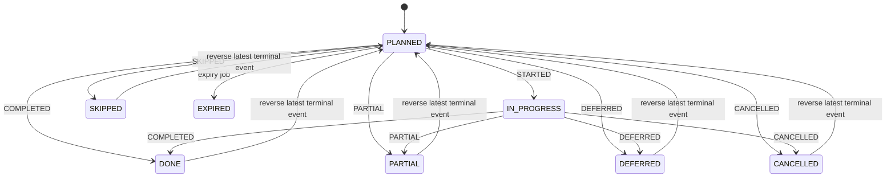

# 成长规划、任务与进度

成长工作刻意分为两层：**任务定义**描述用户要做什么，**日程实例**则是可在某个日期实际执行的项目。目标提供受限且归属某个维度的规划时段；周计划按周一开始的一周组织工作；`user_task` 保存重复规则、投入时长、角色和维度权重；`task_schedule` 将某一次执行具体化。`task_event` 是仅追加的执行账本，并保存任务快照，因此日后修改任务不会改写历史归因。[^model] [^snapshots]

HTTP 入口均从认证主体 `CurrentUser` 推导所有者：目标位于 `/api/v1/goals`，周计划位于 `/api/v1/plans/weekly`，任务位于 `/api/v1/tasks`，已排期工作及事件位于 `/api/v1/task-schedules`。角色进度读取入口是 `/api/v1/progress/roles`；伙伴档案、互动和购买入口在 `/api/v1/partners` 下。有关认证、CSRF 与资源所有权的通用边界，参见[认证与所有权](authentication-and-ownership.md)。[^endpoints]

## 模型与规划生命周期

*持久化的规划层级：任务定义、日程实例和事件账本彼此分离。*

### 目标、维度与周计划

目标引用系统维度，或引用该用户可见且未归档的维度。目标的起止日期按含首尾两日计算必须为 14–84 天；创建时会先锁定用户，再检查最多只能有三个 `ACTIVE` 目标。`ACTIVE` 与 `PAUSED` 可相互切换，或切换至 `COMPLETED`/`CANCELLED`；切回 `ACTIVE` 时会重新执行同一账户范围的上限检查。已被目标使用的用户自有维度不会物理删除，而是归档并停用。[^goals]

周计划必须从周一开始、与目标期间有重叠，且 `(goal, week_start_date)` 唯一。它初始为 `DRAFT`，状态只能是 `DRAFT`、`CONFIRMED`、`COMPLETED` 或 `ARCHIVED`，并保存 IANA 时区。首次设为 `CONFIRMED` 时写入 `confirmed_at`，后续更新不会覆盖该时间。[^plans]

任务的预计时长必须为 5–240 分钟，难度必须为 1–3；并且至少关联一个活跃、未归档的用户维度，每个权重为正且不超过 30。显式角色必须是 `STUDENT`、`FITNESS_USER`、`WORKER` 或 `EMOTIONAL_SUPPORT_USER`；未提供时由维度权重推断，无法匹配则回退到学生角色。模板引用仅在模板已发布且其场景匹配该角色时可用。[^tasks]

任务可直接附加到周计划，也可针对处于 `ACTIVE` 或 `DRAFT` 的目标创建。后一模式会验证活跃日期完全落在目标内，为覆盖的每周创建缺失的兼容周计划，将任务挂到第一个周计划，并立即为请求范围创建日程实例。相对地，附加到周计划的任务在调用 `POST /api/v1/plans/weekly/{planId}/materialize` 时展开。日程表的唯一键 `(task_id, planned_start_at)` 与 `insert ignore` 使重复物化保持安全。[^materialization]

`POST /api/v1/tasks/quick` 是轻量的第三条路径：它创建不隶属周计划或目标的独立 `user_task`，并在选定的本地日期创建一条 `PLANNED` 日程。该日程有意不设置 `planned_end_at`，故过期任务不会把未完成的清单项变成过期工作。快速创建同样要求幂等键。[^quick-tasks]

### 重复与时区

`RecurrenceRule` 仅支持 `DAILY` 和 `WEEKLY`，可使用 `INTERVAL`、`BYDAY`，以及二选一的 `COUNT` 或 `UNTIL`。周规则必须给出 `BYDAY`；重复或不受支持的属性、非正间隔/次数及格式错误都会返回 `INVALID_RRULE`。展开器从 `activeFrom` 起按本地日期遍历，应用频率和边界后，在计划时区将本地时间解析成 `Instant`。因此，重复的本地时间承诺会跨 DST 转换保持本地时间语义，而非假定固定 UTC 偏移。[^recurrence]

## 执行一个日程实例

普通执行的唯一变更边界是 `POST /api/v1/task-schedules/{scheduleId}/events`，必须提供 `Idempotency-Key`。服务拒绝客户端提交 `REVERSED` 或 `EXPIRED`，按所有者锁定日程，验证事件/状态转换，计算影响，写入事件和日程状态，并在同一事务中保存可重放响应。完成事件还会在计算每日经验前锁定用户行，以串行化该账户的并发完成操作。[^execution]

*允许的日程状态转换；撤销会记录补偿事件，而不是删除原事件。*

`STARTED` 是进入 `IN_PROGRESS` 的唯一转换。从 `PLANNED`，用户可开始、完成、部分完成、延期、跳过或取消；从 `IN_PROGRESS`，可完成、部分完成、延期或取消。任一终态都会拒绝再次提交终态事件，并返回 `INVALID_TASK_TRANSITION`。`PARTIAL` 必须给出严格介于零和一之间的比例；完成固定为 1.0，所有非进度结果比例均为零。[^state-machine] [^execution]

延期要求请求的新开始时间晚于当前时间。它将原日程置为 `DEFERRED`，并新建一条通过 `deferred_from_id` 相连的 `PLANNED` 日程；若源日程有结束时间，新日程的结束时间会按任务预计时长重算。[^defer]

### 事务与幂等性不变量

- **日程、事件、维度 XP、角色 XP、钱包变动、outbox/分析记录和幂等响应要么全部成功，要么全部回滚。** 事件保存执行时的任务标题、预计时长、难度、角色和维度权重。Redis 概览缓存仅在提交后失效，且此操作是尽力而为的，因为 MySQL 才是权威存储。[^execution] [^snapshots]
- **一个键标识用户范围内的一次操作及其精确请求内容。** `IdempotencyService` 保存规范 JSON 的 SHA-256 哈希及响应，保留 24 小时。相同请求重试会重放响应；同键不同请求体返回 `IDEMPOTENCY_KEY_REUSED`；首个事务尚未完成时的并发请求返回 `IDEMPOTENCY_REQUEST_IN_PROGRESS`。[^idempotency]
- **撤销是有序、补偿式且幂等的。** `POST /api/v1/task-schedules/{scheduleId}/events/{eventId}/reverse` 只接受该日程中最近一条、尚未被撤销的终态用户事件（`COMPLETED`、`PARTIAL`、`DEFERRED`、`SKIPPED` 或 `CANCELLED`）。它追加 `REVERSED`，抵销已记录的 XP 影响；根据是否存在此前的 `STARTED` 恢复为 `PLANNED` 或 `IN_PROGRESS`；对延期事件则取消其仍为 `PLANNED` 的子日程。[^undo]

### 过期处理

`ScheduleExpiryJob.expireDue` 以固定延迟运行，配置键为 `app.execution.expiry-delay-ms`，默认 60 秒，并在事务中执行。它用 `FOR UPDATE SKIP LOCKED` 锁定仍为 `PLANNED` 且 `planned_end_at` 早于当前时间的日程；由于 SQL 的比较对 `NULL` 不成立，无截止时间的日程不会被选中。条件更新将每条已认领记录变为 `EXPIRED`，并追加带快照、零 XP 的 `EXPIRED` 事件。多个任务工作者因此会跳过已锁记录，且与其他转换竞争的项目不会被重复登记为过期。[^expiry]

## 经验、角色与伙伴奖励

只有 `COMPLETED` 和 `PARTIAL` 能获得任务经验。基础值为 `ceil(minutes / 10) * difficulty`，钳制到 2–30 后乘以完成比例并四舍五入；按日程本地日期计算的每日经验最多 100。经验按任务保存的维度权重分配，最后一个维度接收舍入后的余数；维度经验不会降到零以下。[^experience]

每个任务都有一个职业角色。执行会在行锁下把实际获得的任务 XP 写入该角色的进度，按需初始化全部四个角色行，并在事件中单独记录**实际**角色增量。角色曲线覆盖 1–10 级，累计阈值是 `0, 10, 25, 50, 90, 155, 260, 430, 705, 1150`；角色总 XP 上限为 2,149，10 级的最终进度条显示为 999 XP。记录实际增量对于上限很重要：撤销只抵销实际被接纳的 XP。[^roles]

非零任务 XP 变动还会在同一执行事务中更新用户伙伴钱包。正 XP 奖励 `ceil(xp / 2)` 金币，负 XP 按同一向上取整规则扣除金币；余额被限制在 0–999,999，`lifetime_coins` 仅按实际正变动增加且同样上限为 999,999。购买操作锁定钱包，拒绝余额不足或物种不兼容的商品，之后扣减金币并增加宠物亲密度。伙伴功能的社交和奖励边界，另见[社交与奖励系统](social-and-reward-systems.md)。[^partner-coins]

读取伙伴档案时会惰性确保钱包与一只已选中的初始宠物。亲密度在 20 级以前按当前等级的 `level * 10` 阈值升级，20 级时保存的亲密度最多为 999。每日互动以用户时区的 `(user_id, local_date)` 为键：当天跨该用户所有宠物的首次互动增加两点亲密度，后续互动只更新时间戳。[^partners]

## 变更与测试指引

修改此处应保持任务定义与事件快照的区分，不应绕过 `TaskExecutionService` 直接修改日程状态或奖励余额。新增终态事件时，应把状态机、事件模式/约束、撤销策略、奖励计算、历史读取行为和测试作为一个特性同步更新。若客户端可重试某操作，应为其分配操作命名空间，并在事务内使用 `IdempotencyService`。

已存在的聚焦覆盖包括：

- `GoalPlanningIT` 覆盖目标数量/时长限制、所有权、周计划物化幂等性，以及直接目标任务的兼容周计划和物化。[^planning-tests]
- `RecurrenceExpanderTest` 覆盖 DST 本地时间展开及不支持 RRULE 的拒绝。[^recurrence-tests]
- `TaskStateMachineTest` 和 `ExperienceCalculatorTest` 固定状态转换与 XP 算法。[^execution-tests]
- `TaskExecutionIT` 覆盖幂等重放/键冲突、延期、过期、撤销（包括角色上限）、每日 XP 上限、独立清单和所有权；`TaskExecutionConcurrencyIT` 证明十个使用同一键的并发完成请求只产生一个事件和一条幂等记录。有关测试环境和验证分层，参见[验证策略](../testing/verification-strategy.md)。[^execution-integration-tests]
- `RoleProgressionServiceTest` 验证等级阈值与上限；`PartnerInteractionIT` 验证每天仅首次本地日互动授予亲密度。[^role-partner-tests]

端到端的用户操作顺序见[规划并完成工作](../workflows/plan-and-complete-work.md)。

[^model]: 核心表关系与约束：repo://backend/src/main/resources/db/migration/V1__baseline.sql#L96-L266；独立任务的计划可选性：repo://backend/src/main/resources/db/migration/V25__standalone_tasks.sql#L1-L2
[^snapshots]: 事件快照写入与提交后缓存行为：repo://backend/src/main/java/com/betterself/growth/execution/TaskExecutionService.java#L243-L269；repo://backend/src/main/java/com/betterself/growth/execution/TaskExecutionService.java#L368-L378
[^endpoints]: 目标 API：repo://backend/src/main/java/com/betterself/growth/goal/GoalController.java#L22-L105；规划/任务 API：repo://backend/src/main/java/com/betterself/growth/goal/WeeklyPlanController.java#L22-L71；repo://backend/src/main/java/com/betterself/growth/goal/TaskController.java#L23-L112；执行/角色/伙伴 API：repo://backend/src/main/java/com/betterself/growth/execution/TaskEventController.java#L20-L61；repo://backend/src/main/java/com/betterself/growth/career/RoleProgressController.java#L14-L36；repo://backend/src/main/java/com/betterself/growth/partner/PartnerController.java#L19-L83
[^goals]: 目标验证、锁与转换：repo://backend/src/main/java/com/betterself/growth/goal/GoalService.java#L81-L141；repo://backend/src/main/java/com/betterself/growth/goal/GoalService.java#L192-L227；策略：repo://backend/src/main/java/com/betterself/growth/goal/GoalPolicy.java#L11-L21
[^plans]: 周计划验证、唯一性处理与状态更新：repo://backend/src/main/java/com/betterself/growth/goal/DatabasePlanningService.java#L53-L84；repo://backend/src/main/java/com/betterself/growth/goal/DatabasePlanningService.java#L169-L185
[^tasks]: 任务验证、角色推断、权重与模板角色匹配：repo://backend/src/main/java/com/betterself/growth/goal/DatabasePlanningService.java#L86-L166；repo://backend/src/main/java/com/betterself/growth/goal/DatabasePlanningService.java#L489-L520；角色：repo://backend/src/main/java/com/betterself/growth/career/CareerRole.java#L9-L58
[^materialization]: 直接目标任务的兼容周计划/物化：repo://backend/src/main/java/com/betterself/growth/goal/DatabasePlanningService.java#L383-L456；周计划展开及防重日程插入：repo://backend/src/main/java/com/betterself/growth/goal/DatabasePlanningService.java#L232-L270
[^quick-tasks]: 快速任务创建、幂等性和无截止时间：repo://backend/src/main/java/com/betterself/growth/goal/QuickTaskService.java#L34-L60
[^recurrence]: 规则解析约束与本地日期展开：repo://backend/src/main/java/com/betterself/growth/goal/RecurrenceExpander.java#L25-L56；repo://backend/src/main/java/com/betterself/growth/goal/RecurrenceExpander.java#L63-L165
[^execution]: 事务命令处理、锁、影响及幂等性完成：repo://backend/src/main/java/com/betterself/growth/execution/TaskExecutionService.java#L74-L123；按所有者锁定日程及比例验证：repo://backend/src/main/java/com/betterself/growth/execution/TaskExecutionService.java#L192-L225
[^state-machine]: 允许的状态/事件转换：repo://backend/src/main/java/com/betterself/growth/execution/TaskStateMachine.java#L13-L33
[^defer]: 延期日程验证及插入：repo://backend/src/main/java/com/betterself/growth/execution/TaskExecutionService.java#L272-L290
[^idempotency]: 键验证、规范请求哈希、24 小时记录、冲突与重放语义：repo://backend/src/main/java/com/betterself/growth/execution/IdempotencyService.java#L32-L85
[^undo]: 撤销流程及可撤销事件查询：repo://backend/src/main/java/com/betterself/growth/execution/TaskExecutionService.java#L126-L165；repo://backend/src/main/java/com/betterself/growth/execution/TaskExecutionService.java#L292-L327
[^expiry]: 定时过期选择、条件状态更新与快照事件：repo://backend/src/main/java/com/betterself/growth/execution/ScheduleExpiryJob.java#L27-L65
[^experience]: XP 公式、每日上限和加权维度更新：repo://backend/src/main/java/com/betterself/growth/execution/ExperienceCalculator.java#L8-L22；repo://backend/src/main/java/com/betterself/growth/execution/TaskExecutionService.java#L231-L241；repo://backend/src/main/java/com/betterself/growth/execution/TaskExecutionService.java#L329-L353
[^roles]: 锁定/有上限的角色应用与曲线：repo://backend/src/main/java/com/betterself/growth/career/RoleProgressionService.java#L13-L16；repo://backend/src/main/java/com/betterself/growth/career/RoleProgressionService.java#L38-L91
[^partner-coins]: 任务金币变动与购买锁/验证：repo://backend/src/main/java/com/betterself/growth/partner/PartnerService.java#L118-L176
[^partners]: 惰性档案默认值、亲密度曲线和本地日互动唯一性：repo://backend/src/main/java/com/betterself/growth/partner/PartnerService.java#L34-L39；repo://backend/src/main/java/com/betterself/growth/partner/PartnerService.java#L87-L116；repo://backend/src/main/java/com/betterself/growth/partner/PartnerService.java#L178-L194；repo://backend/src/main/java/com/betterself/growth/partner/PartnerService.java#L303-L323；模式：repo://backend/src/main/resources/db/migration/V9__daily_partner_interaction.sql#L1-L16
[^planning-tests]: repo://backend/src/test/java/com/betterself/growth/goal/GoalPlanningIT.java#L49-L278
[^recurrence-tests]: repo://backend/src/test/java/com/betterself/growth/goal/RecurrenceExpanderTest.java#L15-L41
[^execution-tests]: repo://backend/src/test/java/com/betterself/growth/execution/TaskStateMachineTest.java#L9-L26；repo://backend/src/test/java/com/betterself/growth/execution/ExperienceCalculatorTest.java#L8-L27
[^execution-integration-tests]: repo://backend/src/test/java/com/betterself/growth/execution/TaskExecutionIT.java#L53-L239；repo://backend/src/test/java/com/betterself/growth/execution/TaskExecutionConcurrencyIT.java#L84-L121
[^role-partner-tests]: repo://backend/src/test/java/com/betterself/growth/career/RoleProgressionServiceTest.java#L7-L31；repo://backend/src/test/java/com/betterself/growth/partner/PartnerInteractionIT.java#L47-L75
