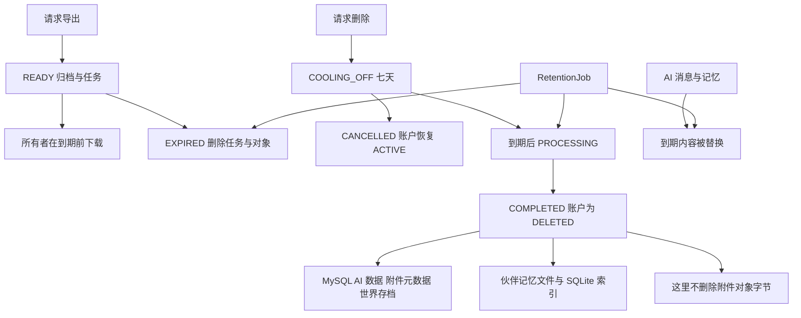

## 范围与所有权边界

隐私操作位于需认证的 `/api/v1/privacy`，附件的上传与关联则位于 `/api/v1/attachments`。控制器从 `CurrentUser` 取得内部用户 ID，并将其传给服务或 SQL 查询。导出状态、内容和下载查询同时按 `user_id` 与公开导出 ID 限定；附件关联也分别验证附件和目标任务事件都属于该用户。因此，猜中公开 ID 不能读取、下载或关联其他人的数据。认证与 CSRF 的契约见[认证与所有权](/openwiki/concepts/authentication-and-ownership.md)。

隐私功能必须盘点**全部持有用户数据的存储**，而非仅盘点 MySQL 表。伙伴世界状态保存在 `town_companion_world`，而居民记忆另有权威文件存储。`FileMemoryStore` 会在 `<root>/u<userId>/<residentId>/` 下为每条记忆保存一个 Markdown 文件；同目录的 SQLite `index.db` 是可重建索引，不是记忆的权威来源。导出和删除均通过 `MemoryStore` 接口处理这份文件数据，避免世界存档表示变化后遗漏它。

该图展示定时转换与清理边界：账户删除会清理 MySQL 所有的数据和伙伴文件数据，但可见的删除路径只将附件元数据标为已删除，并不删除附件对象。

## 附件：先元数据，后字节

`POST /api/v1/attachments/presign` 会在创建调用者拥有的 `attachment` 行之前验证声明的 MIME 类型、文件扩展名和大小。允许的组合是 JPEG（`jpg` 或 `jpeg`）、PNG（`png`）、PDF（`pdf`）和纯文本（`txt`）；大小必须大于零且不超过 10 MiB。对象键格式为 `attachments/<userId>/<publicId>.<lowercase-extension>`。响应提供有效期 15 分钟的上传 URL 及 `expiresInSeconds: 900`。

直接上传意味着对象存储接收文件字节，而 MySQL 保存所有者、对象键、声明的元数据、关联、校验和/扫描字段及删除时间。S3 提供方会为上传和归档直接写入请求 AES256 服务端加密；预签名上传保留声明的内容类型。默认内存对象提供方适合本地或测试：其字节仅存在于进程内，重启即丢失。

上传对象不会自动变为可用。`POST /api/v1/attachments/{attachmentId}/associate` 会按调用者 ID 查找未删除附件，要求其 `scan_status = CLEAN`，再按同一所有者查找目标任务事件，最后写入 `task_event_id`。待扫描、感染、失败或已删除的对象会得到 `ATTACHMENT_NOT_CLEAN`；不存在或属于他人的附件/事件会被视为未找到。数据库中新附件初始为 `PENDING`，状态集合还包括 `CLEAN`、`INFECTED`、`FAILED` 和 `DELETED`；已检查的应用代码没有将 `PENDING` 提升为 `CLEAN` 的扫描器或上传完成工作器。若要上线附件关联，部署必须补充并监控这项集成，否则关联始终不可用。

删除会把用户的所有附件行标为 `DELETED` 并设置 `deleted_at`，却不会对 `attachments/` 键调用 `ObjectStorage.delete`。因此不能把此方法单独表述为物理擦除附件字节。导出也不同：当前归档既不含附件元数据，也不含对象内容。若附件需要可携带或物理擦除，应以可靠、按所有者限定的对象存储清理方案，同时扩展导出和删除。

## 导出任务与下载访问

| 操作 | 端点 | 行为 |
| --- | --- | --- |
| 创建 | `POST /api/v1/privacy/exports` | 使用 `Idempotency-Key`；返回 `201 Created` 和已就绪导出视图。 |
| 查看 | `GET /api/v1/privacy/exports/{exportId}` | 返回所属任务状态、SHA-256 校验和、请求/完成/到期时间。 |
| 获取 URL | `GET /api/v1/privacy/exports/{exportId}/download` | 仅对所属且未到期的 `READY` 任务返回有效期 15 分钟的预签名下载 URL。 |
| 获取内容 | `GET /api/v1/privacy/exports/{exportId}/content` | 返回相同的所属可用 ZIP，类型为 `application/zip`，下载名为 `better-self-export.zip`。 |

`ExportService.create` 以所有者、`DATA_EXPORT` 操作和固定的 `zip-v1` 请求描述调用 `IdempotencyService`。同一已完成幂等键会重放已保存的导出视图。服务还会统计该用户过去 24 小时内的所有导出请求；若已有请求便以 `EXPORT_RATE_LIMIT` 拒绝新的请求，换不同键也不会绕过此限制。

创建是同步的：先构建 ZIP，经 `ObjectStorage` 写入 `exports/<userId>/<exportId>.zip`，对归档计算 SHA-256，随后持久化状态为 `READY` 的 `data_export_job`，其请求/完成时间相同，到期时间为 24 小时后。数据库还定义了 `PENDING`、`PROCESSING` 和 `FAILED`，但此实现不排队后台生产任务，也不会经过这些状态。归档构建或存储写入失败会阻止随后插入任务，而不是记录 `FAILED` 任务。

归档包含 `manifest.json`、`profile.json`、`goals.csv`、`task_events.csv`、`role_progress.csv` 和 `town_experience.json`。清单格式版本为 1。`town_experience.json` 含调用者的伙伴存档行及 `memories` 映射：代码从每个存档的 `residentStates` 数组发现居民 ID，再加载该居民的文件存储记忆。这样无需硬编码居民，且记忆迁出 `state_json` 后也不会在导出中丢失。当前归档构建代码没有导出附件、AI 消息或 `ai_memory`；在扩展前，不应将其宣传为覆盖所有存储的可携带数据导出。

可用性有双重约束：任务必须仍为 `READY`，且 `expires_at` 不得早于注入的时钟；否则下载和内容端点返回 `410 EXPORT_EXPIRED`。任务不存在或不属于当前用户时返回 `404 EXPORT_NOT_FOUND`。执行到期时，`expireDue` 删除对象并将任务改为 `EXPIRED`；数据库行与校验和作为生命周期元数据保留。

## 账户删除、撤销与取消

`POST /api/v1/privacy/deletion` 创建删除请求；若已有 `COOLING_OFF` 或 `PROCESSING` 请求，则返回该请求。新请求进入 `COOLING_OFF`，`process_after` 恰为七天后；同时账户改为 `DELETION_PENDING`、禁用通知并撤销全部会话。认证过滤器只允许删除待处理身份访问删除路由，使其可查看或取消请求而不能恢复日常活动。

`GET /api/v1/privacy/deletion` 返回当前冷却期/处理中请求；没有请求则返回 `DELETION_REQUEST_NOT_FOUND`。`POST /api/v1/privacy/deletion/cancel` 只能转换 `COOLING_OFF` 请求：它设置 `cancelled_at`，改为 `CANCELLED`，并恢复账户 `ACTIVE`。处理中的或已完成请求返回 `409 DELETION_NOT_CANCELLABLE`。由于发起删除时会撤销会话，客户端不应将取消视为会话恢复，而应预期重新建立可用会话状态。

到期处理通过 `FOR UPDATE SKIP LOCKED` 锁定已过 `process_after` 的冷却期请求，并逐一改为 `PROCESSING`。处理会将 AI 消息内容改为 `[DELETED]`，将 AI 记忆内容改为 `[DELETED]` 且状态设为 `DELETED`，标记附件元数据已删除，删除伙伴世界存档，调用 `companionMemories.deleteUser(userId)`，记录 SHA-256 完成回执，并在将账户设为 `DELETED` 前匿名化邮箱、显示名和密码哈希。

`MemoryStore.deleteUser` 会删除用户记忆目录、驱逐进程缓存并清除该用户的 SQLite 索引项。这是伙伴记忆清理的必要边界。它有意保持幂等，但文件系统操作位于 SQL 事务之外；文件系统失败可能在外部清理已部分发生后回滚数据库事务，而遍历中单个文件删除失败会被忽略。因此改变删除语义时，应把跨存储重试、可观测性和对账作为一等问题，不能假定数据库事务能使文件系统或对象存储操作原子化。

用户还可按所有者显式删除 AI 数据：`DELETE /api/v1/privacy/ai/sessions/{sessionId}` 会将该会话的消息内容改为 `[DELETED]`、设置消息 `deleted_at`，并将会话状态设为 `DELETED`；`DELETE /api/v1/privacy/ai/memories/{memoryId}` 会把对应记忆内容改为 `[DELETED]`、状态设为 `DELETED` 并记录 `deleted_at`。这些更新按用户 ID 和公开 ID 限定；即使目标不存在，端点仍返回 `DELETED` 状态。

## AI 保留与定时执行

用户以 `{ "days": 7 | 30 | 90 }` 调用 `PUT /api/v1/privacy/ai/retention` 设置 AI 保留选择。其他值返回 `INVALID_AI_RETENTION`；接受的值写入 `user_preference.ai_retention_days`。`AiService` 插入 AI 消息时以该所有者当前偏好计算 `expires_at`；仅当查到的值为 null 时回退到 30 天。因此修改偏好只影响随后插入消息的到期时间，更新端点不会重算既有消息到期时间。

`RetentionJob.enforce` 按 `${app.privacy.retention-cron:0 10 * * * *}` 运行，默认每小时第 10 分钟一次，并在事务中执行三类工作：

1. 将已到期且未删除的 `ai_message` 内容替换为 `[EXPIRED]`、状态设为 `FAILED`，并设置 `deleted_at`。
2. 将已到期且未删除的 `ai_memory` 内容替换为 `[EXPIRED]`、状态设为 `EXPIRED`，并设置 `deleted_at`。
3. 使已就绪导出对象到期，并处理已到期的账户删除。

保留任务不会删除 AI 行，而是脱敏其内容并记录删除/到期状态；也不会仅因 `ai_session.expires_at` 已过而清扫 AI 会话。运维必须确保调度启用，并保留默认值或显式配置 `app.privacy.retention-cron`；集成测试用遥远的 cron 表达式关闭自动运行，并直接调用服务方法以保证时间相关行为可确定测试。

## 变更与测试清单

添加个人数据存储或修改已有存储时，应作为一项完整的隐私设计变更完成以下事项：

- 为新权威数据源补充按所有者限定的导出和删除清理，包含非 SQL 存储与派生索引/缓存；不能假设 `state_json` 导出已覆盖外部文件。
- 明确删除是脱敏、元数据墓碑还是物理对象删除，并实现相应对象存储动作及重试/对账路径。
- 为每次状态、内容和下载查询，以及附件到事件之类的关系维护所有者过滤。
- 保持导出幂等性及每 24 小时一次的限额；验证重试不会创建重复归档。
- 测试时钟边界和跨账户隔离。`PrivacyFlowIT` 覆盖所属 ZIP 访问、导出限流与到期、七天冷却期、会话撤销、取消、完成删除和回执；`TownPrivacyIT` 验证只导出所有者的伙伴世界，且删除不会影响他人的世界。`AttachmentPolicyTest` 和 `RetentionPolicyTest` 覆盖窄允许列表、干净状态门槛、固定时长及可接受的 AI 保留选择。

[账户生命周期](/openwiki/workflows/account-lifecycle.md)与[本地开发和部署](/openwiki/operations/local-development-and-deployment.md)提供周边的用户生命周期和部署语境。
