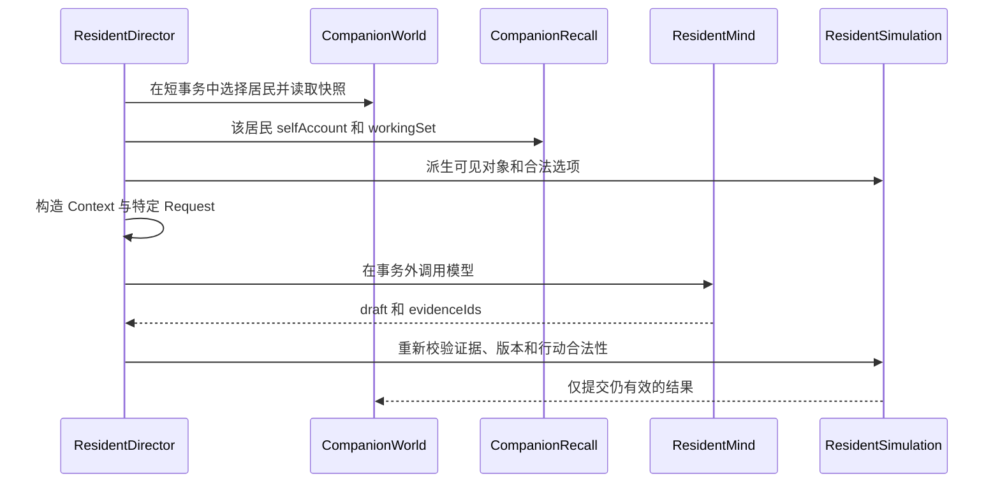

# Resident Context、限知与 Prompt 输入契约

`ResidentMind.Context` 是居民模型调用的**结构化视角快照**：它回答“此刻正在被问的这个居民，能够依据什么来回答”。`ResidentDirector.perspective(...)` 从世界状态派生该快照；不把整个 `CompanionWorld`、用户意图或内部控制量交给模型。它同时被普通 `decide`、对话、反应、日计划、解释、反思、承诺及 venture 调用复用；不同调用再在 `Context` 之外附加各自的问题材料。

这是一项限知设计，不是把模型当作全知世界模拟器：世界中存在某事，不等于该居民看见、听说或记得它；可观测的开发者数据，也不因此成为居民的感知。

上图展示上下文与提交的分离：模型思考不持有世界写锁，且回复不是世界事实，必须重新经过规则校验。

## 结构化契约：Context 中有什么

`ResidentMind.Context` 是 record 形式的显式 allowlist，而非 `CompanionWorld` 的序列化副本。生产路径使用其规范构造器；为旧测试 fixture 保留的兼容构造器不能被视为生产输入格式。所有时间以字符串表达，地点会把居民自己的实际 home id 映射为模型可说的 `home`；对象的进度也映射为“刚开始”“进行中”等定性状态。

| 输入面 | `Context` 字段及构造方式 | 含义与边界 |
| --- | --- | --- |
| 当下自我 | `residentId`、`localTime`、`weather`、`self`、`goal`、`occupation`、`lifeIntent`、`careerIntent`、`currentPlan` | 居民身份、可见角色/地点/活动、目标及当前生活线索。`PlanView` 带权威的剩余秒数，方便选择继续或恢复，但不是模型自行重置计划的权限。 |
| 定性身心与日常 | `salientPerceptions`、`routineCues`、`todaySoFar` | `salientPerceptions` 仅传达到显著阈值的体验，例如疲惫；`routineCues` 是“平常睡觉时间”一类习惯事实；`todaySoFar` 是今天已经做过的可观察动作、次数和时长。三者均不暴露数值量表，也不命令居民必须做什么。 |
| 人设 | `persona` | `ResidentSeed.narrative(residentId)` 的 `wantSelf`、`oughtSelf`、`actingSelf`、`memoryBias`、`looseningNote` 原文复制为 `PersonaView`。它影响表达、回忆取舍和动机背景，不能收窄 `availableActions` 或成为能力门槛；未编写叙事的居民及 avatar `self` 得到 `null`，不会猜造。 |
| 个人记忆 | `memories` | 合并最多 12 条自述与最多 10 条小工作集，且只取 `ownerId` 等于当前居民的记忆。记忆视图保留来源、文本、时间和可引用 id；其分层和窗口见下节。 |
| 眼前空间 | `nearby`、`peopleHere`、`visibleObjects`、`currentRoomId`、`positionUses` | `nearby` 只含同一 room、不是 `walk` 的人；`visibleObjects` 也只含当前 room 的物件。因此同一建筑不同房间的人或桌面物件不会泄漏。`peopleHere` 只给当前居民对眼前人的定性亲近感以及这份 context 中相关的本人记忆 id。 |
| 已知而非实时可见 | `knownPlaces`、`knownProjects` | 地点来自世界 locations，自己的家规范化为 `home`，其他居民的家不在其中；项目须满足该居民的 `knows`。项目进度被渲染为居民能理解的阶段及发起者名字。已知地点仅说明长期用途，不断言那里当前有人、营业或能进入。 |
| 对话和工作现场 | `conversation`、`workArrangements`、`cafeOperatorId`、`cafeRoleFacts`、`canTend`、`visibleServiceRequests`、`cafeStatus`、`cafeScheduleCue`、`cafeNotice`、`pausedAction`、`portableAction` | 当前对话 transcript 由调用点传入；工作安排只限与该居民有关或其作为经营者需要知悉的有效安排；服务请求限制在自身地点。暂停/可携带行动只描述权威原任务和剩余时间。 |
| 可做的事 | `availableActions`、`decisionOptions` | 规则实时产生动作名及完整的 action/place/room/target 叶选项。每个 `DecisionOptionView` 用一个 `id` 将四项绑在一起，避免模型把分别合法的字段拼成非法笛卡尔积。 |

## 记忆不是一个混合检索窗口

普通 context 的 `memories` 有两层，目的在于同时保留“我是谁/我相信什么”和“上次被问后发生了什么”，而不让居民近期的自我解释反复淹没输入：

1. **自述文档 `selfAccount`**：固定最多 12 条。先取该居民未被 supersede 的 `belief`，按最近确认倒序；未占满时由最早的 `seed` 背景补足。这样基础背景不会因时间早于第一轮调用而永久消失。
2. **小工作集 `workingSet`**：固定最多 10 条，只包含 raw 层的 `seed`、`observed`、`heard`，按时间倒序，且只取 `lastAskedAt` 之后发生的材料。`reflection` 与 `belief` 都是已加工的结论，不进入这部分。

`lastAskedAt` 是“这名居民上次被问”的个人水位，不是固定分钟窗口。调度在构造本次 context 后、预留本次模型调用时才推进它；因此下一次能看到的正是这次问题以后发生的 raw 经验。对话 turn 和 conversation summary 特意不推进该水位：turn 已直接取得 live transcript，而谈话产生的 raw 记忆必须能留到谈话结束后的下一次实际决策。

反思、谈话摘要和承诺到期想法不应误读为普通决策的记忆窗口：它们各自携带专用材料，例如 `ReflectRequest.source` 是个人开放回顾源，`SummaryRequest.conversationMemories` 是该参与者的谈话记忆，`PromiseSettledRequest.aboutThem` 则是当前居民关于承诺人的少量个人记忆。

## 不可进入的知识

下列排除主要由 `Context` 的字段形状和 `perspective(...)` 的过滤实现；它们是居民知识边界的关键部分。

- **真实用户 Todo、意图文本和内心念头**：`Context` 没有 `Intent`/Todo 字段，`perspective` 不遍历这些内容。avatar 可作为同室的 `nearby` 人出现，但其 name/label 是固定预写短语，不携带用户键入文本；即使 avatar 启用自主决策，其自己的 context 也不含用户文本。
- **世界总览与开发者视角**：不发送 `worldId`、world revision、intent revision、世界事件总表、模型预算/失败/调度状态，也不发送 mood、thought、`energy`、`social`、`curiosity`、人格数值、坐标、到期时间或记忆 importance。内部数据被转成必要的定性提示，或完全不出现在契约中。
- **他人的私密关系和内心状态**：其他居民的 `relationships` 原始分数、`affectionExpressed` 及其是否表白均不进入当前居民 context。仅当前居民面对眼前人时，才派生其自己的关系分数为“熟”“有点生分”等文字；这不是可交换、可讨价还价的数值。
- **不在眼前的实时情况**：`nearby` 与对象按 room 过滤，已知项目/地点也不是实时观察。特别是一个居民不知道的门锁状态，不可通过从 `knownPlaces` 删除地点来提前泄漏；“可命名”不等于“抵达一定成功”。

因此，测试、日志、数据库或运维人员可观察到的信息，除非被感知/记忆机制写成该居民拥有的材料，或被 `perspective` 明确派生到 allowlist 中，**不会自动成为居民感知**。

## Prompt 文字与结构化边界的职责不同

`QwenResidentMind` 将调用特定说明、JSON 序列化的输入对象和 JSON Schema 交给 `QwenProvider.generateStructured(...)`。普通决策的 prompt 会按本次情境挑选相关 `DecisionPromptLine`，并把完整 `Context` 追加为输入；对话、反应、日计划、解释、反思、承诺与 venture 则包装各自的 request record。提示文字会要求居民只扮演 `perspective.self`、只引用自己的记忆、不要猜 Todo/远处状态，解释 `sourceType`，并说明“没有”是正常答案。

但这些文字**不是隔离或动作安全边界**：模型可能忽略、误解或产出 schema 允许但世界已变化的内容。真正的边界是：

1. `Context`/request 的结构化 allowlist 决定什么数据实际离开应用层；
2. JSON Schema 对输出形状和枚举施加约束；普通决策的 schema 只接受本快照内 `decisionOptions` 的 `choiceId`；
3. `ResidentDirector` 在模型返回后校验 `evidenceIds` 必须属于实际给该调用的记忆集合，并重新解析所选 option；
4. `ResidentSimulation.applyDecision`、`proposeDecision` 及其他 `apply*` 依据 resident revision、必要时 intent revision 和领域规则提交。超过 90 秒的回复、过期版本、未给出的动作或不在输入窗口的证据都会被拒绝。

换言之，prompt 用于提升角色一致性和输出质量；结构、schema 与权威规则才负责信息最小化和世界写入安全。`availableActions` 也不是建议清单，而是本次规则已证明可行的选择空间；未列出的动作对模型来说就不可做。

## 调用生命周期、失败与扩展

`ResidentDirector.consider(...)` 先检查 mind 是否启用、世界版本、退避、预算及是否有值得处理的工作。`reserve(...)` 在 `store.update` 中按优先级选择具体工作并调用 `perspective(...)`，随后通过 `reserved(...)` 记录调用、占用“该居民正在思考”的键；网络模型调用发生在事务外。一个 world 可以有多个居民并行思考，但同一 resident 不会有两个在途调用，世界修改仍由短事务串行应用。

结果返回时，应用层会计量 usage，并在新事务中按具体调用类型应用草稿。对任何调用，超过 90 秒的结果不再代表当前场景；普通决策还必须引用本次合法 option 和本次 context 中的记忆。失败会保留既有计划并进入退避；不支持某项可选 `ResidentMind` 能力时，director 会作相应的中性处理或记住该能力不可用，避免同一触发在每个 tick 无限重试。接口提供未实现即抛出 `UnsupportedOperationException` 的默认方法，使已有实现可以逐项选择支持 day plan、reaction、reflection 等调用。

扩展 `Context` 时应遵循以下规则：

- 先问该字段是否是**当前这个居民**可感知、可记得或为一次动作校验所必需的事实；不要为了方便调试把 world state 放进去。
- 优先派生定性、最小化视图，而不是暴露内部量表和原始控制变量；新增结构字段时同步审查序列化、prompt、schema、应用校验和快照测试。
- 若新行为有目标/地点组合，应继续由规则生成原子 `DecisionOptionView`，不要让模型重组多个独立 enum。
- 若新增模型调用需要不同材料，应仿照 `ReflectRequest`/`SummaryRequest` 单独传入，并用同一份实际材料约束 `evidenceIds`；不要借用不相干的普通 `Context.memories`。

## 重点回归测试

- `ResidentContextSnapshotTest.exportsTheCanonicalNormalAndTiredInputsForTheSameResidentAndTask` 对同一居民、同一任务导出正常/疲惫/夜间例子：疲惫以定性 `salientPerceptions` 出现，夜间习惯作为 `routineCues`，而不是暴露 energy 数值。
- `ResidentDirectorTest` 覆盖 context 中只允许个人 memory、同地 nearby，并断言私有 intent 文本不出现；另有 avatar 在场及 avatar 自主决策时均不泄漏用户文字的回归。
- 同一测试类断言 `Context` record 不含 world revision、内部身心量表、关系 map 等字段；也断言他人 `affectionExpressed` 不会进入第三方 context。
- `aPerspectiveOnlySeesPeopleAndObjectsInItsCurrentRoom` 验证同一 cafe 的不同 room 仍彼此不可见；`actionPlaceRoomAndTargetMustComeFromTheSameLegalOption` 验证模型不能把合法字段重新拼出未提供的动作叶。
- `perspectiveMemoriesNoLongerFloodedByThisResidentsOwnPastReflections`、`workingSetHonoursThisResidentsOwnLastAskedAtMarkerRatherThanAFixedWindow` 与 `aConversationTurnDoesNotConsumeTheWorkingSet` 固定两层记忆、水位线和对话例外。

## 相关页面

- [从事件到感知、记忆与信念](events-perception-memory-and-belief.md)：memory 如何从世界事实和言说产生，以及 evidence 的语义。
- [认证与所有权](authentication-and-ownership.md)：用户、世界与权限归属，而不是居民局部知识。
- `workflows/action-legality-and-world-commit.md`：模型输出为何还必须经规则校验并提交。
- `workflows/resident-attempt-loop.md` 与 `workflows/resident-trigger-and-scheduling-catalog.md`：何时发起居民调用及其调度优先级。
