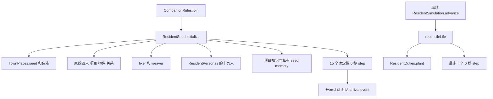

# 场景种子、居民初始基因与 Warm Start

`ResidentSeed` 是每个新 `CompanionWorld` 的**手工开局装配器**，不是运行时“招募”或自动生成剧情的系统。`CompanionRules.join(...)` 先建立 avatar 和原始四位居民，再调用 `ResidentSeed.initialize(...)`；初始化一次性清空并重建开局的居民状态、项目、物件、对话和地点，最终形成 25 名 NPC（avatar `self` 不计入），之后常规 `advance` 只做兼容修复、例行种植和模拟推进。[^join] [^seed-flow] [^population]

这里的“种子”包含静态人设、住所和社会图、日常职责及少量背景记忆；它们是开发者预置的实验条件。它们本身**不等于**居民在运行时观察到了某件事，更不能把测试、指标或 world 全局状态自动写成居民知识。只有明确写入某居民 `Memory` 的 seed，或后续经在场/言说等路径形成的个人记忆，才可作为该居民的材料。详见[事件、感知、记忆与信念](events-perception-memory-and-belief.md)及[Resident Context 与限知](resident-context-and-bounded-knowledge.md)。[^memory-boundary]



图示为新世界开局与后续推进的不同阶段：初始化负责手工装配和短 warm start；后续推进不重新播放开局。

## 入口、一次性语义与旧存档

- `initialize(w, now)` 以 `simulationVersion >= 2` 为幂等闸门。首次执行会保存当前 `revision`，设版本为 5，重置开局专属集合，关闭 `modelConversationsEnabled`，以 `past = now - 90s` 放入初始内容并 warm start；结束时恢复模型对话开关并恢复原始 `revision`。因此开局中的互动不是一次 LLM 调用的偶然产物。[^seed-flow]
- 后续 `ResidentSimulation.advance(...)` 仍会调用 `initialize`，但已初始化的世界直接跳过；接着 `reconcileLife` 为缺失 occupation/life intent/sleep schedule 的居民补值，调用 `ResidentDuties.plant`、`settleIn`，并处理路人。版本低于 5 的旧世界走**加性** `reconcileSecondVersion`：补缺的新人、住宅、物件与地点，但不清空列表、不覆盖演化关系或回退计划。[^simulation-advance] [^reconcile]
- `addResident(...)` 是手工新增居民的公开入口：ID 必须匹配 `[a-z][a-z0-9-]{1,30}`，姓名、角色和职业均非空，且不能与已有 state/actor 重名；成功才先建独立住所、再以 `newcomer` 添 state、actor、搬入 seed memory 和“在家安顿”的计划。它不会由模拟循环自行调用。若新增者应合住，调用方须改用 `TownPlaces.addFlatmate` 后走内部装配路径，不能把“独居建房”和“合住”混为一谈。[^manual-arrival]

这套语义也限定了实验复现：相同世界 ID、时区、加入时间和开局配置会经历相同的规则种子和 hash 型选择；但持久化后的世界已经有自己的关系、计划和记忆，不应再次调用 `initialize` 来“重置实验”。可重放 harness、对照和观测解释见[实验 harness 与架构 seam](../architecture/companion-architecture-hotspots-and-seams.md)。[^determinism]

## 人口、人设与“初始基因”

### 两批手工居民，而非运行时 persona 生成

开局保留四名基础居民 `owner`、`student`、`artist`、`gardener`，再手工加入独居的 `fixer`（周野）和与 `artist` 合住的 `weaver`（阿满）。`ResidentPersonas` 提供另外 19 名冻结的 `NewResident` 数据（ID、姓名、角色、职业、公共建筑、人生阶段、household 与叙事），`populateTheTwentyFive` 将其接入世界；总数因而为 25。[^base-six] [^population]

`ResidentSeed.PersonalityNarrative` 是五段文字：`wantSelf`、`oughtSelf`、`actingSelf`、`memoryBias`、`looseningNote`。`ResidentSeed.narrative(id)` 统一解析前六人与十九名新人的叙事；`self` 和未手工编写的 ID 返回 `null`，不会臆造 persona。`ResidentDirector.personaView` 每次组装 context 时复制这段静态文字；它是动机、表达和回忆取舍的背景，不是动作能力、阈值或授权门。[^narrative] [^persona-context]

数值人格是另一条独立轨道。`Personality.of(ResidentState)` 仅在 `personalitySeeded` 为 false 时为四名基础居民填入四个 0–100 维度（`extroversion`、`conscientiousness`、`sensitivity`、`volatility`），其他 ID 与 avatar 使用中性值；之后只读 state 中已经持久化的数值，绝不以初值覆盖漂移结果。规则实际读取这些数值来调整社交阈值/冷却、放弃项目机会、贡献幅度、观察细节和关系变化强度，而非仅作为展示数据。[^personality] [^personality-use]

### 住房、地点与可达的日常空间

`TownPlaces` 维护地点—房间—position 的结构及占用规则；`seed` 可以反复调用以补齐旧存档的 locations、rooms、positions、公共建筑和知识入口。`homeOf` 将 flatmate 路由到 host 的同一 `Location`；`addFlatmate` 则在该地址内为每人建立独占 bed、desk 与 bedroom，并建立共用空间/炉灶，避免“同住”退化为共用一张床。[^places] [^flatmates]

十九人的 `households()` 是住所分组的唯一源：host 建 home，其他成员 add flatmate；其 `occupationClusters()` 将 24 名居民分到 `cafe`、`garden`、`academy`、`shop`、`gym`、`board` 六个四人簇，`artist` 保持不绑定公共建筑。地点种植据此确保新增公共建筑和工作台等可占用位置存在。[^households] [^public-buildings]

### 初始关系与知识不是全图广播

原始四人开局彼此写入关系：对 `owner` 为 62，其余边为由世界 ID 和双方 ID 导出的确定值；`fixer`/`weaver` 的通用 newcomer 路径会与已有居民互设 40，随后 `artist`—`weaver` 改为双向 55。[^base-relations]

25 人扩展不能沿用“人人互相 40”：十九人以 `newcomer(..., false)` 出生，先不写任何关系，再只通过 `ResidentPersonas.initialRelationships()` 添住所 clique 与职业 clique 的有向边，并保留少数手工不对称值。既不共住也不同职业的 pair 以缺边表示陌生，而不是显式零分；这让开局社会图稀疏、聚类且可测不对称。[^relationship-graph] [^relationship-test]

项目知识也分层。每人先知道自己的开局项目；初始化随后把公告板上的项目元数据写为 `knownProjects`，使非项目 owner 知道项目存在、地点、状态、进度和来源为 `noticeboard`。这不是给每人附加“我亲历过”的 memory，更不表示其知道后来进展；后续进展仍须通过普通观察或获知路径到达个人视角。[^project-knowledge]

## 职责种子：偏好和可选行动，不是强制脚本

`ResidentDuties` 为 25 名 NPC 的每人定义起床/入睡时刻、2–4 段 `Duty`（时间、地点、action、事项、可选对象）和一段工作背景 seed memory。`plant` 按开始时间复制 duties，解析 `home` 为该居民的实际 home，写睡眠时刻；首次种植才额外写一条 topic 为 `work` 的 seed memory。职责表版本为 2：旧版可更新到新 duty 表，但已经主动清空 duties 的居民保留空表，且升级绝不写第二条工作 seed memory。[^duties] [^duty-lifecycle]

这些是居民可被日计划读取的**信念/线索**，并不会移动任何人或保证任务发生。日计划和决定循环仍须从规则给出的 `PLAN_ACTIONS`/合法选项中选择；`markProgress` 只在居民于该时段实际到达计划地点且未在 walk/sleep/away 时标记 `done`，错过的计划由后续反思处理。故不得将某条 duty、实验者看到的计划或其工作记忆描述为已经发生的行为。[^duty-semantics] [^duty-progress]

## 记忆、私有异常与确定性 Warm Start

初始化既放入背景，也有严格的私有性：每个基础居民有自己的项目/history seed；新人有“刚搬来”的 self seed；`ResidentDuties` 的工作叙述也归各自 owner。特别地，`student` 独有一条 topic 为 `anomaly`、来源为 `observed` 的手工**虚构**种子，描述前一天 15:30–16:30 的异常；其他居民并未因此获得该 memory。它是可被小川以后讲述、被人相信或质疑的开局材料，不能当成观测系统已接通的全局事实。[^private-anomaly] [^anomaly-test]

初始化还以 `past` 为 simulated time 连续调用 15 次 `step`，每次相隔 6 秒，然后将 `simulatedAt` 设回 `now`。期间模型对话被强制关闭，故可生成确定的早期交互与未完成计划。若咖啡馆开门，最后会覆盖 owner/artist 的即时计划、结束已有 active conversation 并开启两人围绕 `reading-night` 的对话，同时记录 `arrival`；打烊则只写安静到家的 arrival。这个 warm start 的规则产物可影响开局状态，但不应反推为每个居民都感知了所有开局写入。[^warm-start]

路人是相反的运行时例子：`reconcileLife` 在实际 advance 时按本地 8、11、18 点最多每日各写一次街道事件；没有 Actor、ResidentState 或模型心智。仅当时真正位于 `street` 的居民得到自己的 `observed` memory，空街不会广播。[^passersby]

## 变更准则与验证

1. **改人口或 persona 时**，同时审查 `ResidentPersonas.all`、households、occupation clusters、initialRelationships、`TownPlaces.homeOf`/家具与 `ResidentDuties.SEEDS` 的 referential integrity；不要只增加字符串 ID。新静态 persona 若要进模型 context，应经 `ResidentSeed.narrative`，未编写时保持 `null`。
2. **改种子数据或 warm start 时**，区分 world state、公开 event 与 owner memory；尤其不要因方便测试或观测而把开发者全局资料写入多人 memory。保留初始化关闭模型对话、固定 tick 数和最终 `simulatedAt=now` 的可复现边界。
3. **改旧存档逻辑时**，优先加性 repair：不要清空演化列表、重设关系、重新插 seed memory，或把居民主动清空的 duties 恢复回来。
4. **改空间时**，合住必须既共享地址又各有 bed/desk；新增 duty 的地点必须存在、home 必须解析到本人、action 必须是可提供的选项、`toId` 必须存在。

重点测试可从 backend 目录执行：

```bash
./mvnw test -Dtest=ResidentSeedTest,ResidentDutiesTest,TwentyFiveResidentsTest,PersonalityTest
```

`ResidentSeedTest` 锁定六人的独立床桌、阿满与知夏同址不同家具、六份叙事、私有 anomaly 及路人限知；`ResidentDutiesTest` 验证一次种植/升级不重复记忆、地点和 action 都可落地；`TwentyFiveResidentsTest` 检查人数、合住地址和稀疏不对称社会图；`PersonalityTest` 则验证数值种植不会重置持久化/漂移值且每个维度确有规则后果。[^seed-test] [^duties-test] [^twenty-five-test] [^personality-test]

## 已实现边界与未实现的“序章/剧本”

当前实现是**手工居民 + 手工初始世界 + 短确定性 warm start**：静态 source 内的姓名、人设、住所、关系、项目、物件、背景和固定规则步骤共同给实验一个可比较起点。它不是通用的序章编排器、可配置场景 DSL、按章节推进的剧本、运行时生成 persona，亦没有“新居民因世界需求自动出现”的机制。[^manual-arrival] [^seed-flow]

若未来引入序章/剧本系统，应把它作为待实现的新入口：明确输入版本、可审计的 state/event/memory 写入、每位居民的知情条件、幂等/迁移语义及与 warm start 的互斥或组合规则，并补充可重放测试。在这些契约与实现出现前，不应把当前静态种子说明成已经支持的剧情系统。

[^join]: `join` 创建初始 world 并调用初始化：repo://backend/src/main/java/com/betterself/growth/town/companion/domain/CompanionRules.java#L17-L30
[^seed-flow]: 初始化、版本闸门、基础内容和结束状态：repo://backend/src/main/java/com/betterself/growth/town/companion/domain/ResidentSeed.java#L125-L224
[^population]: 十九人接线与 25 人测试：repo://backend/src/main/java/com/betterself/growth/town/companion/domain/ResidentSeed.java#L273-L284；repo://backend/src/test/java/com/betterself/growth/town/companion/domain/TwentyFiveResidentsTest.java#L29-L39
[^memory-boundary]: Memory 的 owner 边界和 seed 含义：repo://backend/src/main/java/com/betterself/growth/town/companion/domain/CompanionWorld.java；repo://backend/src/main/java/com/betterself/growth/town/companion/application/ResidentDirector.java#L851-L885
[^simulation-advance]: advance 的初始化、修复、离线截断与 step 限制：repo://backend/src/main/java/com/betterself/growth/town/companion/domain/ResidentSimulation.java#L164-L180
[^reconcile]: `reconcileLife` 与加性 version migration：repo://backend/src/main/java/com/betterself/growth/town/companion/domain/ResidentSeed.java#L37-L50；repo://backend/src/main/java/com/betterself/growth/town/companion/domain/ResidentSeed.java#L226-L240
[^manual-arrival]: `addResident` 验证、建房和 newcomer 装配：repo://backend/src/main/java/com/betterself/growth/town/companion/domain/ResidentSeed.java#L245-L299
[^determinism]: position 选择使用 world/resident/position 的确定性 hash：repo://backend/src/main/java/com/betterself/growth/town/companion/domain/TownPlaces.java#L383-L388
[^base-six]: 基础四人、两位手工新人及其开局：repo://backend/src/main/java/com/betterself/growth/town/companion/domain/ResidentSeed.java#L133-L180
[^narrative]: `PersonalityNarrative`、统一查询与 null 语义：repo://backend/src/main/java/com/betterself/growth/town/companion/domain/ResidentSeed.java#L71-L124
[^persona-context]: `ResidentDirector` 将叙事复制为 PersonaView：repo://backend/src/main/java/com/betterself/growth/town/companion/application/ResidentDirector.java#L876-L886
[^personality]: 人格的有状态首次种植和中性回退：repo://backend/src/main/java/com/betterself/growth/town/companion/domain/Personality.java#L20-L63
[^personality-use]: 人格派生规则与调用点：repo://backend/src/main/java/com/betterself/growth/town/companion/domain/Personality.java#L65-L95；repo://backend/src/main/java/com/betterself/growth/town/companion/domain/ResidentSimulation.java#L345-L368
[^places]: `TownPlaces.seed` 的自修复地点/位置流程：repo://backend/src/main/java/com/betterself/growth/town/companion/domain/TownPlaces.java#L170-L210
[^flatmates]: home 路由及 flatmate 的独立家具：repo://backend/src/main/java/com/betterself/growth/town/companion/domain/TownPlaces.java#L70-L105；repo://backend/src/main/java/com/betterself/growth/town/companion/domain/TownPlaces.java#L121-L164
[^households]: households、职业簇和关系图来源：repo://backend/src/main/java/com/betterself/growth/town/companion/domain/ResidentPersonas.java#L249-L325
[^public-buildings]: 公共建筑与可占用位置：repo://backend/src/main/java/com/betterself/growth/town/companion/domain/TownPlaces.java#L211-L243
[^base-relations]: 原始关系和阿满/知夏修正：repo://backend/src/main/java/com/betterself/growth/town/companion/domain/ResidentSeed.java#L137-L172；repo://backend/src/main/java/com/betterself/growth/town/companion/domain/ResidentSeed.java#L293-L299
[^relationship-graph]: 十九人不默认相识并只接作者关系边：repo://backend/src/main/java/com/betterself/growth/town/companion/domain/ResidentSeed.java#L273-L284；repo://backend/src/main/java/com/betterself/growth/town/companion/domain/ResidentPersonas.java#L286-L325
[^relationship-test]: 稀疏和不对称的测试约束：repo://backend/src/test/java/com/betterself/growth/town/companion/domain/TwentyFiveResidentsTest.java#L59-L85
[^project-knowledge]: 自己项目、公告板项目知识及其边界：repo://backend/src/main/java/com/betterself/growth/town/companion/domain/ResidentSeed.java#L146-L147；repo://backend/src/main/java/com/betterself/growth/town/companion/domain/ResidentSeed.java#L196-L201
[^duties]: 职责表、允许的 action 与版本：repo://backend/src/main/java/com/betterself/growth/town/companion/domain/ResidentDuties.java#L34-L52
[^duty-lifecycle]: `plant` 的一次记忆、版本更新和主动清空保护：repo://backend/src/main/java/com/betterself/growth/town/companion/domain/ResidentDuties.java#L168-L181
[^duty-semantics]: 职责是 belief/cue 而非移动命令：repo://backend/src/main/java/com/betterself/growth/town/companion/domain/ResidentDuties.java#L15-L30
[^duty-progress]: 计划时段查询和 done 的物理条件：repo://backend/src/main/java/com/betterself/growth/town/companion/domain/ResidentDuties.java#L183-L210
[^private-anomaly]: 私有虚构 anomaly 种子：repo://backend/src/main/java/com/betterself/growth/town/companion/domain/ResidentSeed.java#L202-L207
[^anomaly-test]: 私有 anomaly 的测试：repo://backend/src/test/java/com/betterself/growth/town/companion/domain/ResidentSeedTest.java#L74-L80
[^warm-start]: 固定 15 step、模型关闭和开局对话：repo://backend/src/main/java/com/betterself/growth/town/companion/domain/ResidentSeed.java#L208-L223
[^passersby]: 路人时钟、无脑实体及仅街上居民记忆：repo://backend/src/main/java/com/betterself/growth/town/companion/domain/ResidentSeed.java#L305-L334
[^seed-test]: ResidentSeed focused tests：repo://backend/src/test/java/com/betterself/growth/town/companion/domain/ResidentSeedTest.java#L21-L101
[^duties-test]: ResidentDuties focused tests：repo://backend/src/test/java/com/betterself/growth/town/companion/domain/ResidentDutiesTest.java#L12-L79
[^twenty-five-test]: TwentyFiveResidents focused tests：repo://backend/src/test/java/com/betterself/growth/town/companion/domain/TwentyFiveResidentsTest.java#L29-L95
[^personality-test]: Personality focused tests：repo://backend/src/test/java/com/betterself/growth/town/companion/domain/PersonalityTest.java#L20-L97
