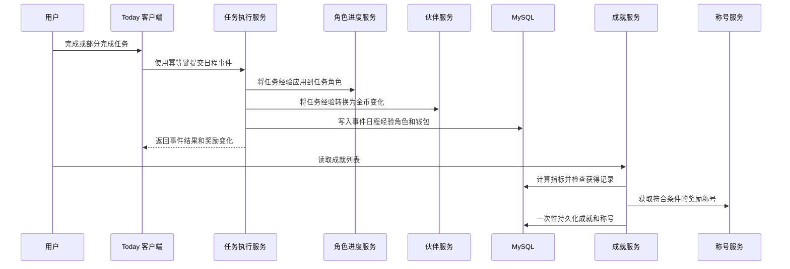
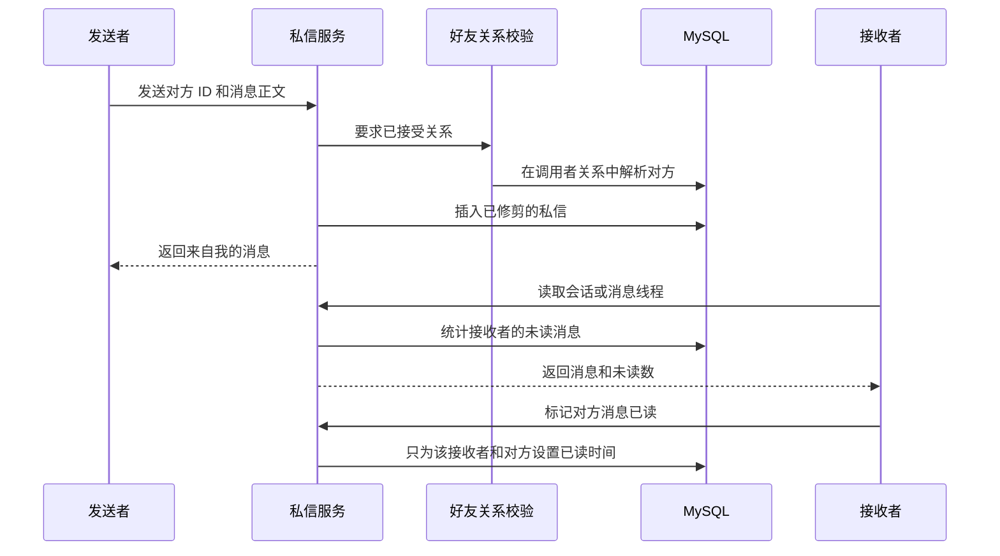

# 社交与奖励系统

这些面向用户的功能相互独立，但有两条关键连接：任务执行是经验、职业角色进度和伙伴金币的权威来源，成就系统随后从已持久化的历史中计算结果；社交可见性则以关系为门槛。认证用户只能操作自己的数据，只有在双方接受好友关系后，才可读取对方受限的进度资料。认证、会话及 CSRF 机制见[认证、会话、同意与所有权](/openwiki/concepts/authentication-and-ownership.md)，任务事件与奖励计算见[成长规划、任务与进度](/openwiki/concepts/growth-planning-and-execution.md)。

## 入口与所有权边界

控制器从 `@AuthenticationPrincipal CurrentUser` 取得 `user.id()` 并传给服务层；公开 ID 仅用于定位资源，不能自行授予访问权限。[^controllers]

| 范围 | 主要入口 | 变更入口 | 所有权或可见性规则 |
| --- | --- | --- | --- |
| 每日状态 | `GET /api/v1/daily-status` | `POST /api/v1/daily-status` | 每位用户、每个本地日期一条记录。 |
| 成就与称号 | `GET /api/v1/achievements`、`GET /api/v1/titles` | `PATCH` 或 `DELETE /api/v1/titles/equipped` | 定义全局共享；获得与佩戴状态归调用者所有。 |
| 角色进度 | `GET /api/v1/progress/roles` | 无直接公开写入接口 | 只有任务执行会改变调用者的角色行。 |
| 伙伴 | `GET /api/v1/partners/profile` | 创建、编辑、选中、互动宠物，以及 `POST /api/v1/partners/purchase` | 宠物查询始终同时按 `user_id` 与宠物公开 ID 过滤；钱包按用户隔离。 |
| 好友与私信 | `GET /api/v1/friends`、好友详情/摘要、会话和消息 | 申请、接受/拒绝/删除、发送、标记已读 | 资料或私信操作要求调用者参与一条 `ACCEPTED` 关系。 |
| 群组 | `/api/v1/friends/groups` 下的列表、详情、消息与未读摘要 | 创建、发送、标记已读 | 创建者及受邀者均存为成员；之后每次读取和发送都要求成员资格。 |

好友申请按规范化邮箱查找目标，并要求账户处于活跃、未删除状态且没有开启 `solo_growth`。对无法添加的目标返回同一种未找到结果；不能给自己发送申请。关系使用由两个内部 ID 排序生成的 `pair_key`，因此每一对用户最多一条关系。若目标此前已向当前用户发出待处理申请，反向申请会直接变为 `ACCEPTED`；显式接受或拒绝只能由收件人完成。删除关系会立即切断好友资料和私信访问。[^friendship]

`solo_growth` 只阻止通过好友申请发现**新的**关系，并不是通用授权机制。新增社交 API 时，应在服务层复用 `requirePeerId` 或 `requireMember` 一类的校验，而不能信任浏览器传入的对方或群组公开 ID。[^friendship] [^group-membership]

## 每日状态：持久化的节奏建议

每日状态把 `LOW`、`STEADY` 或 `OPEN` 精力，以及 10–180 分钟的可用时间，记录到用户本地日期。服务端自行推导建议值，不接受客户端指定的建议：

- 精力为 `LOW` **或**时间少于 20 分钟，得到 `SHRINK`；
- 精力为 `OPEN` 且时间至少 45 分钟，得到 `KEEP`；
- 其他情况得到 `LIGHT`。

同一用户同一日期再次保存会更新既有行，数据库唯一键保证每日只有一条状态。控制器在未指定日期时以账户时区确定当天。保存后会尽力删除该用户的 Redis insights overview 缓存；Redis 不可用不会使已在 MySQL 中完成的保存失败。`weeklyStats` 为 Insights 提供打卡数以及建议和精力的分布。[^daily-status]

Today 客户端会同时载入当天任务和保存的状态：`SHRINK` 按预计时长从短到长排列活动任务并推荐前两项，`LIGHT` 推荐第一项已排期任务，`KEEP` 保持日程顺序。这只是展示建议，不会改变任务，用户仍可按通常流程执行、推迟或部分完成日程。最新状态还会补充进 AI 系统提示词，要求建议遵循该节奏。[^today-pacing] [^ai-daily-context]

## 成就与称号

成就是数据驱动的：每条激活定义包含展示元数据、JSON 条件和可选的奖励称号代码。`GET /api/v1/achievements` 是有意设置的惰性评估边界：它计算调用者指标、检查所有激活定义，并在尚未获得且条件成立时写入 `user_achievement`，再在同一事务中授予已配置且激活的称号。`(user_id, achievement_code)` 唯一键和称号插入的重复处理使重复读取不会重复发奖。因此，成就不会在任务事件写入时自动弹出，而是在读取成就列表时评估。[^achievement-lifecycle]

指标仅纳入未被撤销的 `COMPLETED` 和 `PARTIAL` 事件。每周动作数和完成率按用户时区计算本周一至今天；总维度经验和角色等级取当前总值；相邻活跃日期相隔至少八天计一次恢复；连续活跃天数取最长序列。条件求值器支持正整数阈值的 `effective_actions`、`recovery_count`、`longest_streak`、`total_experience`，范围为 `(0, 1]` 的 `fulfillment`，指定角色等级、达到最低等级的角色数量以及最高角色等级。缺失、格式错误或未知的 JSON 条件都会安全地判定为不满足。[^achievement-metrics] [^achievement-conditions]

称号目录与调用者的持有记录左连接；新获得的称号默认未佩戴。佩戴前，服务锁定用户行，验证调用者持有一个仍激活的称号，清除其全部佩戴标记，再设置目标称号；取消佩戴同样清除全部标记。数据库以生成列 `equipped_user_id` 和唯一键保证即使绕过服务写入，每个用户也至多佩戴一个称号。资料接口通过 `TitleService.equipped` 暴露选中的称号与边框。[^titles]

## 任务到奖励的生命周期

*任务事件原子地改变进度和金币；之后的成就列表读取评估持久化结果，并至多授予一次称号奖励。*

每个任务属于四个角色之一：`STUDENT`、`FITNESS_USER`、`WORKER` 或 `EMOTIONAL_SUPPORT_USER`。`RoleProgressionService` 会按需为所有四种角色创建进度行，并锁定要更新的目标行。总角色经验会被限制到 0–2,149，再依累计阈值 `0, 10, 25, 50, 90, 155, 260, 430, 705, 1150` 映射为 1–10 级。API 返回当前等级内的进度；第 10 级在展示上使用 999 XP 的需求值。执行事件保存实际获准的角色经验差值，因此在触顶后撤销仍然安全。[^roles] [^task-rewards]

伙伴钱包也在任务执行事务中更新：正任务经验产生 `ceil(xp / 2)` 金币，撤销请求相应的负变化。钱包在变更前加锁，余额限制为 0–999,999；`lifetime_coins` 只按实际正变化增加，且同样有上限。因此，一个任务事件的维度经验、角色进度、钱包变化和幂等结果共享执行事务；撤销使用事件记录的经验，而不根据可能已改变的任务重新计算。[^task-rewards] [^partner-wallet]

## 伙伴资料、亲密度与购买

读取 `/partners/profile` 会惰性创建调用者钱包；如果尚无宠物，也会创建一只选中的初始橘白中华田园猫。用户可创建八种允许物种中的一种，并且只能编辑名称、品种和毛色。切换选中宠物时，先清除该用户全部宠物的选中状态，再选中其拥有的目标宠物。资料还返回激活的商店物品与静态素材库链接。[^partner-profile]

亲密度是按宠物保存的等级进度：20 级前，每级需要 `level * 10` 亲密度；余量可跨越多级；20 级时保存的亲密度最多为 999。互动日按主人时区计算，并插入到唯一键 `(user_id, interaction_date)`。所以一个用户在某个本地日内、跨全部宠物的第一次互动才获得 2 点亲密度；之后互动只更新 `last_interacted_at`，奖励为零。[^partner-affection]

购买会验证激活商店物品存在、物种限制适用于目标宠物，并在锁定的钱包中确认余额充足；随后在一个事务中扣除价格、增加物品亲密度，并写入购买流水。客户端可以禁用不可能的购买以提供反馈，但服务器校验仍是权威。[^partner-purchases]

## 好友、消息与已读状态

*每项私信操作均校验关系；未读状态属于接收账户。*

私信的发送、列表和标记已读均要求已接受的好友关系。正文会修剪，必须非空且最多 1,000 个字符。线程在存储查询中按最新在前，反转后按时间顺序返回；每次请求上限是 100 条，默认 50 条。会话只包含至少有一条消息的已接受好友，按最后消息时间排序；未读数是对方发送给当前用户且 `read_at` 为 null 的消息数。标记已读只更新由指定已接受好友发给当前调用者的消息。前端仅在文档可见时每四秒轮询打开的线程，并静默重试轮询失败；这不是实时推送通道。[^direct-messages] [^chat-client]

群组名称必须非空且最长 80 个字符，至少选择一位已接受好友，且包括创建者在内最多十人。创建时会将拥有者和每位已接受的受邀者作为成员插入，其初始已读时间为创建时刻。之后的详情、消息、发送和已读操作都要求调用者有 `friend_group_member` 行。群组未读是其他发送者在该成员 `last_read_at` 之后的消息，而私信未读仍使用每条消息的 `read_at`；未读摘要合并两者并选出最新的未读目的地。[^groups]

已接受好友的详情是有意受限的社交投影：显示身份、汇总等级/经验、Insights 概览、最长连续记录、角色等级、选中宠物、属性和对方本地日期的日程。它不会移交对方任务、钱包或宠物的控制权。关系校验发生在调用这些内部服务之前，所以公开路由不得直接复用这些服务的按用户 ID 方法，除非提供同等的关系校验。[^friend-profile]

## 修改与验证指南

- **新增奖励：** 保持任务执行的事务边界，并记录撤销时可实际应用的差值。若奖励属于解锁机制，明确它应像成就一样惰性评估，还是处在事件事务内；不要无意间让 `GET` 成为写操作。
- **新增社交投影：** 最小化字段集合，在查询对方数据前以已接受好友关系或群成员资格校验，并在每个受所有权约束的写操作中保留 `user_id` 谓词。
- **修改每日策略：** 同时更新 `DailyStatusService.adviceFor`、Today 的排序与推荐行为、AI 提示词和 Insights 预期。建议会被持久化，策略修改不会回溯重算既有行。
- **运行聚焦测试：** `AchievementConditionEvaluatorTest` 覆盖条件接受与失败关闭；`AchievementTitleIT` 覆盖惰性、幂等授予和单一佩戴约束；`RoleProgressionServiceTest` 固定 XP 曲线；`DailyStatusPolicyTest` 和 `DailyStatusIT` 覆盖策略、upsert 与 Insights；`PartnerInteractionIT` 验证每日只能获得一次亲密度。好友、私信和群组集成测试覆盖隐私、成员资格、未读和分页。Playwright 的 `chat-flow.spec.ts` 覆盖双浏览器文本、emoji 与轮询体验，`daily-status.spec.ts` 覆盖保存状态、Today 排序、刷新恢复和 Insights 展示。[^tests]

[^controllers]: 每日与好友控制器从认证主体传递调用者 ID：`repo://backend/src/main/java/com/betterself/growth/daily/DailyStatusController.java#L33-L54`，`repo://backend/src/main/java/com/betterself/growth/social/FriendController.java#L31-L91`。
[^friendship]: `FriendService` 负责隐私感知的申请创建、互惠接受、已接受关系校验及规范化 pair key：`repo://backend/src/main/java/com/betterself/growth/social/FriendService.java#L58-L67`，`repo://backend/src/main/java/com/betterself/growth/social/FriendService.java#L109-L201`，`repo://backend/src/main/java/com/betterself/growth/social/FriendService.java#L352-L381`。
[^group-membership]: 群成员授权集中于 `requireMember`：`repo://backend/src/main/java/com/betterself/growth/social/FriendGroupService.java#L273-L287`。
[^daily-status]: 策略、按日期更新/插入、缓存失败处理与统计：`repo://backend/src/main/java/com/betterself/growth/daily/DailyStatusService.java#L38-L140`；控制器按用户时区确定日期：`repo://backend/src/main/java/com/betterself/growth/daily/DailyStatusController.java#L33-L60`。
[^today-pacing]: Today 的排序、推荐及保存/重载集成：`repo://frontend/src/modules/today/today.logic.ts#L96-L175`。
[^ai-daily-context]: AI 提示词由最新每日状态增强：`repo://backend/src/main/java/com/betterself/growth/ai/AiService.java#L295-L312`。
[^achievement-lifecycle]: 读取成就时的事务性评估、持久化与称号授予：`repo://backend/src/main/java/com/betterself/growth/achievement/AchievementService.java#L44-L107`；称号获取幂等：`repo://backend/src/main/java/com/betterself/growth/achievement/TitleService.java#L58-L71`。
[^achievement-metrics]: 指标、时区周界和有效事件计算：`repo://backend/src/main/java/com/betterself/growth/achievement/AchievementService.java#L110-L201`。
[^achievement-conditions]: 支持的条件格式与失败关闭行为：`repo://backend/src/main/java/com/betterself/growth/achievement/AchievementConditionEvaluator.java#L19-L95`。
[^titles]: 称号列出、持有验证、用户锁和佩戴清除顺序：`repo://backend/src/main/java/com/betterself/growth/achievement/TitleService.java#L26-L109`；单一佩戴数据库约束：`repo://backend/src/main/resources/db/migration/V14__achievements_and_titles.sql#L56-L71`。
[^roles]: 角色和进度曲线：`repo://backend/src/main/java/com/betterself/growth/career/CareerRole.java#L9-L58`，`repo://backend/src/main/java/com/betterself/growth/career/RoleProgressionService.java#L13-L91`。
[^task-rewards]: 任务执行应用角色/钱包奖励、保存实际差值并按记录撤销：`repo://backend/src/main/java/com/betterself/growth/execution/TaskExecutionService.java#L74-L164`。
[^partner-wallet]: 金币换算、锁定、边界和累计金币：`repo://backend/src/main/java/com/betterself/growth/partner/PartnerService.java#L154-L176`。
[^partner-profile]: 资料初始化、宠物所有权范围内的变更与初始宠物：`repo://backend/src/main/java/com/betterself/growth/partner/PartnerService.java#L34-L85`，`repo://backend/src/main/java/com/betterself/growth/partner/PartnerService.java#L178-L194`，`repo://backend/src/main/java/com/betterself/growth/partner/PartnerService.java#L239-L254`。
[^partner-affection]: 互动、亲密度曲线与用户本地日期：`repo://backend/src/main/java/com/betterself/growth/partner/PartnerService.java#L87-L116`，`repo://backend/src/main/java/com/betterself/growth/partner/PartnerService.java#L303-L323`。
[^partner-purchases]: 购买校验、钱包锁、流水与亲密度更新：`repo://backend/src/main/java/com/betterself/growth/partner/PartnerService.java#L118-L152`。
[^direct-messages]: 关系门槛、分页、正文校验、发送和仅接收者可更新的已读状态：`repo://backend/src/main/java/com/betterself/growth/social/FriendMessageService.java#L36-L135`。
[^chat-client]: 客户端线程读取、已读、轮询和失败发送草稿处理：`repo://frontend/src/modules/friends/friends.logic.ts#L304-L412`。
[^groups]: 创建约束、已接受好友校验、群消息/已读和未读聚合：`repo://backend/src/main/java/com/betterself/growth/social/FriendGroupService.java#L39-L80`，`repo://backend/src/main/java/com/betterself/growth/social/FriendGroupService.java#L151-L287`。
[^friend-profile]: 好友关系门槛及仅好友可见的资料组合：`repo://backend/src/main/java/com/betterself/growth/social/FriendService.java#L212-L285`。
[^tests]: 后端聚焦测试：`repo://backend/src/test/java/com/betterself/growth/achievement/AchievementConditionEvaluatorTest.java#L25-L86`，`repo://backend/src/test/java/com/betterself/growth/achievement/AchievementTitleIT.java#L54-L155`，`repo://backend/src/test/java/com/betterself/growth/daily/DailyStatusIT.java#L48-L118`，`repo://backend/src/test/java/com/betterself/growth/partner/PartnerInteractionIT.java#L47-L75`，`repo://backend/src/test/java/com/betterself/growth/social/FriendMessageIT.java#L48-L148`，`repo://backend/src/test/java/com/betterself/growth/social/FriendGroupIT.java#L49-L160`；浏览器流程：`repo://e2e/chat-flow.spec.ts#L17-L85`，`repo://e2e/daily-status.spec.ts#L3-L86`。
