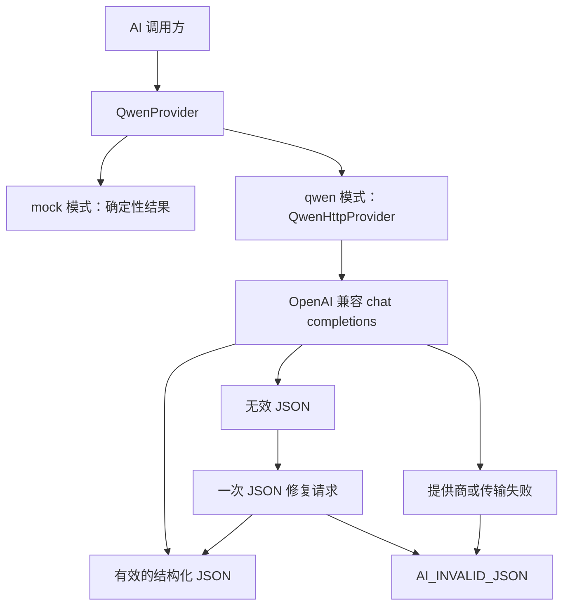
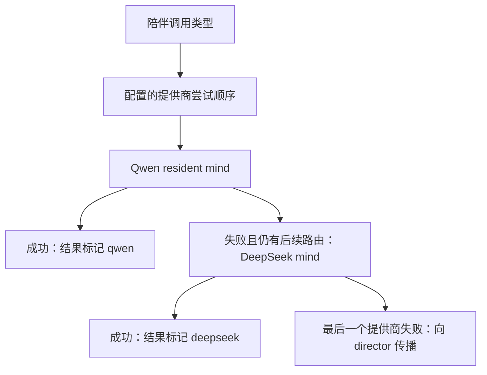
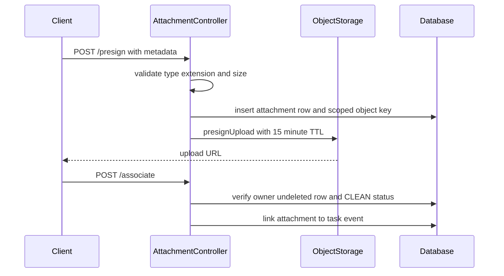
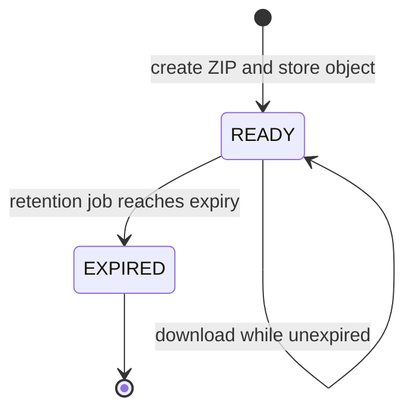

# AI 提供商与对象存储集成

后端有两个刻意分离的集成端口：

- `QwenProvider` 是全应用的 AI 端口：默认选择确定性的 mock，实现真实调用时选择面向 OpenAI 兼容 Qwen 端点的 HTTP 客户端。
- `ObjectStorage` 是二进制对象端口，供隐私附件和数据导出 ZIP 使用：默认是进程内存，实现生产持久化时可选择 S3 兼容服务（例如 MinIO）。

陪伴小镇复用应用级 Qwen 提供商作为主模型，并可独立创建 DeepSeek 兼容提供商作为回退。DeepSeek 不会替换其他 AI 功能所使用的应用级提供商。

## 提供商选择与配置

`app.ai.provider` 来自 `QWEN_PROVIDER`，默认值为 `mock`。当其为 `mock` 或未设置时，Spring 创建 `MockQwenProvider`；为 `qwen` 时则创建主 `QwenHttpProvider`。二者互斥且均为主候选，因此未加限定符的 `QwenProvider` 注入始终解析为当前配置的应用级提供商。

要接入真实 Qwen 兼容端点，请通过部署环境或平台秘密管理配置下列变量，不要将真实秘密提交到源码：

| 变量 | 应用属性 | 含义 |
| --- | --- | --- |
| `QWEN_PROVIDER` | `app.ai.provider` | `qwen` 启用 HTTP 调用；`mock` 保留确定性的本地行为。 |
| `QWEN_BASE_URL` | `app.ai.base-url` | 基础 URL；客户端会追加 `/chat/completions`，且必须使用 HTTP 或 HTTPS。 |
| `QWEN_API_KEY` | `app.ai.api-key` | Bearer 凭据；空值和可识别的占位值会阻止真实提供商启动。 |
| `QWEN_MODEL` | `app.ai.model` | 每个补全请求发送的模型名。 |
| `QWEN_TIMEOUT` / `QWEN_STREAM_TIMEOUT` | `app.ai.timeout` / `app.ai.stream-timeout` | 普通请求和较长流式请求的超时。 |
| `QWEN_JSON_MODE` | `app.ai.json-mode` | 启用时，为结构化调用添加 OpenAI 兼容的 `response_format: {type: json_object}`。 |
| `QWEN_THINKING_STYLE` / `QWEN_THINKING_ENABLED` | `app.ai.thinking-style` / `app.ai.thinking-enabled` | 推理（thinking）功能的供应商线协议格式与应用级默认值。 |

HTTP 客户端以固定的低 temperature 和最大输出长度，携带 Bearer 授权头向 `POST /chat/completions` 发起结构化请求。`StructuredPrompt` 的 `thinkingEnabled` 是与供应商无关的可空开关：`null` 不改变客户端默认值，`true` / `false` 则只在 HTTP 边界转换。`qwen` 样式发送 `enable_thinking`；`deepseek` 样式发送 `thinking.type` 对象；未知样式不猜测网关扩展字段。模型名以 `deepseek-v4-` 开头时，还会被强制为 `thinking.type=disabled`。

> **不要从 `.env.example` 复制凭据。** 它是变量模板而非凭据存储。应使用部署环境或平台的秘密管理注入受限运行时凭据。

## 请求控制流与失败语义

该图展示结构化生成的分支：格式错误的模型回复仅获得一次修复机会，随后失败，不会返回未经验证的文本。

对于结构化生成，系统提示要求输出匹配给定 schema 的 JSON，解析前会移除 Markdown 代码围栏。首次内容不是 JSON 时，提供商只发起一次修复请求，并累加两次调用的 prompt、completion 和 reasoning token；修复结果仍无效则以 `AI_INVALID_JSON` 失败。`QWEN_JSON_MODE=false` 会省略不被部分网关支持的 `response_format`，但 schema 提示和修复路径依旧存在。

流式调用采用 server-sent events，请求 `stream_options.include_usage`，只向调用方发送非空内容 delta，并在事件中存在时保留最终 request id、响应模型和 usage。一个成功 HTTP 流若没有任何内容，会以 `AI_EMPTY_RESPONSE` 拒绝；无效事件负载、I/O 失败和未处理异常都映射为提供商不可用。

HTTP 边界会将提供商细节映射为安全的服务不可用错误，不向调用方泄露响应体：401/403 映射为 `AI_PROVIDER_AUTH_FAILED`，429 为 `AI_PROVIDER_RATE_LIMITED`，其他 4xx 为 `AI_PROVIDER_REQUEST_REJECTED`，其他非 2xx 为 `AI_PROVIDER_ERROR`；网络和超时失败为 `AI_PROVIDER_UNAVAILABLE`。

`QwenHttpProvider.WireRequestBudget` 是在请求真正发送前执行的、可选且并发安全的保护器。它可为共享的重试客户端限制所有受跟踪请求，记录请求序号和种类；封存后或超过上限的后续调度分别以 `AI_WIRE_REQUEST_BUDGET_CLOSED` 和 `AI_WIRE_REQUEST_BUDGET_REACHED` 拒绝。生产构造使用无限预算；需要精确限制 wire-call 数量的测试或扩展可共享该预算实例。

## Mock 模式与聚焦测试

Mock 模式适合本地开发和测试：`MockQwenProvider` 返回固定的结构化示例、含元数据的两段流式回复和 `L0` 分类，不调用外部服务。只有同时满足 `app.ai.provider=qwen` 与 `app.town.companion-model-enabled=true`，陪伴模型路由才启用；因此 mock 模式不会意外调用已配置的回退提供商。

边界回归测试覆盖以下行为：

- `QwenContractTest` 使用进程内 HTTP 服务器验证认证和模型负载、JSON 修复及 token 累加、SSE usage 解析、供应商特定 thinking 字段、安全失败映射、空流拒绝，以及并发下的共享请求预算上限。
- `RoutingResidentMindTest` 验证尝试顺序、回退、所有提供商都失败时的传播、Qwen-only 评估、历史 `qwen3` 路由别名和启用门控。
- `QwenResidentMindUsageTest` 验证有计量的 decision、turn、summary 路径会保留提供商 token 数和模型元数据。

## 陪伴小镇路由与回退

`RoutingResidentMind` 是注入 `ResidentDirector` 的唯一 `ResidentMind`。它持有具名的 Qwen mind 与 DeepSeek mind，并为 `decision`、`turn`、`summary`、`dayplan`、`react`、`consider`、`explain`、`reflect`、`venture` 和 `promise` 分别选择提供商。路由是逗号分隔的尝试顺序：去除空项和重复项，`qwen3` 仍是 Qwen 别名；未知提供商会跳过，空路由退化为仅 Qwen。

该图展示故障转移而非负载均衡：第一个成功的提供商胜出。路由器移向后续条目时记录安全警告，并重新抛出最终失败，使既有的 director 失败/退避逻辑能够处理。要测量 Qwen 本身，应将路由设为 `qwen`；加入 `deepseek` 后，Qwen 失败会静默降级到 DeepSeek。

`DEEPSEEK_BASE_URL`、`DEEPSEEK_API_KEY`、`DEEPSEEK_MODEL`、超时与 JSON 模式位于 `app.town.companion-model.deepseek`。缺失任何必需回退设置不会阻止应用启动：配置会提供 `UnavailableModelProvider`，只有路由实际尝试它时才失败。按调用类型设置的 `COMPANION_MODEL_THINKING_DECISION`、`...TURN` 和 `...SUMMARY` 对实际选中的任一提供商生效；空的 turn/summary 值代表没有按调用覆盖。

运维上要注意配置来源差异：`.env.example` 为三个陪伴路由示例设为 `qwen,deepseek`，而 `application.yml` 与 `deploy/compose.yaml` 的环境默认值是 `qwen`。环境变量优先级更高，应明确选择期望行为而非依赖模板。

## Token 用量记账

结构化提供商结果包含提供商返回的模型、request id、prompt token、completion token、延迟，以及在提供时的 reasoning 内容存在标记和 reasoning token。陪伴 `QwenResidentMind` 会将结果 token 变为带计量的 `ResidentMind.Usage`，并标记实际服务的提供商。`ResidentDirector` 在调用后记录它；记账失败只会记录日志，不会替代模型结果。

`JdbcModelUsage` 保存按日累加的计数器，而不是无界的每调用日志。每行按用户、本地 usage day 和存储 call type 键控；重复键 upsert 会增加调用次数、输入 token 和输出 token。为在受限的 call-type 字段中保留供应商归属，记录器编码如 `decision@q3` 与 `decision@ds` 的供应商标签，读取时解码为 `qwen` 和 `deepseek`。没有正数实测 token 的调用不会写入行。

## 附件与导出的对象存储

`ObjectStorage` 定义 put、get、预签名下载、预签名上传和 delete。`OBJECT_STORAGE_PROVIDER=memory`（或未设置）选择并发的内存实现，适合本地/测试；数据只在当前进程中，重启即消失。`OBJECT_STORAGE_PROVIDER=s3` 选择 `S3ObjectStorage`。

| 变量 | 含义 |
| --- | --- |
| `OBJECT_STORAGE_ENDPOINT` | S3 兼容端点；Compose 后端使用内部 MinIO URL。 |
| `OBJECT_STORAGE_REGION` | AWS SDK region。 |
| `OBJECT_STORAGE_BUCKET` | S3 初始化时检查或创建的 bucket。 |
| `OBJECT_STORAGE_ACCESS_KEY` / `OBJECT_STORAGE_SECRET_KEY` | 运行时 S3 凭据；应存放于秘密管理。 |
| `OBJECT_STORAGE_PROVIDER` | `memory` 或 `s3`。 |

S3 实现使用静态凭据、端点覆盖以及 S3 客户端的 path-style addressing，从而兼容 MinIO。构造时检查 bucket，且只在捕获 `NoSuchBucketException` 时创建它。对象写入指定 `AES256` 服务端加密并保留给定 content type；预签名上传也要求该加密和 content type。下载和上传 URL 均由 S3 presigner 使用调用方提供的 TTL 生成。

生产 Compose 栈运行带持久化 `minio_data` 卷的 MinIO，发布 API 与控制台端口，并将内部端点和凭据传给后端。后端没有通过 `depends_on` 等待 MinIO，因此 S3 bean 构造或受影响的存储操作可能暴露存储服务不可用；运行时应关注其 health check 和持久卷。

### 附件生命周期

该图展示附件从预签名到关联的控制点；上传 URL 本身不证明对象已上传或已通过扫描。

1. `POST /api/v1/attachments/presign` 验证声明的 content type、匹配的扩展名，以及大于零且不超过 10 MiB 的大小。
2. 它创建用户范围的 `attachments/{userId}/{publicId}.{extension}` key 和附件数据库行，然后返回 15 分钟上传 URL。
3. `POST /api/v1/attachments/{attachmentId}/associate` 仅在附件归属当前用户、未删除且 scan status **恰为** `CLEAN` 时，才将其关联到任务事件。

允许的类型是 JPEG、PNG、PDF 和纯文本。策略检查请求元数据，而 clean-status 才保护关联；该集成本身不实现扫描器。

### 隐私导出生命周期

导出会同步构建为 ZIP 归档。创建受幂等性保护，每个用户每 24 小时最多请求一次。归档写入 `exports/{userId}/{publicId}.zip`，其 SHA-256 与 `READY` job 一同保存，内容包括 profile、goals、task events、role progress、陪伴存档数据及文件型陪伴记忆。

该状态图展示导出 job 的可下载窗口及其由保留任务触发的终止状态。

就绪且未过期的导出返回一个 15 分钟预签名下载 URL；内存存储则返回应用下载路由。直接读取内容和获取下载 URL 都会拒绝非 `READY` 或已过期的 job，并返回 `EXPORT_EXPIRED`。按小时运行的保留任务删除到期导出对象并将 job 标记为 `EXPIRED`；导出对象保留期是 24 小时。

## 运维检查清单

1. 本地确定性行为使用 `QWEN_PROVIDER=mock` 和 `OBJECT_STORAGE_PROVIDER=memory`。
2. 启用 `qwen` 前，设置真实端点、模型、有效的受限凭据以及合适的普通/流式超时。启动校验会拦截空白或占位凭据，以及格式错误或非 HTTP 的 base URL。
3. 仅在端点、bucket、region 和凭据均可用时启用 `s3`。Compose/MinIO 应使用后端内部 `http://minio:9000`，而不是仅宿主机可见的地址。
4. 明确决定陪伴路由使用 `qwen`（评估或让失败可见）还是 `qwen,deepseek`（可用性优先的回退），并为相关调用类型单独配置。
5. 按带供应商标签的 call type 观察每日陪伴用量；它记录提供商上报的 token，不是估算账单。
6. 将预签名 URL 视为短时效能力，将对象存储凭据置于文档之外，并同时监控导出过期/删除与存储可用性。

另见：[AI coaching](/openwiki/concepts/ai-coaching.md)、[companion town](/openwiki/concepts/companion-town.md)、[privacy and retention](/openwiki/concepts/privacy-and-retention.md) 与 [local development and deployment](/openwiki/operations/local-development-and-deployment.md)。
