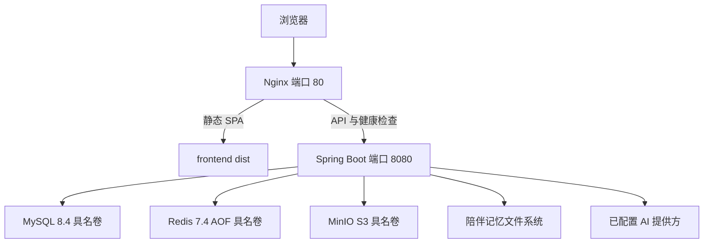

Lamplit 是一个 Vue/Spring Boot 模块化单体应用。MySQL 是系统记录库，Redis 是可丢弃的加速层，MinIO 提供本地 S3 兼容对象存储。有两种**互斥**的开发模式：

1. **本机进程开发**：MySQL、Redis 和 MinIO 由 `deploy/compose.yaml` 运行；后端通过 Maven、前端通过 Vite 在宿主机运行。
2. **共享开发服务器**：`deploy/compose.dev.yaml` 将全部服务置于容器中，并挂载宿主机源码，以支持后端重启和 Vite HMR；适合让协作者连接到同一台机器。

不要同时运行两种模式。它们有意复用相同的具名数据卷，切换模式时数据会保留，但默认宿主机端口会冲突。

## 前置条件与本地配置

安装 Java 21、Docker（含 Docker Compose）、Node.js 22.13 或更高版本，以及 pnpm 11。前端固定 `pnpm@11.9.0` 并声明了 Node 版本限制；不支持 Node 20。

创建被忽略的本地配置文件：

```bash
cp .env.example .env.local
```

`.env.local` 被有意忽略。`.env.example` 中的值仅为开发占位符，不能作为部署凭据。用于共享或生产形态环境前，应替换密码、`JWT_SECRET`、`MFA_ENCRYPTION_KEY`、MinIO 凭据与 KMS 密钥，以及所有外部模型密钥。不要提交、写入日志或分发 `.env.local`。

### 配置速查表

| 范围 | 变量 | 运维含义 |
| --- | --- | --- |
| URL 与端口 | `APP_URL`、`API_URL`、`VITE_API_BASE_URL`、`SERVER_PORT` | 控制后端 URL、浏览器 API 基址及宿主机后端端口。前端通过 `envDir: '..'` 从仓库根目录读取环境变量。 |
| MySQL 与 Redis | `MYSQL_*`、`REDIS_*` | 所需的凭据和端点。Compose 运行带具名数据库卷的 MySQL 8.4，以及启用 AOF 持久化和密码认证的 Redis 7.4。 |
| 对象存储 | `MINIO_*`、`OBJECT_STORAGE_*` | MinIO 是本地 S3 端点。设置 `OBJECT_STORAGE_PROVIDER=s3` 后，应用使用 S3，并在缺失时初始化配置的 bucket。 |
| 身份认证 | `JWT_SECRET`、`MFA_ENCRYPTION_KEY`、令牌 TTL 变量、`SECURE_COOKIES` | 认证签名/加密材料以及 Cookie、令牌生命周期。随附的 HTTP Compose 配置将 `SECURE_COOKIES` 设为 false；HTTPS 部署应按实际入口正确设置。 |
| AI | `QWEN_*`、`DEEPSEEK_*`、`COMPANION_MODEL_ROUTE_*`、`COMPANION_MODEL_THINKING_*` | `QWEN_PROVIDER=mock` 是本地验证的安全默认值。要调用外部模型，设置 `QWEN_PROVIDER=qwen` 并提供受限的真实密钥、匹配端点和模型。陪伴模型路由是有序的故障转移列表；需要可复现实验时应固定显式路由。 |
| 隐私与调度 | `AI_RETENTION_DAYS`、`SCHEDULING_ENABLED` | 管理端点只暴露 `health` 和 `info`，调度默认启用。用户可选的 AI 保留期限制为 7、30 或 90 天。 |
| 开发服务器端口 | `DEV_WEB_PORT`、`DEV_API_PORT`、`DEV_DEBUG_PORT`、`DEV_LOGS_PORT` | 分别是共享服务器的 Vite、后端、JDWP 和 Dozzle 端口。通过 Bash `source` 环境文件时，诸如 `DEV_TOWN_REFLECTION_CRON` 的 cron 表达式必须加引号。 |

`local` Spring profile 会提高应用日志级别，并仅在获授权时显示健康详情。本地管理员功能也受 `local` profile 单独限制：不得在非本地部署启用；启用但未同时提供用户名和密码时，应用会中止启动。

## 选择一种开发模式

### A. 在宿主机运行应用进程

只启动基础服务：

```bash
cd /path/to/repository
docker compose --env-file .env.local -f deploy/compose.yaml up -d
```

然后在不同终端中，以 `local` profile 启动后端，并启动 Vite 前端：

```bash
cd backend
set -a
source ../.env.local
set +a
./mvnw spring-boot:run -Dspring-boot.run.profiles=local
```

```bash
cd frontend
pnpm install
pnpm dev
```

Vite 默认把 `/api/v1` 代理到 `http://127.0.0.1:8080`，使宿主机开发时浏览器请求保持同源。此模式要求开发者机器安装 Java 和 pnpm。

### B. 运行共享容器开发服务器

使用封装脚本，而不是临时手动调用开发 Compose 文件：

```bash
scripts/dev-server.sh up
scripts/dev-server.sh urls
scripts/dev-server.sh logs
```

该脚本要求存在 `.env.local`，会 source 它以选择端口，检查 Vite、后端、调试和日志面板端口是否已被非 Docker 宿主机进程监听，再启动 `deploy/compose.dev.yaml`。`urls` 会输出局域网应用、代理 API、直连 API、健康检查、日志、调试和数据库地址；不要随意暴露这些局域网服务及其凭据。`down` 停止容器但保留卷。`restart` 有意使用 `docker compose up -d [service]` 而非 `docker compose restart`，这样环境变量或挂载变化会触发容器重建。

开发后端使用 Maven/Temurin 21 镜像，挂载 `../backend`，并将 Maven 缓存和 `target` 放在独立具名卷中；它等待 MySQL 和 Redis 健康后，以 `local` profile 运行 `spring-boot:run`，并在端口 5005 开启 JDWP。入口脚本先解析依赖、编译，然后每两秒轮询源码和资源：成功重编译后 Spring DevTools 重启；编译失败则继续运行上一次可用的字节码。轮询是必要的，因为文件监视事件无法可靠跨越宿主机 bind mount。

开发前端也挂载源码，但用 Linux 卷覆盖 `node_modules` 和 Vite 缓存，避免宿主机与容器的原生二进制冲突。它在所有接口上提供 Vite 服务，仅在容器模式开启轮询 HMR 和宽松的主机处理，并将 `/api/v1` 代理到 `http://backend:8080`。Dozzle 以只读方式访问 Docker socket，并按此 Compose 项目过滤，为 Web 日志面板提供日志。

## 部署用 Compose 拓扑

`deploy/compose.yaml` 是生产形态拓扑，不是源码挂载的开发栈。后端仅在 MySQL 和 Redis 健康检查成功后启动；Nginx 依赖后端。MinIO 有自己的存活检查，但不在后端的依赖条件中，因此在依赖导出或上传前，应单独验证对象存储已就绪。



*部署用 Compose 的请求与持久化拓扑：Nginx 提供 SPA 并代理 API/健康检查流量，后端负责连接数据服务和外部模型。*

Nginx 提供构建后的 SPA，代理 `/api/v1` 时禁用缓冲和缓存（这对流式响应很重要），并代理 `/actuator/health`。它提供 SPA history fallback，禁止缓存 `index.html`，将 `/assets/` 设为一年不可变缓存，限制请求体为 12 MB，并设置内容类型、Referrer、Permissions 和 Content Security Policy 响应头。

后端镜像基于 Java 21 JRE，并复制 `backend/target/growth-backend-0.0.1-SNAPSHOT.jar`；Nginx 镜像复制 `frontend/dist/`。因此，构建或启动生产形态栈前必须先构建两个产物：

```bash
cd backend && ./mvnw package
cd ../frontend && pnpm install && pnpm build
cd ..
docker compose --env-file .env.local -f deploy/compose.yaml config
docker compose --env-file .env.local -f deploy/compose.yaml up -d --build
```

Compose 当前还发布后端 `8080` 端口；应将这个直连端口视为管理/开发便利，而不是公共入口的替代品。

### 持久化是运维不变量

Compose 为 `mysql_data`、`redis_data` 和 `minio_data` 命名并持久化，且共享开发栈使用相同名称。Redis 显式开启 AOF。后端将陪伴记忆存于 MySQL 之外：每条记忆是 `COMPANION_MEMORY_ROOT` 下的 Markdown 文件，SQLite 仅作为可重建的元数据索引。后端 Dockerfile 将 `/var/lib/growth/memory` 声明为卷，开发栈在此正确挂载了具名 `companion_memory` 卷。

**部署检查：**`deploy/compose.yaml` 没有为后端挂载具名 `companion_memory` 卷。将该 Compose 配置作为持久部署之前，必须在 `/var/lib/growth/memory` 添加持久且已备份的挂载；否则，陪伴记忆无法保证在容器替换或发布后仍存活。这个文件系统应与数据库和对象存储卷一起备份：它保存权威记忆文本，而 SQLite 索引可从文件重建。

## 启动、迁移、健康检查与管理

Spring Flyway 已启用，加载 `classpath:db/migration` 中的版本化脚本；Hibernate schema generation 已禁用。后端启动时会迁移新的空数据库。不要原地编辑已应用的迁移：添加新的版本化迁移，在新的 MySQL 实例上测试，并保留迁移历史。`DatabaseMigrationIT` 使用 MySQL Testcontainers，并断言完整的版本化基线成功建立。

直接检查可用性：

```text
http://localhost:8080/actuator/health
```

存在 Nginx 时，同一路径也会在其公共地址上被代理。安全配置允许未认证访问健康检查；除列出的认证端点外，其他应用请求都需要认证。数据库和 Redis 容器健康是必要条件而非充分条件：确认后端健康端点；若导出或上传重要，再验证 S3 路径。

没有公开的管理员注册。创建首个管理员时，在首次启动前同时设置 `ADMIN_BOOTSTRAP_EMAIL` 和 `ADMIN_BOOTSTRAP_PASSWORD`；密码至少 12 个字符。仅当没有活动 `ADMIN` 时，runner 才创建账户。若未提供 MFA secret，它会生成一个并仅记录一次日志；应安全保存并登记，完成 MFA 登录后移除所有 bootstrap 变量。只提供部分 bootstrap 配置会导致启动失败，而不会留下部分初始化状态。

## 受许可素材与构建降级

小镇美术来自四个已购买的 LimeZu 资源包。许可证允许使用但禁止再分发，因此供应商压缩包和生成图集均未提交。要在本地生成，将 `modernexteriors-win.zip`、`moderninteriors-win.zip`、`Modern_Farm_v1.2.zip` 和 `Modern_Office_Revamped_v1.2.zip` 放入被忽略的 `tmp/`，安装 Pillow 后运行：

```bash
python3 scripts/build-town-assets.py
python3 scripts/build-companion-assets.py
```

不要提交生成的素材或源压缩包。若缺少生成的小镇地图，场景会回退为绘制地面，因此不含已购美术时应用其余部分仍可运行；要获得完整视觉效果，购买者必须自行生成素材。

## 验证与故障检查

交接或部署前，按以下层次执行：

```bash
cd backend && ./mvnw test
cd frontend && pnpm lint && pnpm test --run && pnpm build
cd ..
docker compose --env-file .env.local -f deploy/compose.yaml config
./scripts/verify-global-flow.sh
```

`verify-global-flow.sh` 会启动生产形态 Compose 服务、等待报告的健康状态，并运行后端验证、前端 lint/单元构建、Playwright、API smoke flow、数据库不变量、Redis 认证和敏感日志扫描。它要求 `.env.local`；默认 mock AI 使验收验证不会访问外部模型。

发生故障时按以下顺序排查：

1. **模式/端口冲突：**进入共享服务器模式前停止宿主机的 `pnpm dev` 和 `spring-boot:run`，或调整 `DEV_*_PORT`。使用 `scripts/dev-server.sh status` 与 `logs [service]`。
2. **配置展开：**运行上面的 Compose `config` 命令。缺失的必需 Compose 变量会有意导致展开失败；在追查容器行为前先检查这里。
3. **依赖就绪：**检查 `docker compose ... ps`、MySQL 和 Redis 健康日志、后端 `/actuator/health` 与 MinIO `/minio/health/live`。后端启动受 MySQL/Redis 健康门控，不受 MinIO 健康门控。
4. **构建输入：**若镜像构建报告缺少 JAR 或 `dist`，先运行 Maven 打包和 `pnpm build`。若浏览器中的小镇显示异常，先确认是否有意跳过了受许可图集生成，而不要误判为 API 故障。
5. **状态与替换安全：**不要把重置卷当作常规重启。`scripts/dev-server.sh reset-db` 会要求确认、重建数据库，并依赖 Flyway 重建；这是破坏性操作。替换后端容器前，确保陪伴记忆挂载是持久的。
6. **外部 AI：**为确定性测试保留 `QWEN_PROVIDER=mock`。使用真实 AI 时采用未提交的受限密钥，并验证端点、模型和超时设置；mock 测试成功不代表外部提供方可达。

有关系统边界、隐私生命周期、AI/对象存储行为、快速开始流程和更完整的测试策略，参见[系统概览](../architecture/system-overview.md)、[隐私与保留](../concepts/privacy-and-retention.md)、[AI 与对象存储](../integrations/ai-and-object-storage.md)、[快速开始](../quickstart.md)和[验证策略](../testing/verification-strategy.md)。
