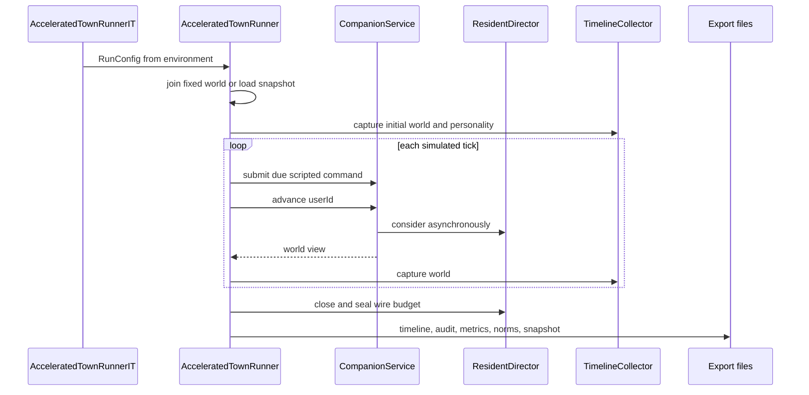

`AcceleratedTownRunner` 是小镇的**离线实验驱动器**，不是另一套模拟器。它用内存存储和可变时钟组装生产同形的 `CompanionService` 与 `ResidentDirector`，以固定 `worldId` 生成或续跑世界，并在每个 tick 走 `service.advance`；可选的脚本化 avatar 意图也经 `service.submit` 注入。因此规则推进、异步模型提交和行动合法性仍由应用层负责，实验层负责控制时钟、预算、导出和证据保全。

> **边界与隐私**：不要读取、提交或复制 `experiments/**/data/`、运行产物中的居民记忆、`model-calls.json`、`world-snapshot.json` 或 `.env.local`。这些可能含第三方模型原文或凭据。可引用已提交的实验 `README.md`、`results/` 和源码；若 README 没有提交结果表或完整 manifest，只能报告其方法/限制，不能补写数值结论。

## 一次运行的控制流与产物



*图示的是 Harness 只驱动公共 `CompanionService` 入口；模型调用仍由 director 异步调度。*

### 生命周期、隔离与节流

- 新运行通过 `CompanionRules.join(worldId, avatarName, timezone, start, modelEnabled)` 建种子；续跑则读取 `resumeFrom` 指向的 `world-snapshot.json`，以快照 `updatedAt` 作为有效开始时间，并以本次 `modelEnabled` 覆盖快照设置。`InMemoryWorldStore` 和 `InMemoryModelUsage` 使此运行不访问 `JdbcWorldStore`。
- tick 至少为一秒；总 tick 是模拟天数加 `drainTicks`。每 tick 先推进 `MutableClock`，再发到期的固定偏移命令、调用 `advance`、捕获世界；每日捕获人格快照。`scriptedAvatarIntents` 的两个固定命令覆盖一次显式 `walk` 和一次 passing `thought`，它们是**作者写入的测试刺激**，不是居民自主行为。
- 模型模式使用 `RecordingMind` 包装选定 provider，记录规范输入、结构化输出/usage 和失败类别；凭据与 HTTP headers 不进入导出。它没有 provider fallback：缺少所选 provider 的 `BASE_URL`、`API_KEY` 或 `MODEL` 会失败，而不会用另一模型悄悄完成实验。
- 模型网络调用与 tick 并发。Harness 观测 `modelSequence` 后，在 45 模拟秒保护窗内按 `realPaceMillisPerTick` 睡眠，给异步请求落地的真实时间；无新 dispatch 时只作很短的让步。这个机制降低短运行“模型开启但 0 调用”的风险，**不保证**多条并发请求各自拥有完整保护窗，也不把 Harness 变成调度器。结束时先 seal wire budget、关闭 director，再 detach collector，避免后续同 world id 的座位监听混入本次结果。

## 入口、配置与可复现实验步骤

命令入口是 opt-in 的 `AcceleratedTownRunnerIT`。它只有 `COMPANION_RUN=true` 才执行，所有旋钮都从环境读取，以免凭据出现在 Maven 命令行或 Surefire 报告；普通 `./mvnw test` 不应消耗 token。

```bash
cd backend
COMPANION_RUN=true COMPANION_RUN_DAYS=3 \
  ./mvnw test -Dtest=AcceleratedTownRunnerIT
```

模型探针需要先在本机受限环境中加载凭据，并取得向模型服务发送数据的明确授权；不要把该文件、环境值或原始输出加入 Git。选择为 `qwen` 或 `deepseek` 的 `COMPANION_RUN_MODEL_PROVIDER`，并提供该 provider 的 `*_BASE_URL`、`*_API_KEY`、`*_MODEL`；`qwen3` 是 `qwen` 的旧别名。`COMPANION_RUN_PARALLELISM`（默认 6）也写进 manifest，比较时必须固定它。

建议按以下顺序执行，避免把结构验收误报成涌现：

1. 在新目录运行一次 `ruleOnly`（`COMPANION_RUN_MODEL` 不设或为 `false`），固定 `worldId`、开始时间、天数、时区、tick、脚本意图和代码 commit；先检查导出完整且无模型调用。
2. 若研究模型选择，保持上述项不变，只启用模型并固定**带日期的模型快照**、provider、每日预算、wire 请求预算、`inputTokenStop`、parallelism 和 blind-test seed。`inputTokenStop` 是收到 usage 后的阈值，不是预请求的硬上限；因此 manifest 中 started/completed/wire 三种调用数都应保留。
3. 对模型结论至少做两次独立运行，并为每个模型运行配同种子规则对照。不同 `worldId`、初始状态补丁、模型或代码都属于变量；不要在一个比较中同时改变它们。
4. 将问题、假设、commit、模型、种子、命令、manifest 摘要、结论和限制写入 `experiments/<date>-<slug>/README.md`，小型整理表放 `results/`。遵循 [实验档案](../../experiments/README.md)：`data/` 不入 Git，`README`/`results` 才是可审阅记录。
5. 仅向盲读者交付 quiz 目录，保留 key 给独立核对者；先记录盲读者基于行号的答案，再查看 key 或 `norms.md`。不得让读者先读仓库、人设或居民结论。

## 导出：什么可用于回答什么问题

`manifest.json` 是可比性的首要索引，记录世界/时间范围、tick、模型开关、provider/model、并发度、预算、输入阈值、userId、脚本意图、盲测 seed/size、最终 revision 与 status。`timeline.json` 是按时间排序的全量观察，`timeline.md` 是可读版本，`highlights.md` 仅保留较值得阅读的事件、对话、关系变化、人格快照和部分记忆。

| 产物 | 用途与解释限制 |
| --- | --- |
| `usage.json`、`model-calls.json`、`model-wire-requests.json` | 分别查看已完成 usage、逻辑调用记录和已开始 wire 请求；三者不可互换。原始模型记录不应提交或复制。 |
| `model-application-outcomes.json`、`action-outcomes.json` | 以 `OutcomeListener` 在应用点给出的 `applied`/`rejected`/`failed`/`unsupported` 为准。行动表按实际 menu 统计 `offered`、`selected` 和结果；`consider` 同时计其 key 与 `none`，无 menu 的 call type 只有 `*` 汇总行。不能从 `modelStatus` 或 tick 文案反推成功率。 |
| `metrics.json`、`metrics.md` | 输出服务请求、人格漂移、关系不对称、记忆分歧、同地分组与共同活动。没有触发的机制须显式为 0；共同活动只把持续至少 5 分钟的 `sharedProject`、`gathered`、`satTogether` 纳入主动总数，`sameActivity` 单列以免把同处误当选择。 |
| `norms.json`、`norms.md` | 本次 Runner 调用的是只输入 timeline 的 `NormDetector.detect(worldId, sorted, timezone)`：可报告时间线候选与被拒绝项，但**不**向 detector 传入 snapshot memories 或 positions，故不应把此文件当作信念独立性或座位占用权的完整测量。 |
| `blind-test/quiz` 与 `blind-test/key` | 人格盲测仅从模型来源、非 avatar、长度至少 6 的对话中，按 seed 去重、分层抽样并掩名字；社会盲测给可见对话/事件和“这个镇上有什么规矩？”问题，key 才含带 `supersedesKey` 的居民长期看法。 |
| `world-snapshot.json` | 供 `withResumeFrom` 继续模拟；它是敏感运行状态，不能作为提交的实验 data。 |

`TimelineCollector` 在每个 tick 去重捕获 diary、事件、记忆、对话和关系变化，原因是世界自身保留滚动窗口。它还单独监听完整的 `seat_state` 转移，用于座位回放；该流不写入人读的 timeline markdown，以免座位抖动淹没叙事。这个“逐 tick 捕获、结束 detach”的不变量使多日指标不会因世界窗口淘汰或 JVM 中 world id 重用而悄然丢失/串台。

## 指标不是因果结论

`MetricsExporter` 只从 timeline、collector 和终态世界读数，且把运行覆盖的每个本地日期传入共同活动指标，所以空白天仍在分母中。它适合发现薄弱环节或回归，例如人格四维是否曾偏离初始快照、成对好感是否不对称、同一 topic 是否被不同人记成不同文本、主动共同活动是否达到每天目标 3。

但下列数值不能越界解释：

- `reflectionsTriggered` 是多个写入点共享的 `sourceType="reflection"` 标签，不能做 `reflect` 调用数或“反思到信念转化率”的分母。
- 同地、同 activity 和对话都不是“居民选择一起做事”；前两者可能完全由地图和习惯造成，后者也没有计入共同活动主指标。
- 时间线记录到的文本或人格漂移只能说明该次运行的观察结果；除非控制组和重复均支持，不能将其归因于模型。

## 规范候选、对照与盲扫

`NormDetector` 是筛查器，不是“涌现认证器”。它从贡献、可见事件和完整座位流构造 `pairAffinity`、`whoJoins`、`occasion`、`reciprocity`、`spotRespect` 与 `ownSpot` 候选，排除 avatar `self`。候选必须跨至少两天、强度至少为自身零假设的 1.5 倍、支持数达到随实际观察居民数线性缩放的下限（最低 4，25 人为 17），并排除“同一分钟、同一组合”的 clock-like 台钟；失败项也写入 `dropped`，而非沉默消失。

座位占用权尤其要求完整且无缺口的 `seat_state` 回放；缺记录、回放 gap 或当时别人位置并不空闲时，检测器拒答，而不是把“没法判断”记作避让。`whoJoins` 与 `reciprocity` 仍有已记录的耦合：谁有机会最先开项目由规则侧机会分配决定，因而“后来搭手”不能被干净地归因给偏好。

纯规则对照是“作者写入”边界：`notWrittenByUs` 从模型运行的候选中减去同 dimension/key 的 rule-only 候选；任何控制组也能产生的规律，都不是模型或居民涌现。`judge` 再比较两次模型运行：两次同一候选归为 seed 驱动；两次各有不同的、控制组没有的候选才到 `AWAITING_SPOKEN_CHECK`。只有独立盲读者从居民自己的话中确认，外部流程调用 `withSpokenBy` 后才可到 `MET`。因此：

- **规则生成的规律**：即使稳定、可读，也只证明作者规则与种子能产生它，不算涌现。
- **模型选择产生的规律**：须固定模型快照、seed、配置和代码，与规则对照相减并跨重复；它仍可能受 prompt、预算、并发和异步时序影响。
- **人设/职责预写的规律**：即使模型重复表达，也不能算新发现。已提交的 [人设独立盲扫 README](../../experiments/2026-09-14-persona-blind-review/README.md) 规定命中其盲扫清单者一律排除；该 README 指向未提交 data 与另一文档中的冻结摘要，故本页不复述名单或把它当作新的实验结果。

## 消融矩阵：可控制变量与无法干净拆开的项

| 问题 | 可做的比较 | 必须固定 | 不能宣称已隔离的耦合 |
| --- | --- | --- | --- |
| 模型是否增加某候选 | model-on 与 rule-only，同 worldId/起点/脚本意图 | 代码、天数、tick、时区、parallelism、预算 | 模型回复到达时序、异步 rejected/failed、模型可用性 |
| provider/model 差异 | 两个 model-on 批次，各自配规则控制 | 带日期 model 名、所有 RunConfig/环境旋钮、seed | provider 延迟、JSON/超时行为与调用数量会共同变化；不能把差异简化为“文风” |
| action 很少被采用的原因 | 同一运行的 `offered → selected → outcome` 漏斗 | call type、实际 menu、occasion 到达机会 | menu 暴露频率和行动合法性共同决定结果；低 selected 不是偏好缺失的充分证据 |
| 规范是否非作者写入 | 两个模型重复 + 同 seed rule-only control + 社会盲测 | detector 版本、阈值、时间线完整性、盲测流程 | `whoJoins`/互惠受“谁先动手”机会分配影响；检测器不能自行完成 spoken check |
| 人格可辨识度 | 固定 `blindTestSeed` 的模型来源对话 quiz | poolStats、样本数、模型/seed | 短运行可能缺样本；规则 fallback 被排除，故不能以该测验证明整个时间线的人设质量 |

## 已提交实验记录的证据等级

| 记录 | 可安全陈述 | 不可推出的结论 |
| --- | --- | --- |
| [2026-09-14 v2 rules acceptance](../../experiments/2026-09-14-v2-rules-acceptance/README.md) | README 记录为 25 人、2 天、纯规则结构验收，报告 2,880 ticks、0 模型调用，并明确限制为“不是社会涌现证据”。 | 不能用它证明模型效果、规范涌现或任何盲测结果；README 未提供可提交的原始 manifest 供本页复算。 |
| [2026-09-14 persona blind review](../../experiments/2026-09-14-persona-blind-review/README.md) | README 记录盲扫只读 25 份原始人设、用于列出预写社会预期并排除命中项。 | 结果原文在未提交 `data/`；不能复制、不能将它当作模型运行结果，也不能把清单外项目自动认证为涌现。 |
| [实验档案索引](../../experiments/README.md) | 规定可引用数字的运行应有 README/results，原始 `data/` 被忽略；并警告 `qwen3.8-flash` 与当前规定的 `qwen3.7-flash-2026-07-15` 不能混比。 | 目录索引不是结果表；没有 commit、模型、seed、manifest 摘要和限制的数字不具可复现证据等级。 |

## 聚焦测试与安全修改清单

- 修改 action 审计时运行 `AcceleratedTownRunnerActionAuditTest`：它离线验证 offered 来自每次真实 menu、菜单外 selected 不虚增 offered、无 menu call type 保留 `*` 行、`consider` 计入 `none`。
- 修改规范门槛、对照或 seat 回放时运行 `NormDetectorTest`：覆盖台钟/单日拒绝、规则对照减法、`MET` 只能由盲读闭合、人口缩放、avatar 排除和 seat record 缺失/缺口拒答。
- 修改盲测题面时运行 `NormBlindTestTest`：题面必须不给居民结论、允许“没有”、排除内心独白并保留社会关系所需名字。
- 修改导出或 tick 捕获时，以 `AcceleratedTownRunnerIT` 的规则模式先验证文件集合和可读事件；模型模式仅在授权后执行，并保存受控的本地审计。不要为了让检测器“有结果”而降低阈值、混入 key、补录 data 或把规则 fallback 当作模型输出。

参见[Harness 总览](../architecture/companion-harness-overview.md)、[事件、感知、记忆与信念](../concepts/events-perception-memory-and-belief.md)、[居民触发与调度目录](../workflows/resident-trigger-and-scheduling-catalog.md)及[整体验证策略](verification-strategy.md)。
