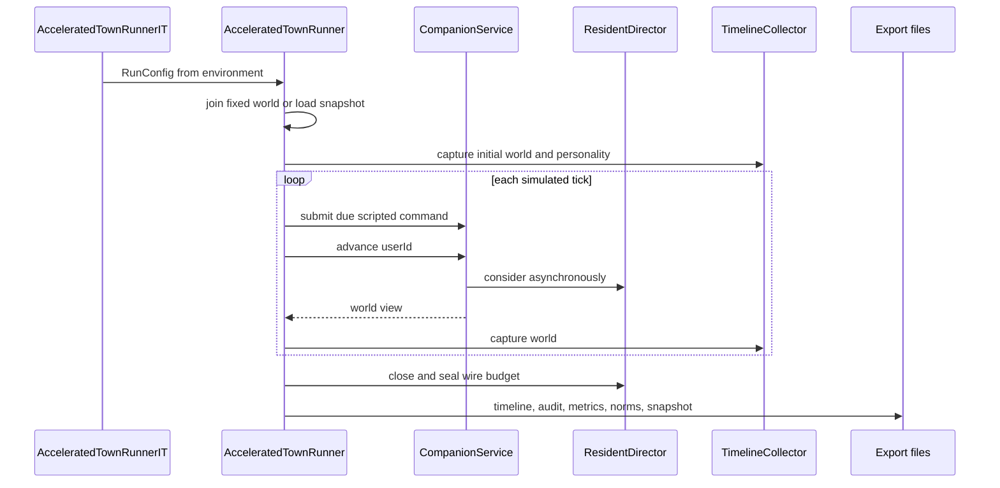

`AcceleratedTownRunner` 是离线、无界面的实验驱动器，不是另一套模拟器。它以 `InMemoryWorldStore`、`MutableClock`、`CompanionService` 和 `ResidentDirector` 组装一次隔离运行；新运行用固定 `worldId` 经 `CompanionRules.join` 建立世界，续跑读取 `world-snapshot.json`，并以本次的 `modelEnabled` 覆盖快照设置。每个 tick 仍通过应用层的 `service.advance` 推进；可选脚本 avatar 意图也通过 `service.submit` 注入。因此规则推进、模型预约、异步调用和结果合法性仍由既有应用层负责，Harness 只控制时钟、预算、采集与导出。

> **证据与隐私边界**：不要读取、提交或复制 `experiments/**/data/`、原始模型输出、`model-calls.json`、`world-snapshot.json` 或 `.env.local`。它们可能包含第三方模型内容、运行态记忆或凭据。本页仅以提交的 `README.md`/`results/`、测试和源码为证；README 没有提交的 manifest 或原始数据时，不补算数值结论。

## 运行控制流



*Harness 只驱动公共 `CompanionService` 入口；`ResidentDirector` 才负责异步模型调度与权威写回。*

### tick、刺激与异步边界

- tick 数为请求的模拟时长除以 `tickSeconds`，再加 `drainTicks`；每轮先推进 `MutableClock`，发送到期脚本命令，调用 `advance`，随后采集世界。每日边界会采集人格快照。
- 默认脚本化 avatar 意图在固定模拟偏移提交一次显式 `walk` 和一次 passing `thought`。这是作者写入、用于覆盖公共提交入口的测试刺激，**不是**居民自主行为，不能作为社会行为或模型效果证据。
- 模型调用在 `ResidentDirector` 的后台执行。Harness 观察 `modelSequence`；发生预约后，在有限保护窗内按 `realPaceMillisPerTick` 让出真实时间，避免短跑在首个请求开始前就结束。它不自己排队或重写 Director 的并发约束，也不保证每条并发调用各有独立的完整保护窗。
- 结束时先 seal wire budget、关闭 director、再 `detach` collector。后一步尤其防止同一 JVM 中复用相同 world id 的下一运行把座位转移写进已完成的采集器。

## 入口、配置与操作

`AcceleratedTownRunnerIT` 是 opt-in 命令入口，只有 `COMPANION_RUN=true` 才会运行；旋钮从环境读取，避免凭据出现在命令行或 Surefire 报告。普通 `./mvnw clean test` 不应发起模型调用。

```bash
cd backend
COMPANION_RUN=true COMPANION_RUN_DAYS=3 \
  ./mvnw test -Dtest=AcceleratedTownRunnerIT
```

规则模式默认禁用模型。模型模式还需 `COMPANION_RUN_MODEL=true`，并明确选择 `COMPANION_RUN_MODEL_PROVIDER=qwen` 或 `deepseek`；所选 provider 必须有对应的 `BASE_URL`、`API_KEY` 与 `MODEL`。`qwen3` 只是 `qwen` 的旧别名。Harness 故意没有 provider fallback：缺配置或所选服务失败应显式失败，不能悄悄由另一个模型生成看似可比的报告。

对比时固定 `worldId`、起点、代码、时区、时长、tick、脚本刺激、模型快照、`COMPANION_RUN_PARALLELISM`、预算和盲测 seed；一次只改变代码、模型、种子或初始状态之一。`manifest.json` 会记录模拟范围、模型、并发度、日预算、wire 请求预算、`inputTokenStop`、脚本和盲测参数。注意 `inputTokenStop` 是收到 usage 后才检查的阈值，而不是请求前的硬上限；比较时应保留 completed、logical started 与 wire started 三种计数。

若要向外部模型发送数据，先获得明确授权。长运行不要与编译或重型测试争抢资源，否则真实调用更可能在模拟时钟推进后过期。

## 导出物：审计对象而非自动结论

一次运行写出 `manifest.json`、`timeline.json`/`timeline.md`/`highlights.md`、`usage.json`、模型逻辑与 wire 调用记录、应用 outcome、行动审计、人格与社会盲测材料、`metrics.json`/`metrics.md`、`norms.json`/`norms.md` 和供续跑的 `world-snapshot.json`。以下是它们的解释边界。

| 产物 | 可以回答的问题 | 不能越界为 |
| --- | --- | --- |
| `timeline.*` 与 `highlights.md` | 运行期间已观察到的事件、记忆、对话、关系变化。`TimelineCollector` 每 tick 去重捕获，避免世界滚动窗口淘汰旧项。 | 单次叙事本身不是因果归因或涌现证明。 |
| `usage.json`、`model-calls.json`、`model-wire-requests.json` | 分别核对已完成 usage、逻辑调用和已开始的 wire 请求。 | 三种调用计数不可互换；原始调用记录不应进入 Git。 |
| `model-application-outcomes.json`、`action-outcomes.json` | 结果由 `OutcomeListener` 在应用点记录为 `applied`、`rejected`、`failed` 或 `unsupported`。行动 audit 的 `offered` 来自该次真实菜单。 | 不能由 `modelStatus` 或时间线文字反推成功率。 |
| `metrics.*` | 服务请求、人格快照、关系不对称、同 topic 记忆分歧、同地样本和共同活动。未触发机制应显示为 0。 | 指标是诊断量，不自动给出模型因果效应。 |
| `norms.*` | 从排序 timeline 筛出的候选、计数与拒绝理由。 | 不是“规范/涌现认证书”。当前 Runner 未向 `detect` 传 memories 或 positions，故该文件不包含信念独立性或座位目录的完整测量。 |
| `blind-test/quiz` 与 `blind-test/key` | 将题面与答案隔离，供外部读者先答后核。 | 题面、key 或清单外项目都不能自动认证涌现。 |
| `world-snapshot.json` | 作为 `withResumeFrom` 的状态输入。 | 敏感运行数据，不是可提交的实验结果。 |

行动审计保留必要的菜单语义：`decision` 与 `react` 的 `offered` 取自每次调用实际给出的选项；`consider` 同时提供 occasion key 和 `none`；没有菜单的调用类型以 `*` 汇总。菜单外的模型选择仍会记录 selected/rejected，却不会虚增 offered，因此可区分“未被给出”“未被选择”和“被选后不能落地”。

## 指标与共同活动的边界

`MetricsExporter` 只读取 timeline、collector 和终态世界；运行覆盖的每个本地日期都会进入共同活动分母，空白日不会消失。人格指标比较采集到的四维快照；关系指标比较双向关系值；记忆指标统计同一 topic 的多所有者文本差异。

共同活动只计持续至少五分钟的 episode。`sharedProject`、`gathered` 和 `satTogether` 计入 `chosenTotal`；`sameActivity` 单独报告而不并入总数，因为同处一地做同类事可能完全由地图、地点习惯或规则造成。对话亦只作上下文计数，不能代替共同活动。

同样，`reflectionsTriggered` 是 timeline 中多个写入点共用的 `sourceType="reflection"` 标签，不能当作 `reflect` 调用次数，更不能作为“反思到信念转化率”的分母。模型开启后看到文本、记忆或人格漂移，也只说明这次运行出现了这些观察；没有同配置规则对照与重复，不能归因给模型。

## 规则对照、规范候选与盲扫

`NormDetector` 是筛查器。它从 contribution、可见事件和完整 `seat_state` 流构造候选；候选须跨至少两天、支持数达到按实际观察居民数线性缩放的下限、强度至少为该维度零假设的 1.5 倍，并排除同一分钟同一组合的 clock-like 模式。avatar `self` 被排除；不达门槛的模式进入 `dropped` 而不是静默消失。座位记录有缺失或 gap 时，`spotRespect` 应拒答，而不是把“不知道”当成没有避让。

验证链还须分层：

1. **规则对照**：对同一起点的 rule-only 运行检测候选；`notWrittenByUs` 从模型运行中减去同一 `dimension/key` 的对照候选。对照中也能产生的模式，只证明规则或种子能产生它。
2. **重复运行**：`judge` 将两次剩余候选相同的情况标为 `SAME_IN_BOTH_RUNS`；只有各自出现不同候选才到 `AWAITING_SPOKEN_CHECK`。这仍是统计筛选，不是已达成规范。
3. **社会盲扫**：检测器不能自行到 `MET`；外部盲读者须先只看可见社会轨迹并回答“这个镇上有什么规矩？”，“没有”是合法答案。题面不含居民 belief 或内心独白，key 才含居民自己的长期看法，之后才可调用 `withSpokenBy` 闭合检查。
4. **人设盲扫**：已提交的 [人设独立盲扫](../../experiments/2026-09-14-persona-blind-review/README.md) 只审阅 25 份原始人设来列出预写社会预期；命中清单者一律不算涌现。它不是模型运行结果，且其原始清单位于不提交的 `data/`，本页不复述。

即使统计、盲读和居民话语都对齐，也仍要经过 rule-only 对照：作者写入的机会分配、座位规则、人设、职责和脚本刺激都可能产生可读模式。反之，未命中盲扫清单不等于获得认证。

## 已提交档案的证据等级

| 记录 | 可安全陈述 | 不可推出 |
| --- | --- | --- |
| [2026-09-14 v2 rules acceptance](../../experiments/2026-09-14-v2-rules-acceptance/README.md) | README 记录 25 人、23 地点、66 房间世界的两天纯规则结构验收：2,880 ticks、终态结构完整、435 条记忆、333 条事件、0 模型调用。README 明确限定为结构稳定性证据。 | 不能作为社会涌现、规范、盲测或模型效果证据。 |
| [2026-09-14 v2 model choice probe](../../experiments/2026-09-14-v2-model-choice-probe/README.md) | README 记录从规则验收快照续跑 0.02 天，使用 `qwen3.7-flash-2026-07-15` 和 4 并发；24 次逻辑调用中 20 次应用、4 次拒绝。 | 0 条 `decision`，未验证 `choiceId`；产物不能回溯 wire 请求数，不能补数，也不能将短探针泛化为模型选择结论。 |
| [实验档案索引](../../experiments/README.md) | 可引用数字的真模型、规则对照和盲扫应有 README/results；`data/` 被忽略，不同模型快照的数字不能混比。 | 索引不是结果表；没有配置、种子、commit 与限制的数字不具可复现证据等级。 |

## 聚焦测试与安全修改

- 修改运行入口、导出集合或规则两日结构验收时，运行 `AcceleratedTownRunnerIT` 的 rule-only 模式；它检查关键文件存在，且在两天以上检查 25 位居民及位置、房间等结构引用。
- 修改模型预算、provider、审计或 pacing 时，覆盖模型配置/预算测试，并确认模型运行的调用边界而非仅看 `modelStatus`。
- 修改行动菜单或 outcome 聚合时运行 `AcceleratedTownRunnerActionAuditTest`：它覆盖真实菜单的 offered、菜单外 selected 不虚增 offered、无菜单的 `*` 汇总和 `consider` 的 `none`。
- 修改规范门槛、对照或座位回放时运行 `NormDetectorTest`：重点是台钟与单日拒绝、规则对照减法、人口缩放、avatar 排除、seat record 缺失/缺口拒答，以及只有盲读才能到 `MET`。
- 修改盲测题面时运行 `NormBlindTestTest`：社会题面必须给可见事件、保留社会关系所需名字、排除内心独白与居民结论，并允许“没有”。

参见 [Harness 总览](../architecture/companion-harness-overview.md)、[事件、感知、记忆与信念](../concepts/events-perception-memory-and-belief.md)、[居民尝试循环](../workflows/resident-attempt-loop.md)、[居民触发与调度目录](../workflows/resident-trigger-and-scheduling-catalog.md) 与 [整体验证策略](verification-strategy.md)。
