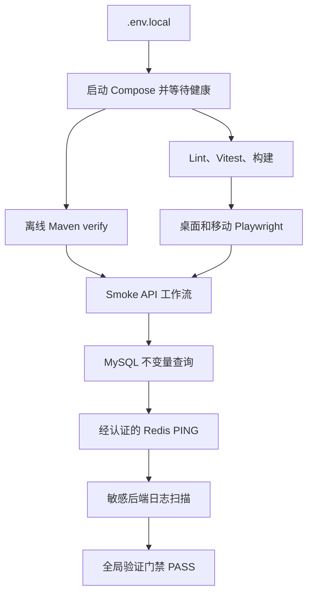

Lamplit 按层验证行为：先运行快速的后端规则测试以及前端状态/UI 测试，再运行使用临时 MySQL 的 Spring 集成测试、针对运行中应用的浏览器验收测试，最后运行一个实际驱动本地 Compose 堆栈的数据路径、并检查持久化与日志的脚本。每层回答的问题不同；组件测试通过并不能证明浏览器接线、存储行为或服务就绪状态正确。

**工作准则：** 运行能够证明所改行为的最窄且安静的检查。不要隐藏、截断或丢弃失败输出。保留命令输出；浏览器失败时，还应保留 Playwright 留存的 trace 和截图，以便后续诊断具有原始证据。当改动跨越应用边界，或涉及迁移、认证、持久化、AI 安全、导出或部署配置时，再升级到全局门禁。

## 测试层与入口

| 层级 | 主要命令 | 可证明的事项 | 运行时假设 |
| --- | --- | --- | --- |
| 后端单元与集成 | `cd backend && ./mvnw test` | Java 规则、HTTP/服务集成、迁移、安全、并发和领域行为 | Java 21；集成测试创建 MySQL 8.4 Testcontainers，因而 Docker 必须可用。 |
| 前端静态/单元 | `cd frontend && pnpm lint && pnpm test --run && pnpm build` | Vue/TypeScript 类型检查、基于 jsdom 的组件/Store/逻辑行为，以及生产构建 | Node >=22.13 和 pnpm 11。 |
| 浏览器验收 | `cd frontend && pnpm exec playwright test -c playwright.config.ts` | 针对运行中前端/API 的用户可见跨页面行为 | 应用可通过 `PLAYWRIGHT_BASE_URL` 或 `http://127.0.0.1:5173` 访问，且已安装 Playwright 浏览器。 |
| 全局数据流门禁 | `./scripts/verify-global-flow.sh` | 以上各项，加上真实本地 Compose 堆栈、API 工作流、数据库断言、Redis 认证和日志卫生 | `.env.local`、Docker Compose、Docker/Testcontainers、Maven 与前端依赖。 |

`frontend/package.json` 提供简写：`pnpm test`（Vitest）和 `pnpm test:e2e`（Playwright）。项目文档中的面向发布顺序还会在全局门禁前验证 Compose 插值：

```bash
cd backend && ./mvnw test
cd frontend && pnpm lint && pnpm test --run && pnpm build
docker compose --env-file .env.local -f deploy/compose.yaml config
./scripts/verify-global-flow.sh
```

前端测试配置使用 `jsdom`，并排除 `e2e/**` 和累积的 `.pnpm-store/**` 链接；浏览器测试是刻意独立的套件，而非被 Vitest 意外发现。前端构建命令会在 `vite build` 前运行 `vue-tsc --noEmit`；`lint` 同样是类型检查命令，而非 ESLint 调用。

## 后端：规则贴近状态所有者，集成覆盖 HTTP/数据边界

Maven Surefire 配置会选取 `**/*Test.java` 与 `**/*IT.java`，在测试中关闭应用调度，并附加 Byte Buddy agent。因此，`./mvnw test` 并不只是单元测试：它会同时运行常规快速测试和集成测试。Spring 的测试依赖包括 Spring Security 测试支持、Testcontainers 的 JUnit/MySQL 模块以及 REST Assured。

套件按能力组织，而不是依赖一个端到端固定夹具。代表性的规则测试覆盖任务状态迁移/重复、目标策略、安全、保留、API 信封和异常映射；companion 套件还保护确定性的领域规则与提示词/模型边界。迭代时使用聚焦的 Maven 选择器，交付前恢复完整套件，例如：

```bash
cd backend && ./mvnw test -Dtest=TaskStateMachineTest
cd backend && ./mvnw test -Dtest=AuthFlowIT
```

集成测试启动自己的 `mysql:8.4` 容器，并为每个 Spring context 提供该容器 JDBC URL 及仅测试使用的签名/加密配置。这使得迁移和仓库行为无需开发者的 Compose 数据库即可测试。例如，`DatabaseMigrationIT` 会验证干净容器上的 Flyway baseline 成功、已植入的维度/模板以及模式预期。

集成层特意测试控制器 mock 可能遗漏的安全与持久化属性。`AuthFlowIT` 验证 HttpOnly 认证 Cookie、可读取的 CSRF Cookie、不安全变更被拒绝、携带 `X-CSRF-Token` 时接受变更，以及注册创建同意/偏好/维度/角色行且不在 JSON 中返回令牌。`TaskExecutionConcurrencyIT` 并发运行十个重复的终态事件请求，并断言它们收敛为一个事件和一条幂等记录。`AiFlowIT` 使用 `app.ai.provider=mock`，检查 SSE 顺序、所有权隔离、危机安全事件形态和脱敏的安全持久化，以及幂等的建议采纳。隐私集成测试替换为内存对象存储和可控时钟，以测试 ZIP 所有权/速率限制，以及删除的冷静期、取消和处理，而不依赖 MinIO 或真实时间等待。

## 前端 Vitest：状态权威与渲染契约

前端测试在 Vitest/jsdom 下运行，并按需要使用 Vue Testing Library、Vue Test Utils 和 Pinia。它们覆盖 API/SSE 客户端、模块逻辑、视图和共享场景/UI 交互。通过选择受影响文件让改动验证保持局部：

```bash
cd frontend && pnpm test --run src/modules/companion/companion.store.test.ts
```

companion Store 测试体现了值得用前端测试保护的不变量：服务端快照具有权威性；较早的在途读取不能覆盖较新的意图结果；重试未确认的 thought 会复用其 ID；取消依赖服务端响应而非本地臆造状态；focus intention 永不将用户真实任务标为完成。其生命周期案例还验证一个共享的 Pinia world、引用计数轮询、可见性行为、数据变化刷新，以及认证账户变更时清除陈旧数据。这些竞态/生命周期保证很容易被浏览器点击路径遗漏。

对于前端改动，应在所有权边界新增或修改测试：Store 测试覆盖请求排序和状态迁移，逻辑测试覆盖纯策略，组件/视图测试覆盖可访问的渲染行为。若 TypeScript、模板、路由或 bundle 输入改变，聚焦运行后还应执行 `pnpm lint` 和 `pnpm build`。

## Playwright 验收覆盖

默认 Playwright 配置从仓库级 `e2e/` 读取测试，在桌面 Chrome 和 iPhone 13 尺寸的移动项目中运行每个测试，并设置 120 秒单测试超时。它优先使用 `PLAYWRIGHT_BASE_URL`，否则使用 `http://127.0.0.1:5173`。失败时保留 trace 并截图；HTML 报告写入 `playwright-report`。应将这些产物与完整失败输出一并保留，而不是反复重跑直到证据消失。

调查时运行单个 spec 或单个命名测试，随后在两个已配置项目中运行，才可宣布交互完成：

```bash
cd frontend && pnpm exec playwright test -c playwright.config.ts ../e2e/companion.spec.ts
cd frontend && pnpm exec playwright test -c playwright.config.ts -g "authenticated users receive an AI SSE response"
```

验收覆盖刻意面向浏览器，而不是重复每项后端断言。示例包括：

- 经 UI 注册必须接受三项同意，并进入 onboarding；
- AI UI 发送已认证消息，并等待非空的助手回复而非不可用降级回复；
- 两个独立认证 context 能发起/接受好友请求并交换文本/emoji 消息，包括未读追踪；
- 每日状态、目标栈、响应式导航和布局断言覆盖真实渲染状态；
- 匿名请求代表性的受所有权保护资源会得到 `401`；
- companion 流程恰好一次加入私有的 25-resident world，经 reload 持久化，记录/取消幂等 intents，不让私有任务文本进入 resident memories，并验证 focus 不改变任务状态。

浏览器验收测试**默认使用模拟模型提供者**。`.env.example` 将 `QWEN_PROVIDER=mock`，且 Compose 未覆写时也传入 `mock`，因此常规验收和全局验证不应调用外部模型。真实提供者检查是使用未提交的受限凭据、显式配置的独立操作；mock 运行变绿并不意味着该检查已完成。

## 全局验证门禁

`verify-global-flow.sh` 是本地置信度最高的门禁。它要求 `.env.local`，加载该文件，启动 `deploy/compose.yaml`，并最多以两秒间隔尝试 60 次，直至 Compose 报告所有服务健康。随后执行以下有序流水线：



*该图展示门禁的有序本地数据流；门禁会在第一个失败步骤停止，只有全流水线完成才算通过。*

更准确地说，脚本先运行离线 Maven `verify`，再运行 CI 模式的前端 lint、Vitest、构建和已配置 Playwright 套件，之后执行 `scripts/smoke-api.sh`。API 脚本使用临时 Cookie jar 与产物，将 CSRF Cookie 带入每个非 `GET` 变更操作，并在带标签的失败处立即退出。其工作流注册一个新用户，验证同意行和稳定的任务预设选择/刷新配额；随后创建目标、周计划和任务，并物化日程。它驱动已开始/完成/部分完成/延期/跳过任务事件及撤销，检查角色经验/成长，测试正常 SSE 完成和危机安全（有 `safety` 事件而没有流式 `delta`），确认重复建议采纳返回相同数据，验证包含角色进度的五条目 ZIP 导出，验证跨用户目标访问以 `404` 隐藏，并确认删除进入且可离开冷静期。

API 工作流之后，封装脚本会查询 MySQL 的八项数据不变量：同意、目标、任务事件、AI 安全事件、导出作业和角色进度的下限；恰好 200 个已发布模板；以及预期的三次刷新。它还会单独认证 Redis 并要求 `PONG`。如存在 `logs/backend.log`，脚本会拒绝包含请求 Cookie、刷新/访问令牌、smoke 密码标记或可识别 `sk-...` 密钥的日志内容。任一断言失败都会以非零退出，因为两个脚本都使用 `set -euo pipefail`。

该门禁使用的 Compose 堆栈具备生产形态：MySQL 和 Redis 均受密码保护且有健康检查，Redis 使用 AOF 持久化，MinIO 提供 S3 兼容对象存储路径。后端依赖健康的 MySQL 与 Redis，MinIO 自身也有健康检查。门禁按 `docker compose ps` 报告等待 Compose 健康；若导出/上传行为失败，除后续 API 失败外还应检查 MinIO 就绪性。

## 选择与升级验证

1. **纯后端规则或回归：** 新增/运行最窄的 Java 测试类。事务、迁移数据、HTTP 安全、所有权、幂等性或 Spring 接线重要时，升级到对应的 `*IT`。
2. **前端逻辑、组件或 Store 改动：** 运行对应 Vitest 文件。对于 Store 改动，测试请求竞态、账户变更、计时器和服务端权威响应，而不只测试一次成功点击。
3. **可见的多页面或响应式行为：** 在两个已配置项目中运行受影响的 Playwright spec。失败时检查 trace、截图、网络/API 响应和浏览器错误。
4. **跨服务、持久化或安全敏感改动：** 在局部聚焦检查后运行全局门禁。这包括 AI 流式/安全、Cookie/CSRF、导出、删除、任务物化、迁移、Redis 以及 Compose/env 改动。

变更部署变量时，在启动门禁前验证环境展开：

```bash
docker compose --env-file .env.local -f deploy/compose.yaml config
```

不要通过重置数据库或 volume 来让测试通过；那会移除正在测试的持久化条件。门禁刻意创建新的 API 用户，但会评估配置的本地堆栈中累积的数据谓词。若失败，应保留完整终端输出、脚本打印的相关临时/API 诊断输出、Compose 服务状态/日志和 Playwright 产物。然后修复最早失败的层，而不要把后续数据库、Redis 或日志断言视为根因。

有关安装、生命周期和部署故障排除，参见[本地开发、配置与部署](../operations/local-development-and-deployment.md)。有关面向用户的覆盖背景，参见账户、规划、companion 和任务工作流页面。
