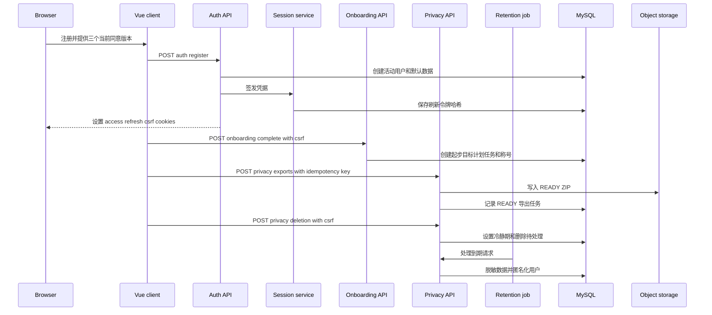

## 范围与状态归属

此流程跨越四个必须协同变化的边界：`AuthService` 中的账户创建、由 `SessionService` 和 `CookieFactory` 签发的浏览器凭据、一次性的入门设置事务，以及拥有导出和删除状态的隐私服务。持久化状态刻意分散：`sys_user`、同意记录、偏好、刷新会话、入门设置、导出和删除记录位于 MySQL；导出归档位于对象存储；陪伴者记忆是文件状态，并有显式的导出和删除处理。

`public_id` 用于标识记录，并不授予访问权限。控制器从 `CurrentUser` 推导所有者，服务按该用户 ID 查询资源，因此不能仅凭公开 ID 访问另一位用户的数据。

上图展示主要账户状态和跨存储交接；凭据签发与隐私操作之间还会发生普通认证请求和刷新令牌轮换。

## 注册：同意是服务端门槛

`POST /api/v1/auth/register` 接收身份和资料数据：过去的出生日期、IANA 时区、至少 12 个字符的密码，以及三项必需的同意版本。服务端而非复选框具有最终决定权：`AuthService` 规范化邮箱、解析时区、拒绝重复地址，并要求 `TERMS`、`PRIVACY`、`AI` 三个版本精确匹配当前的 `2026-07`。缺失或过期版本会返回 `CURRENT_CONSENTS_REQUIRED`。

注册在事务中完成：写入 `ACTIVE`、`USER` 账户和 Argon2 密码哈希，新增三条已授予的同意记录，初始化偏好、通知默认值、系统维度和角色进度。返回的用户视图不包含内部 ID 或令牌值；控制器只会在该服务调用成功后签发会话。前端提供三个独立同意控件，提交同一版本，重新加载 `/me`，并将新用户导向 `/onboarding`。

**变更检查点。** 更新同意版本时，应同步发布后端常量和前端载荷；保留三条可审计记录，不要以单个布尔值替代；并通过认证后的同意端点为既有用户提供迁移路径。客户端已有复选框不是放松注册校验的理由。

## 浏览器会话与认证请求

Spring Security 层保持无状态，但刷新会话具有数据库支持的生命周期。一次签发产生已签名的 access JWT、随机 refresh token 和 CSRF token；`CookieFactory` 仅以 Cookie 发送它们：

| Cookie | 路径与脚本访问 | 用途 |
| --- | --- | --- |
| `access_token` | `/`、HttpOnly、access TTL | 认证请求 JWT。 |
| `refresh_token` | `/api/v1/auth`、HttpOnly、refresh TTL | 用于续期的不透明凭据；其 SHA-256 哈希保存在 `auth_session`。 |
| `csrf_token` | `/`、可由脚本读取、refresh TTL | 双提交值，镜像到 `X-CSRF-Token`。 |

三者均使用 `SameSite=Lax`，`app.security.secure-cookies` 控制 `Secure` 标记。`JwtAuthenticationFilter` 解析 `access_token`，并在安装 `CurrentUser` 前查询账户当前数据库状态；所以旧 JWT 不能让非活动账户继续使用。`DELETION_PENDING` 是刻意狭窄的例外：它只能在 `/api/v1/privacy/deletion` 路由认证，以查询或取消删除请求。

Vue API 客户端总是使用 `credentials: 'include'`；对非安全方法，它读取并 URI 解码 `csrf_token`，写入 `X-CSRF-Token`。双提交过滤器在进入控制器前要求 Cookie 与请求头逐字节相等，否则拒绝变更请求。豁免项仅是公开的凭据建立或恢复端点：注册、登录、MFA 验证、刷新、忘记密码与重置密码。新浏览器客户端和非浏览器 smoke 工具都必须保持此约定，不能为消除 403 而豁免用户范围内的变更。

收到 `401` 时，客户端最多尝试一次 `POST /auth/refresh`，但刷新请求自身不会触发此逻辑；只有刷新成功才重试原请求。轮换会锁定刷新行，并拒绝缺失、未知、过期、已撤销或已轮换令牌。重用已轮换或撤销令牌会撤销整个令牌族，以检测重放。退出登录撤销匹配的认证刷新行；退出所有设备撤销所有活跃会话，二者均会过期浏览器 Cookie。密码重置或认证后的密码修改同样撤销全部会话，因此 UI 应要求重新登录，而不能假设原 Cookie 仍有效。

**会话变更检查点。** Cookie 名称、路径、HttpOnly 分离、`credentials: 'include'` 和 CSRF 请求头行为必须整体保留。生产环境应为 HTTPS 启用安全 Cookie，并分别配置签名和加密密钥。变更轮换语义时，必须覆盖重放令牌族，而不只是测试一次成功刷新。

## 管理员分支：引导不是普通注册

普通 `USER` 凭据会使 `/auth/login` 立即签发会话。非 `USER` 登录则返回 `MFA_PENDING` 且不设置 Cookie。前端仅在切换到 MFA 表单期间保留所提交的凭据；`/auth/mfa/verify` 重新验证凭据、拒绝普通用户、解密并验证管理员 TOTP 密钥，记录 `mfa_verified_at` 后才签发 Cookie 会话。

首个生产管理员属于启动配置，不是注册路径。仅在没有活动管理员且 bootstrap 邮箱和至少 12 字符的密码都已配置时，`AdminBootstrapRunner` 才创建 `ACTIVE` 的 `ADMIN`。它使用给定或生成的 TOTP 密钥并加密持久化；日志会输出注册材料，运维必须将其视为敏感信息并及时完成轮换或注册。只配置部分 bootstrap 参数会令启动失败；完全未配置时仅记录警告且不创建账户。

`LocalAdminBootstrapRunner` 仅限 `local` profile。启用并配置后，它会创建或重置本地 `ADMIN`；认证控制器只允许该配置账户在本地 profile 直接登录。此设计刻意绕过通常的 MFA 待处理分支，绝不能在本地开发以外启用。

## 入门设置：一个幂等的初始化事务

认证用户可通过 `GET /api/v1/onboarding/starters?scene=...` 读取某个场景最多四个已发布的起步模板。Vue 向导选择场景、每日分钟数、每周频率、难度和一至三个起步模板 ID；虽然界面可以预选三个建议，后端仍验证场景、数值范围、唯一性和数量，以及每个模板确属所选场景且为已发布状态。

`POST /api/v1/onboarding/complete` 同时需要有效会话和 CSRF 证明。在用户行锁下，服务检查 `user_preference.onboarding_completed_at`。第一次完成会保存偏好和时间戳，创建四周目标、当周计划、所选任务和物化日程，再授予 `NEWCOMER_PATH`。重复调用不会复制产品数据，而会以 `alreadyCompleted` 返回既有完成时间。必须让这张初始化图在一个事务中创建；拆成由前端编排的多次写入会产生部分设置并破坏安全重试。

## 隐私退出路径

### 导出

`POST /api/v1/privacy/exports` 是要求 CSRF 的认证变更，并要求 `Idempotency-Key`。服务按用户和 `DATA_EXPORT` 作用域处理幂等性；每个用户在 24 小时内最多有一个新导出请求。它同步生成 `exports/<userId>/<exportId>.zip`，写入对象存储，计算 SHA-256 校验和，并持久化一个有效期 24 小时的 `READY` 任务。

归档目前包含清单和资料、目标、任务事件、角色进度以及陪伴者体验和记忆；这不等同于对所有潜在存储提供完整可移植性的承诺。状态、直接 ZIP 内容和预签名下载均按所有者 ID 与导出公开 ID 查询；内容和下载还要求状态为 `READY` 且任务未过期，否则返回 `EXPORT_EXPIRED`。到期任务会删除归档对象并将任务状态改为 `EXPIRED`，而 MySQL 保留其生命周期元数据。

### 删除与取消

`POST /api/v1/privacy/deletion` 创建一个 `COOLING_OFF` 请求，处理时间安排在七天后；若已有当前请求则直接返回它。它立即将账户改为 `DELETION_PENDING`、禁用通知偏好并撤销全部会话。因此提交后不应期望普通认证路由可用；删除路由例外使用户可持仍存在的 access Cookie 和 CSRF 值调用 `GET /privacy/deletion` 或 `POST /privacy/deletion/cancel`。

仅在请求处于 `COOLING_OFF` 时才可取消：服务将请求标记为 `CANCELLED` 并恢复账户为 `ACTIVE`，但不会恢复已撤销的刷新会话，所以客户端应重新登录。到期后，`processDue` 通过 `FOR UPDATE SKIP LOCKED` 认领冷静期行，令其经过 `PROCESSING`：脱敏 AI 数据、标记附件元数据已删除、删除陪伴者世界和文件记忆、记录完成哈希，最后匿名化凭据和资料字段，并把账户设为 `DELETED`。

附件对象的实际字节不由该服务删除；如有物理对象擦除要求，需要独立的对象存储清理和核对机制。文件系统记忆删除位于 SQL 事务外，因此需要重试、可观测性和核对，而不能假设跨存储原子性。`RetentionJob` 按 `app.privacy.retention-cron`（默认每小时第 10 分钟）执行 AI 到期脱敏、导出过期和到期删除处理。

**隐私变更检查点。** 每新增一个用户数据权威来源，都应同时更新按所有者范围的导出、计划删除以及取消和可见性行为。明确清理究竟是脱敏、元数据墓碑还是对象字节删除。

## 聚焦验证

先使用能证明边界的最小测试；变更跨越浏览器、安全、持久化或调度时再扩大范围：

- `backend/src/test/java/com/betterself/growth/auth/AuthFlowIT.java` 验证注册默认值、JSON 不含令牌字段、CSRF 拒绝/接受、同意撤回和密码修改流程；`RefreshReplayIT.java` 覆盖刷新令牌重放。
- `backend/src/test/java/com/betterself/growth/onboarding/OnboardingFlowIT.java` 验证已发布模板约束、首次初始化创建以及重复完成不会复制目标或任务。
- `backend/src/test/java/com/betterself/growth/privacy/PrivacyFlowIT.java` 演练按所有者范围的导出访问、限流/过期、七天冷静期、会话撤销、取消和到期处理。
- `frontend/src/modules/auth/AuthView.test.ts` 与 `frontend/src/modules/onboarding/OnboardingView.test.ts` 覆盖本地 UI 状态；`e2e/global-flow.spec.ts` 验证完成同意的注册会抵达入门设置。
- 修改 Cookie/CSRF、同意版本、生命周期端点、导出或删除时，在运行中的栈上执行 `./scripts/smoke-api.sh`。它的 Cookie jar 会在变更请求中镜像 CSRF 请求头，并断言导出和删除取消行为。

另见[认证与所有权](/openwiki/concepts/authentication-and-ownership.md)、[隐私与保留](/openwiki/concepts/privacy-and-retention.md)、[持久化与 API 契约](/openwiki/architecture/persistence-and-api-contracts.md)及[测试与全局验证策略](/openwiki/testing/verification-strategy.md)。
