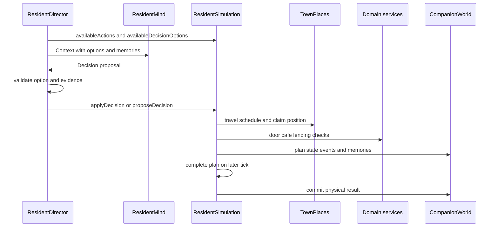

# 动作合法性、物理结果与世界提交

居民模型不是 `CompanionWorld` 的写入者。`ResidentDirector` 只将某一时刻的世界快照、可见记忆和规则生成的候选项交给 `ResidentMind`；回复回到短事务后，仍须经过应用层的格式/证据检查与 `ResidentSimulation` 的权威校验。规则层才会建立计划、移动角色、争抢位置并在完成时改变世界；记忆与 `WorldEvent` 是这些已发生结果的不同记录面，而不是模型回复的替代品。

## 端到端链路

上图展示一次普通决策到延迟物理提交的边界：模型选择的是提案，`complete` 才会执行多数需要耗时的效果。

1. `ResidentDirector` 在构造 `ResidentMind.Context` 时调用 `availableActions` 和 `availableDecisionOptions`。后者将合法的 `action`、`place`、`roomId` 和目标集合捆绑，随后为每个目标展开成带 `dN` id 的 `DecisionOptionView`，避免让模型在独立字段的笛卡尔积中拼出诸如错误地点或错误目标的组合。上下文还只包含当前房间的 `WorldObject`、已知地点、可见人物、位置使用情况和经过筛选的记忆。 [ResidentDirector.java#L853-L874](repo://backend/src/main/java/com/betterself/growth/town/companion/application/ResidentDirector.java#L853-L874) [ResidentSimulation.java#L2416-L2498](repo://backend/src/main/java/com/betterself/growth/town/companion/domain/ResidentSimulation.java#L2416-L2498)
2. 模型 I/O 在预留事务之外执行；结果回写时，90 秒以上的回复会过期。对普通 decision，应用层要求动作仍在上下文菜单中、精确候选模式下选中了提供的 option、`evidenceIds` 都属于提示中的记忆，并且 `propose` 不能没有证据，然后才调用领域方法。 [ResidentDirector.java#L184-L202](repo://backend/src/main/java/com/betterself/growth/town/companion/application/ResidentDirector.java#L184-L202) [ResidentDirector.java#L986-L1023](repo://backend/src/main/java/com/betterself/growth/town/companion/application/ResidentDirector.java#L986-L1023)
3. `ResidentSimulation.applyDecision` 再检查居民 revision、`intentRevision`、固定动词集合、理由/发言长度、以及证据确属该居民。因而并行思考不以全局 `modelSequence` 决定成败；同一居民或 avatar intent 已变化时，旧回复被拒绝，不会覆盖较新的世界。 [ResidentSimulation.java#L2549-L2565](repo://backend/src/main/java/com/betterself/growth/town/companion/domain/ResidentSimulation.java#L2549-L2565) [ResidentSimulation.java#L2568-L2574](repo://backend/src/main/java/com/betterself/growth/town/companion/domain/ResidentSimulation.java#L2568-L2574)

## 从“选择”到计划、抵达与占用

`applyDecision` 不是把任意 JSON 直接变成状态。它先将模型的 `home` 解析为本人住处（仅 `visit_home` 例外），验证地点存在、房间属于该建筑且居民可进入、位置与动作匹配，并对睡觉、洗澡、照料植物、锻炼、读公告板、修理、项目、社交和服务动作施加专项前置条件。`none` 则是合法的安静期：取消等待队列、设置短暂 retry 时间，而不是伪装成一项物理动作。 [ResidentSimulation.java#L2587-L2638](repo://backend/src/main/java/com/betterself/growth/town/companion/domain/ResidentSimulation.java#L2587-L2638) [ResidentSimulation.java#L2714-L2750](repo://backend/src/main/java/com/betterself/growth/town/companion/domain/ResidentSimulation.java#L2714-L2750)

对于需要去别处的选择，`moveOrSchedule` 先创建 `travel` plan、保存目的动作/房间/时长、释放原位置并把 actor 放到 `street` 的 `walk` 状态。旅行结束才调用 `schedule`。这意味着“选择去咖啡馆”不等于已经进入；咖啡馆门和他人住处门均在实际到达时再次检查。被锁门拒绝会写入“进不去”的观察记忆、清除计划并留在街上 idle，等待新的决策，而不会自动重试同一次行走。受邀客人成功进入他人住处时，才消费一张邀请并可触发屋主的 pending encounter。 [ResidentSimulation.java#L452-L463](repo://backend/src/main/java/com/betterself/growth/town/companion/domain/ResidentSimulation.java#L452-L463) [ResidentSimulation.java#L468-L557](repo://backend/src/main/java/com/betterself/growth/town/companion/domain/ResidentSimulation.java#L468-L557) [ResidentSimulation.java#L594-L629](repo://backend/src/main/java/com/betterself/growth/town/companion/domain/ResidentSimulation.java#L594-L629)

位置是独立于“到场”的稀缺资源。站立、观察、聊天、创建和庆祝通常不占 `Position`；床、炉灶、浴室、设备、花圃、公告板以及学习/工作座位等才会按动作选取 position。精确资源使用 `claimExact`，满员则转为 `wait` plan 并保留要重试的动作；因此不会用别的空家具替代共享炉灶，也不会让两个居民重叠占用同一位置。位置损坏在抵达后仍可使动作失败；修理则要求目标已坏、在同一地点，并在 plan 完成时恢复资源。 [ResidentSimulation.java#L514-L581](repo://backend/src/main/java/com/betterself/growth/town/companion/domain/ResidentSimulation.java#L514-L581) [TownV2SystemsTest.java#L138-L159](repo://backend/src/test/java/com/betterself/growth/town/companion/domain/TownV2SystemsTest.java#L138-L159) [TownV2SystemsTest.java#L178-L190](repo://backend/src/test/java/com/betterself/growth/town/companion/domain/TownV2SystemsTest.java#L178-L190)

## 物理提交：完成 plan 才产生效果

`ResidentSimulation.step` 每六秒推进一次（单次 `advance` 至多十步）；plan 到期时先记录 doing，再调用 `complete`。`travel` 和 `wait` 的完成只会继续调度已选动作；其他动作才在对应分支提交副作用。该顺序是安全修改动作时最重要的约束：不要在模型提案或开始 travel 时提前写入“完成了”的物理事实。 [ResidentSimulation.java#L164-L180](repo://backend/src/main/java/com/betterself/growth/town/companion/domain/ResidentSimulation.java#L164-L180) [ResidentSimulation.java#L212-L224](repo://backend/src/main/java/com/betterself/growth/town/companion/domain/ResidentSimulation.java#L212-L224) [ResidentSimulation.java#L294-L389](repo://backend/src/main/java/com/betterself/growth/town/companion/domain/ResidentSimulation.java#L294-L389)

主要提交路径如下：

- `create`/`help` 在完成时给项目增加贡献者和进度；多人项目在贡献者不足时被 `SOLO_PROGRESS_CAP` 限制，完成后项目成为 `ready`，重建关联的 project `WorldObject`，并写 contribution/ready event 与在场见证记忆。`celebrate` 将 ready 项目转为 `celebrating` 并为在场参与者写观察记忆。 [ResidentSimulation.java#L329-L386](repo://backend/src/main/java/com/betterself/growth/town/companion/domain/ResidentSimulation.java#L329-L386)
- `propose` 是特殊的即时“提出愿望”：要求非住处、受限的 `objectKind`、本人的非空证据以及最多两个未庆祝项目；结果项目初始为 `idea`、进度为零，并不会创建 project object。只有后续实际 `create`/`help` 才生成物件和进度。 [ResidentSimulation.java#L900-L925](repo://backend/src/main/java/com/betterself/growth/town/companion/domain/ResidentSimulation.java#L900-L925) [CompanionRulesTest.java#L60-L65](repo://backend/src/test/java/com/betterself/growth/town/companion/domain/CompanionRulesTest.java#L60-L65)
- `tend_plants`、`read_notice`、`repair` 等在完成时分别更新可见物件/公告知识或 position 状态；测试固定了植物动作需先占 `garden-plot`、完成后改变 `flowerbed.state` 并产生带 position id 的 event。 [ResidentSimulation.java#L302-L306](repo://backend/src/main/java/com/betterself/growth/town/companion/domain/ResidentSimulation.java#L302-L306) [TownV2SystemsTest.java#L53-L66](repo://backend/src/test/java/com/betterself/growth/town/companion/domain/TownV2SystemsTest.java#L53-L66)
- `open_cafe` 和 `tend` 也是计划动作，完成时分别调用 `CafeService.openForDay` 与 `finishTending`。服务请求本身由 `request_drink` 创建为 `waiting`，服务状态由 `CafeService` 推进；只有经营者或有生效 assist/delegate 安排者、咖啡馆处于 open 状态才可 `tend`。服务层验证状态和权限，但不从压力、等待时间或人格自动替居民选动作。 [ResidentSimulation.java#L387-L388](repo://backend/src/main/java/com/betterself/growth/town/companion/domain/ResidentSimulation.java#L387-L388) [CafeService.java#L8-L22](repo://backend/src/main/java/com/betterself/growth/town/companion/domain/CafeService.java#L8-L22) [CafeService.java#L79-L112](repo://backend/src/main/java/com/betterself/growth/town/companion/domain/CafeService.java#L79-L112)

## 门、物品与可见事实

`DoorService` 管理门的物理准入，而不是模型的意图：咖啡馆门默认未锁，住户门默认锁；住户本人、锁门者、持有效邀请者或未锁门时可进入。锁/解锁必须人在该地点且状态确有变化，向本人和同房清醒见证者写记忆，再写 `door_locked`/`door_unlocked` event；未在场者抵达失败时只知道门锁着，不知道谁锁的。 [DoorService.java#L10-L40](repo://backend/src/main/java/com/betterself/growth/town/companion/domain/DoorService.java#L61-L98) [DoorService.java#L128-L159](repo://backend/src/main/java/com/betterself/growth/town/companion/domain/DoorService.java#L128-L159)

`Lending` 将借与赠限制为同房的真实交接。借出保留 `ownerId`、把 `holderId` 和物件的地点/房间移给借用人并新增未归还 `Loan`；赠与则同步转移 owner 与 holder，并以已归还的 gift 记录表示不可返还。归还需双方再次同房。模型只指定物品；规则只在现场恰好有一名其他居民时确定接收者，多人或无人时拒绝而非猜测。持有者移动时物件跟随其地点和房间。 [Lending.java#L56-L84](repo://backend/src/main/java/com/betterself/growth/town/companion/domain/Lending.java#L56-L84) [Lending.java#L87-L129](repo://backend/src/main/java/com/betterself/growth/town/companion/domain/Lending.java#L87-L129) [TownV2SystemsTest.java#L161-L176](repo://backend/src/test/java/com/betterself/growth/town/companion/domain/TownV2SystemsTest.java#L161-L176)

## Event 与记忆不是同一层记录

`event` 将公共世界事实放入最多 80 条的 `w.events`，并为 avatar 恰在同一 place 的少数类型补写 diary。领域动作通常还通过 `memory` 给行动者、当场见证者或特定接收者写各自的观察/听闻事实；例如借还的双方总有记忆，旁观者必须同房且非睡眠/行走。记忆归属和证据链是之后模型可引用的认识材料，`WorldEvent` 则是世界级可展示记录；不要用 event 替代个人记忆，也不要把模型理由当作客观物理事实广播。 [ResidentSimulation.java#L3313-L3316](repo://backend/src/main/java/com/betterself/growth/town/companion/domain/ResidentSimulation.java#L3313-L3316) [Lending.java#L132-L156](repo://backend/src/main/java/com/betterself/growth/town/companion/domain/Lending.java#L132-L156)

## 当前边界与安全扩展

- 动词白名单仍是 `DECISION_ACTIONS` 的固定集合，尽管 `availableActions` 会按世界状态收窄菜单、`availableDecisionOptions` 会动态给出地点/房间/目标。因此新增动作至少要同步审查：白名单、候选生成、`applyDecision` 的前置校验、`schedule` 的占用语义、`complete` 的物理提交、模型 adapter 的 schema/提示，以及覆盖拒绝与成功路径的测试。只改 prompt 或只往 `availableActions` 加字符串不会让动作合法或产生效果。 [ResidentSimulation.java#L2339-L2409](repo://backend/src/main/java/com/betterself/growth/town/companion/domain/ResidentSimulation.java#L2339-L2409) [ResidentSimulation.java#L2549-L2574](repo://backend/src/main/java/com/betterself/growth/town/companion/domain/ResidentSimulation.java#L2549-L2574)
- `WorldObject` 是一个扁平不可变 record，以 `id`、`kind`、地点/房间、显示状态、project、owner/holder 等字段表达；现有行为通过 `id`/`kind` 的分支和替换 record 实现，而非由对象多态自行执行。四级地址（building/place、room、position 或 object）需要保持可解析，物件跟随/迁移时必须更新地点与房间。组合式物品或物品组件模型可以是未来候选设计，但当前仓库未实现，不能假定其存在。 [CompanionWorld.java#L623-L638](repo://backend/src/main/java/com/betterself/growth/town/companion/domain/CompanionWorld.java#L623-L638) [TownV2SystemsTest.java#L26-L40](repo://backend/src/test/java/com/betterself/growth/town/companion/domain/TownV2SystemsTest.java#L26-L40)
- 对抗陈旧模型结果应依赖 revision、intent revision、到达时门检与占用结果这些二次验证，不应放宽它们来“提高采纳率”。针对位置目标的测试已经确认床不能作为书桌、不同卧室不能交接物品，而受邀客人只可进入 host 的 common room。 [TownV2SystemsTest.java#L102-L135](repo://backend/src/test/java/com/betterself/growth/town/companion/domain/TownV2SystemsTest.java#L102-L135)
