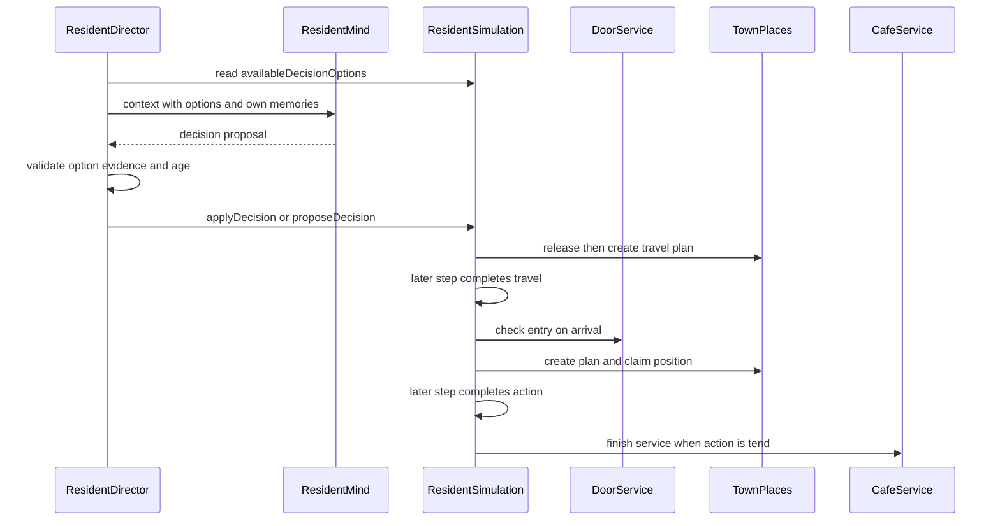

# 动作合法性与世界提交

## 边界：模型提案不等于世界写入

当前实现中，`ResidentMind` 只能提出 decision、项目愿望或反思；它不直接修改 `CompanionWorld`。`ResidentDirector` 将 `availableDecisionOptions` 生成的动作、地点、房间和目标组合展开为带 `dN` 标识的 `DecisionOptionView`，并连同该居民可检索的记忆和可见世界事实交给模型。回包仍须在应用层匹配菜单、精确 option（存在 option 时）和本次上下文中的证据；随后才进入领域方法的二次校验。 [ResidentDirector.java#L853-L874](repo://backend/src/main/java/com/betterself/growth/town/companion/application/ResidentDirector.java#L853-L874) [ResidentDirector.java#L986-L1007](repo://backend/src/main/java/com/betterself/growth/town/companion/application/ResidentDirector.java#L986-L1007)

领域层以居民 `revision`、世界 `intentRevision`、`DECISION_ACTIONS`、文本长度及“证据必须属于该居民”等条件拒绝陈旧、越权或格式不合法的提案。模型调用在事务外运行，应用层还会拒绝超过 90 秒的回包；并发安全并不依赖全局 `modelSequence`，而依赖这些按居民和 intent 划分的乐观版本。 [ResidentSimulation.java#L2604-L2610](repo://backend/src/main/java/com/betterself/growth/town/companion/domain/ResidentSimulation.java#L2604-L2610) [ResidentDirector.java#L986-L1010](repo://backend/src/main/java/com/betterself/growth/town/companion/application/ResidentDirector.java#L986-L1010)

该图展示普通动作的两次时间边界：提案被接受时通常只建立计划，旅行抵达和动作完成时才分别进行门禁、占用和物理提交。

## 提案的合法性与即时分支

`applyDecision` 会把模型的 `home` 解析为本人的住处，只有 `visit_home` 按目标居民解析为他人住处；随后校验地点存在、房间属于该建筑、目标 position 与动作匹配，以及睡觉、洗澡、修理、服务、项目和社交等专项前置条件。`availableActions` 负责收窄菜单，`availableDecisionOptions` 则避免把合法字段拼成非法笛卡尔积；但菜单不是权限的唯一来源，领域层必须保留所有复核。 [ResidentSimulation.java#L2452-L2534](repo://backend/src/main/java/com/betterself/growth/town/companion/domain/ResidentSimulation.java#L2452-L2534) [ResidentSimulation.java#L2654-L2768](repo://backend/src/main/java/com/betterself/growth/town/companion/domain/ResidentSimulation.java#L2654-L2768)

并非所有接受的选择都要等待 `complete`：

- `none` 取消该居民的排队资格，设置一段 retry 时间；若没有现行 plan，则变为 `idle`，而不是伪造一个物理动作。
- `proposeDecision` 是即时写入：只接受非住处、受限 `objectKind`、非空的本人证据和至多两个未庆祝项目，创建进度为零的 `idea`，并不创建 project `WorldObject`。后续 `create` 或 `help` 完成后才推进项目并重建关联物件。
- 锁门、邀请入户、借还或赠与、关闭咖啡馆等分支也在其各自规则方法中立即校验并写入；“即时”不表示模型直接写状态。

[ResidentSimulation.java#L2623-L2637](repo://backend/src/main/java/com/betterself/growth/town/companion/domain/ResidentSimulation.java#L2623-L2637) [ResidentSimulation.java#L936-L960](repo://backend/src/main/java/com/betterself/growth/town/companion/domain/ResidentSimulation.java#L936-L960) [CompanionRulesTest.java#L60-L65](repo://backend/src/test/java/com/betterself/growth/town/companion/domain/CompanionRulesTest.java#L60-L65)

## 旅行、抵达和失败清理

跨地点的 `moveOrSchedule` 先保存 `desiredAction`、目标房间和时长，建立 `travel` plan，立即释放原 `Position`，再把 actor 放到 `street` 的 `walk` 状态。旅行 plan 到期后，`complete` 才调用 `schedule` 尝试目标动作。因此“决定去咖啡馆”不表示已经进入，也未取得目标资源。 [ResidentSimulation.java#L294-L301](repo://backend/src/main/java/com/betterself/growth/town/companion/domain/ResidentSimulation.java#L294-L301) [ResidentSimulation.java#L461-L476](repo://backend/src/main/java/com/betterself/growth/town/companion/domain/ResidentSimulation.java#L461-L476)

`schedule` 在实际抵达咖啡馆或他人住处时重新门检。咖啡馆锁门时仅锁门者能进入；住处则允许住户、锁门者、持有效邀请者，或在门未锁时进入。失败路径会写入“门锁着、进不去”的个人观察、清除 plan 与 desired action、释放位置，并让 actor 在 `street` `idle` 300 秒，等待一项新决策，而不会自动重走同一条路线。 [ResidentSimulation.java#L481-L517](repo://backend/src/main/java/com/betterself/growth/town/companion/domain/ResidentSimulation.java#L481-L517) [DoorService.java#L77-L102](repo://backend/src/main/java/com/betterself/growth/town/companion/domain/DoorService.java#L77-L102) [DoorService.java#L151-L165](repo://backend/src/main/java/com/betterself/growth/town/companion/domain/DoorService.java#L151-L165)

受邀客人成功进入他人住处之后才消费最早的一张仍有效邀请；若屋主此刻在家且可打招呼，会建立一个供屋主响应的 `PendingEncounter`。客人的目标房间仍受限制：客人只能进入 `common` room，不能把 invitation 当成进入卧室的权限。 [ResidentSimulation.java#L652-L665](repo://backend/src/main/java/com/betterself/growth/town/companion/domain/ResidentSimulation.java#L652-L665) [ResidentSimulation.java#L620-L629](repo://backend/src/main/java/com/betterself/growth/town/companion/domain/ResidentSimulation.java#L620-L629) [TownV2SystemsTest.java#L122-L136](repo://backend/src/test/java/com/betterself/growth/town/companion/domain/TownV2SystemsTest.java#L122-L136)

## 房间、灯和位置占用

地点、房间和 `Position` 是不同层次。所有 position 和物件应有可解析的建筑、房间地址；同房才构成室内见证、对话和物品交接的在场条件。 [TownV2SystemsTest.java#L26-L40](repo://backend/src/test/java/com/betterself/growth/town/companion/domain/TownV2SystemsTest.java#L26-L40) [TownV2SystemsTest.java#L108-L120](repo://backend/src/test/java/com/betterself/growth/town/companion/domain/TownV2SystemsTest.java#L108-L120)

多数动作——如站立、观察、创建、聊天和庆祝——不占具名 position，会释放旧位置。只有床、书桌/座位、炉灶、浴室、吧台、花圃、器械、公告板等稀缺资源才走占用逻辑。指定资源使用 `claimExact`，不会用另一件家具替代；资源满员时进入带原动作的 `wait` plan 并保留 FIFO 排队顺序。位置损坏会在抵达、占用前使尝试失败；`tend` 的失败还会把已经标为 `preparing` 的服务请求退回 `waiting`。 [ResidentSimulation.java#L550-L592](repo://backend/src/main/java/com/betterself/growth/town/companion/domain/ResidentSimulation.java#L550-L592) [TownPlaces.java#L602-L645](repo://backend/src/main/java/com/betterself/growth/town/companion/domain/TownPlaces.java#L602-L645) [TownV2SystemsTest.java#L138-L159](repo://backend/src/test/java/com/betterself/growth/town/companion/domain/TownV2SystemsTest.java#L138-L159)

夜间抵达有灯的室内房间时，`schedule` 会把原动作保存为 desired action，先建立 120 秒 `switch_light` plan；其完成时才由 `LightService.turnOn` 写入 `light` 物件状态和 `light_on` event，然后重新调度原动作。离开某房间或最后一名清醒居民入睡时，服务会关闭仍亮的灯。灯不是可争抢的 `Position`。 [ResidentSimulation.java#L302-L310](repo://backend/src/main/java/com/betterself/growth/town/companion/domain/ResidentSimulation.java#L302-L310) [ResidentSimulation.java#L523-L542](repo://backend/src/main/java/com/betterself/growth/town/companion/domain/ResidentSimulation.java#L523-L542) [LightService.java#L97-L155](repo://backend/src/main/java/com/betterself/growth/town/companion/domain/LightService.java#L97-L155)

## `step` 与完成时提交

`advance` 将模拟时间按六秒推进，每次调用最多执行十个 `step`。每个居民在 plan 到期时先记录 doing，后调用 `complete`；若 completion 没有替换 plan，框架才清掉原 plan，并可能恢复被挂起动作或作 reflex 延展。`travel`、`wait` 和 `switch_light` 的 completion 只是重新 `schedule` 目标动作；它们本身不提交项目、资源或服务结果。 [ResidentSimulation.java#L164-L180](repo://backend/src/main/java/com/betterself/growth/town/companion/domain/ResidentSimulation.java#L164-L180) [ResidentSimulation.java#L212-L224](repo://backend/src/main/java/com/betterself/growth/town/companion/domain/ResidentSimulation.java#L212-L224) [ResidentSimulation.java#L294-L310](repo://backend/src/main/java/com/betterself/growth/town/companion/domain/ResidentSimulation.java#L294-L310)

普通耗时动作的现实副作用集中在 `complete`：

- `create`/`help` 在完成后才增加贡献者和进度、更新/重建 project object、记录 contribution；满足所需人数并到达 100 时转为 `ready`。`celebrate` 仅对 ready 项目生效，并给同房参与者写观察记忆。
- `repair`、`tend_plants` 和 `read_notice` 在完成后分别修复 position、更新花圃或读取真实公告内容；`finishUse` 也在相关使用动作完成时累计损耗并可能写 `resource_broken`。
- `open_cafe` 的完成调用 `openForDay`；`tend` 的完成调用 `finishTending`。后者仅把仍为 `preparing` 的请求交付给仍在咖啡馆的请求者，否则标记 `abandoned`。请求的等待、交付后饮用和变冷由每个 `step` 独立调用的 `CafeService.tick` 推进，不依赖请求者仍持有某个 plan。

[ResidentSimulation.java#L311-L398](repo://backend/src/main/java/com/betterself/growth/town/companion/domain/ResidentSimulation.java#L311-L398) [TownV2SystemsTest.java#L53-L66](repo://backend/src/test/java/com/betterself/growth/town/companion/domain/TownV2SystemsTest.java#L53-L66) [CafeService.java#L263-L292](repo://backend/src/main/java/com/betterself/growth/town/companion/domain/CafeService.java#L263-L292) [CafeService.java#L334-L378](repo://backend/src/main/java/com/betterself/growth/town/companion/domain/CafeService.java#L334-L378)

## 事件、记忆与信念的分层

物理事实应先落在相应的世界状态：例如 door 的锁位、`Position.occupantIds`、项目进度、物件状态和服务请求状态。`WorldEvent` 是最多保留 80 条的共享叙事记录；它不是个人知识库。领域动作还会按实际知情范围写个人 `Memory`：行动者、明确接收者或同房且清醒、不在行走的见证者。锁门的后来者只收到“门锁着”的观察，并不知道谁锁了门。 [ResidentSimulation.java#L3347-L3352](repo://backend/src/main/java/com/betterself/growth/town/companion/domain/ResidentSimulation.java#L3347-L3352) [DoorService.java#L128-L165](repo://backend/src/main/java/com/betterself/growth/town/companion/domain/DoorService.java#L128-L165)

见证记忆尤其不能被当成公共广播。`perceive` 仅在同房、对方不在 `walk`、`travel`、`sleep` 或 `away` 时观察人物；观察还受观察者敏感度、状态签名和 120 分钟间隔约束。详细观察可写位置和活动，低敏感度观察者可能完全不留下记忆。反思/信念则必须由模型在另一次调用中基于该居民自有 memory 提出；`applyReflection` 要求本人 revision 和本人证据，带 `supersedesKey` 的结果才写为 `belief`。 [ResidentSimulation.java#L2928-L2958](repo://backend/src/main/java/com/betterself/growth/town/companion/domain/ResidentSimulation.java#L2928-L2958) [ResidentSimulation.java#L3305-L3344](repo://backend/src/main/java/com/betterself/growth/town/companion/domain/ResidentSimulation.java#L3305-L3344)

## 安全扩展清单

新增或改变一个动作时，应把下面事项视为同一变更边界，而不是只改 prompt：

1. **候选与输入契约**：评估是否加入 `DECISION_ACTIONS`、`availableActions`、`availableDecisionOptions` 和模型 schema；目标应是受限 option，不是让模型自由拼 `place`、`roomId` 和 target。
2. **二次验证**：在 `applyDecision`（或独立领域入口）验证版本、证据归属、地址、房间、目标类型、所有权、在场与服务权限；菜单筛选不可替代此处检查。
3. **开始语义**：确定跨地点时 `travel` 的 desired 字段和离开时释放位置；确定抵达时是否需要门检、房间发现、灯光过渡和占位/排队。
4. **完成与失败语义**：耗时效果应放在 `complete` 或明确的服务状态机终点；为锁门、损坏、满位、请求者离开和陈旧 plan 定义清理、可见状态和是否重试。
5. **记录层次**：先更新权威物理状态，再按真实可见范围写 `WorldEvent` 和个人观察；不要把模型 `reason` 广播成客观事实，更不要把 observation、reflection 与 belief 混为同一层。
6. **测试**：至少覆盖非法 target/room、版本或证据拒绝、旅行到达门检、满位 FIFO 或精确资源、完成前后状态差异，以及事件和个人记忆的可见性。现有测试已固定花圃必须完成后变化、床不能当书桌、墙阻断交接、受邀客人只能进 common room，以及 repair 的完成时资源恢复。

[ResidentSimulation.java#L2585-L2610](repo://backend/src/main/java/com/betterself/growth/town/companion/domain/ResidentSimulation.java#L2585-L2610) [TownV2SystemsTest.java#L102-L190](repo://backend/src/test/java/com/betterself/growth/town/companion/domain/TownV2SystemsTest.java#L102-L190)
