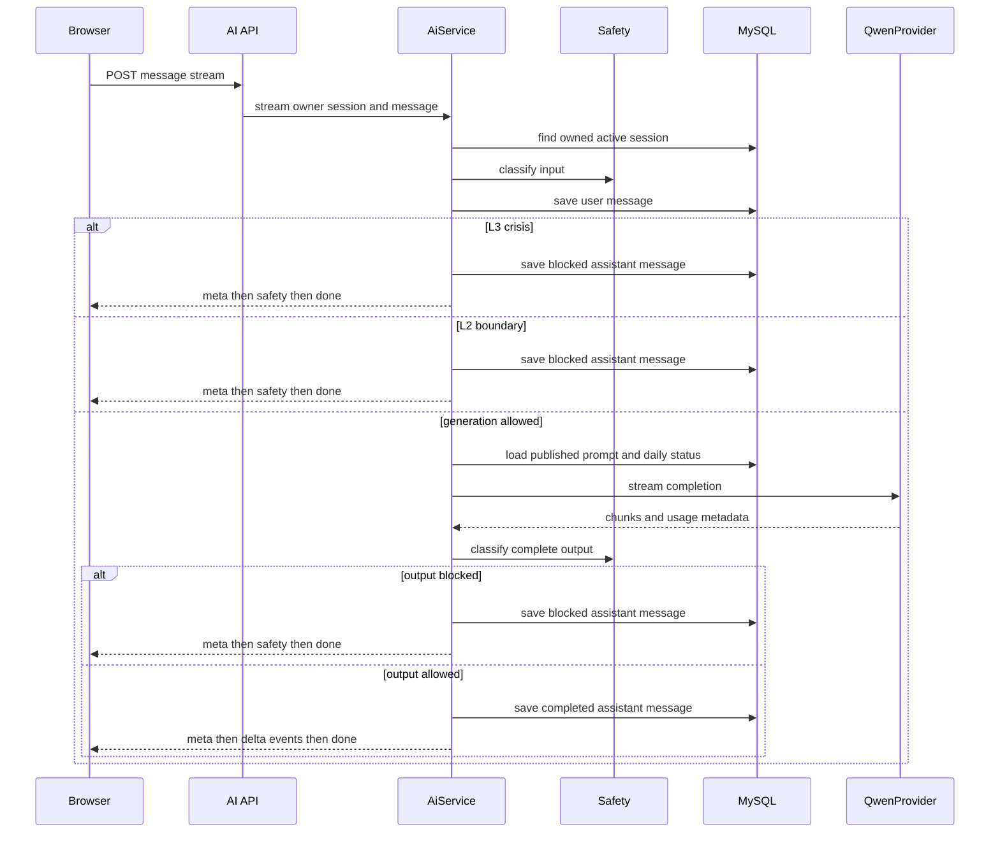
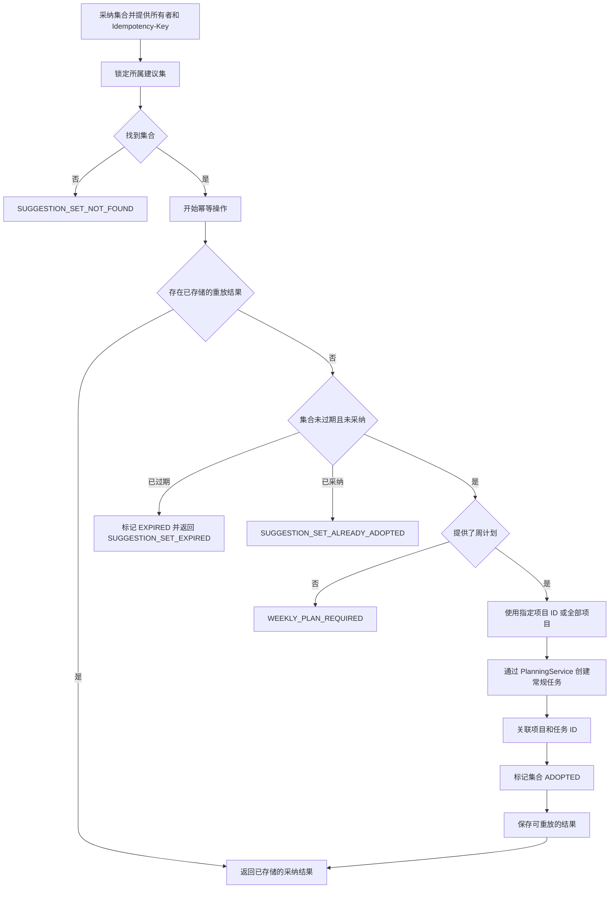

# AI 引导式规划

## 范围与入口

AI 功能是面向已认证用户的教练与规划辅助，而不是直接修改任务的入口。`AiController` 将接口集中在 `/api/v1/ai`；每个会话、消息、草案、建议集及采纳操作均从认证主体取得用户 ID，并据此限定所有权。

| 目的 | API | 结果与边界 |
| --- | --- | --- |
| 创建或继续对话 | `POST /sessions`、`GET /sessions`、`GET /sessions/{sessionId}/messages` | 创建场景为 `ACTIVE` 的会话；历史和消息仅对所属用户可见。 |
| 发送教练消息 | `POST /sessions/{sessionId}/messages:stream` | 返回 `text/event-stream`；用户消息和最终助手消息会持久化，安全或失败分支会以终止事件结束。 |
| 生成目标草案 | `POST /goal-template` | 基于所属对话返回可编辑的结构化草案；它本身不会创建目标。 |
| 生成任务建议 | `POST /suggestions`，再 `GET /suggestions/{setId}` | 为所属的活跃目标保存一个短期建议集。 |
| 采纳建议 | `POST /suggestions/{setId}/adopt`，附带 `Idempotency-Key` | 将选定项目创建为常规规划任务，并返回其公开 ID。 |

支持的对话场景为 `STUDY`、`FITNESS`、`CAREER` 和 `EMOTIONAL_SUPPORT`。前端在首次发送时才创建会话，挂载时读取历史；切换会话、重置或卸载时会中止正在进行的浏览器请求。失败时界面提供手动规划入口。

## 对话生命周期与 SSE 契约

新会话的有效期为 90 天。会话列表只返回调用者的 `ACTIVE` 会话，最多 30 条，并按最近活动排序；消息读取同样按所有者过滤且排除软删除消息。消息保存角色、内容、风险级别和状态；调用提供方的消息还保存模型、提供方请求 ID、输入/输出 token 数与延迟。消息的过期时间取自 `user_preference.ai_retention_days`，未设置时为 30 天。

*该图展示消息从归属校验、安全判断到持久化和 SSE 响应的实际控制流。*

消息必须为 1–4,000 个字符。服务先对输入分类并保存用户消息；只有可生成的输入才读取相应场景最新的 `PUBLISHED` 系统提示词。没有已发布提示词时返回 `AI_PROMPT_UNAVAILABLE`。如存在每日状态，服务会把当日精力、可用分钟数及节奏建议附加到系统提示词后再调用提供方。

正常完成时，事件顺序是 `meta`、零个或多个 `delta`、`done`。消费者应拼接 `delta.text`，并以 `done.status` 作为持久化结果。这里不是把提供方 token 原样转发：`AiService` 先收集所有 chunk，安全检查合并后的文本，写入助手消息，随后才发出 delta。`meta` 带有会话和消息公开 ID、模型及风险级别。UI 收到首个 delta 后开始显示回复；收到 `safety` 时改为危机展示；收到 `error` 时优先显示服务端消息，否则显示通用不可用提示。

### 安全与提供方故障

`SafetyService` 只允许低于 `L2` 的输入进入生成。L2 使用固定的专业服务边界回复；L3 不调用模型，取得危机响应后持久化 `BLOCKED` 的助手消息，并发送 `meta`、`safety`、`done`，不会有 delta。模型输出也会重新分类；不允许的输出会在发送到浏览器之前被替换为阻断边界回复。集成测试同时验证 L3 的事件形状，以及安全事件中保存的是 `[REDACTED]` 而非触发文本。

`QwenProvider` 是提供方扩展边界：对话使用 `stream`，目标草案和建议使用 `generateStructured`。默认配置选择确定性的 `mock` 提供方；设置 `app.ai.provider=qwen` 后启用 `QwenHttpProvider`。该实现启动时要求真实 API key、有效的 HTTP(S) base URL 和模型，并以 Bearer 认证调用 OpenAI 兼容的 `/chat/completions`。

可通过 `QWEN_PROVIDER`、`QWEN_BASE_URL`、`QWEN_API_KEY`、`QWEN_MODEL`、`QWEN_TIMEOUT`、`QWEN_STREAM_TIMEOUT`、`QWEN_JSON_MODE`、`QWEN_THINKING_STYLE` 和 `QWEN_THINKING_ENABLED` 配置（也支持相应的 `QWEN3_*` 兼容来源）。仓库默认普通和流式超时分别为 `PT60S`、`PT70S`；控制器未配置时的 SSE 超时后备值为 `PT130S`。结构化请求可启用 JSON mode；适配器会移除代码围栏，对无效 JSON 做一次修复调用，仍失败则报告 `AI_INVALID_JSON`。

适配器拒绝内容为空的成功流，并将 401/403、429、其他 4xx 及其他提供方故障映射为安全的应用错误码，包括 `AI_PROVIDER_AUTH_FAILED`、`AI_PROVIDER_RATE_LIMITED`、`AI_PROVIDER_REQUEST_REJECTED` 和 `AI_PROVIDER_ERROR`，不会暴露提供方响应体。对话服务将运行时异常转为 SSE `error` 事件及面向用户的映射消息；`IOException` 则以错误完成 emitter。

## 从对话到目标

`POST /goal-template` 要求非空的、属于用户且未删除的会话，并且至少有一条状态为 `COMPLETED` 且未删除的消息。服务取最近 12 条完成消息，恢复时间顺序，并把拼接的对话截取为末尾 12,000 字符；安全检查通过后，才向提供方请求一份满足 schema 的目标草案。

服务拒绝必填文本为空、未知维度和无效的起步任务数组。它会把支持的别名归一化为 `KNOWLEDGE`、`HEALTH`、`CAREER`、`RELATIONSHIP` 或 `WELLBEING`；周期被钳制在 14–84 天，每个（共一至三个）起步任务被钳制为 5–60 分钟、难度 1–3。格式错误或不可用的结构化输出返回 `AI_INVALID_GOAL_TEMPLATE`。

草案始终是客户端的审核工件。AI 页面允许编辑所有字段，将草案写入 `sessionStorage` 的 `better-self:ai-goal-draft`，然后导航至 `/goals?source=ai`。目标模块只取用该值一次以预填表单；只有用户保存目标后，才会针对每个起步任务调用常规 `/tasks` API。因此，用户确认仍是写入规划域的边界，目标和任务的生命周期仍由常规规划模块拥有。

## 建议的生成、保存与采纳

建议生成是独立的、面向目标的流程：它要求非空且通过安全检查的提示词，以及属于用户的 `ACTIVE` 目标。提供方返回结构化任务后，服务在持久化前依据用户的规划配置验证：项目数 1–5、时长 5–60 分钟、难度 1–3、权重非空且只使用用户活跃维度、权重总和 1–30，并且建议时间不在用户的静默时段内。解析或验证失败时返回 `AI_INVALID_SUGGESTIONS`，并引导用户手动创建任务。

有效建议集以 `CONFIRMED` 状态保存，保存目标、模型/请求元数据、有序项目和 30 分钟到期时间。读取和修改均用 `user_id` 限定；不可访问的建议集与不存在的集合一样返回 `SUGGESTION_SET_NOT_FOUND`。每一项通过 `adopted_task_id` 表示是否已被采纳，读取集合时会暴露该状态。

*该图展示采纳操作的锁定、幂等重放与向常规规划任务的转换。*

事务先锁定所属集合，再以 `ADOPT_SUGGESTIONS:{setId}` 操作名调用 `IdempotencyService`。有效 key 是必需的，最长 120 字符。服务为用户、操作和 key 的组合保存规范化请求 JSON 的 SHA-256 哈希，保留 24 小时。相同请求重试会返回已存储的 `AdoptionResult`；使用相同 key 而请求体不同会冲突；原请求仍未完成时会报告进行中。这个重放判断在到期和状态判断之前，所以成功采纳后的重试会返回原任务 ID，而不会重复创建任务或得到“已采纳”冲突。

对于新采纳，请求已过期时集合被标记为 `EXPIRED` 并返回 410；已采纳集合返回冲突。周计划 ID 必填；`itemPublicIds` 缺失时选择全部项目，否则只转换选中的项目。`SuggestionService` 使用建议的标题、描述、时长、难度、权重、建议本地时间和请求的活动日期调用 `PlanningService.createTask`，将项目关联到得到的 `user_task` ID，然后标记集合为 `ADOPTED`。规划服务仍然拥有任务有效性、所有权、排程和后续执行的规则。

## 聚焦验证

- `backend/src/test/java/com/betterself/growth/ai/AiFlowIT.java` 使用 MySQL 和 `app.ai.provider=mock` 验证认证、所有权、SSE 顺序、危机事件形状及脱敏、目标草案、建议生成和重复采纳路径。
- `backend/src/test/java/com/betterself/growth/ai/GoalTemplateNormalizeTest.java` 覆盖维度别名归一化及对模型 schema 漂移的防御性钳制。
- `backend/src/test/java/com/betterself/growth/ai/QwenContractTest.java` 验证提供方认证错误不会泄露响应体，并拒绝内容为空的成功流。
- `frontend/src/modules/ai/AiView.test.ts` 覆盖危机展示、流错误展示、历史续聊、思考状态和可编辑目标草案；`frontend/src/modules/ai/goal-draft.test.ts` 验证一次性存储交接。
- `e2e/ai-assistant.spec.ts` 注册用户、在 `/ai` 发送已认证的 AI 消息，并等待非空助手响应而不是不可用后备内容。

改动该边界时应先运行对应的窄测试，再运行 `./scripts/verify-global-flow.sh`。全局脚本要求 `.env.local`，启动 Compose 栈，并执行后端验证、前端 lint/test/build、Playwright、API smoke 检查、包含 AI 安全事件的持久化断言、Redis 健康检查和日志密钥扫描。完整前提和测试矩阵见[测试与全局验证策略](/openwiki/testing/verification-strategy.md)。
