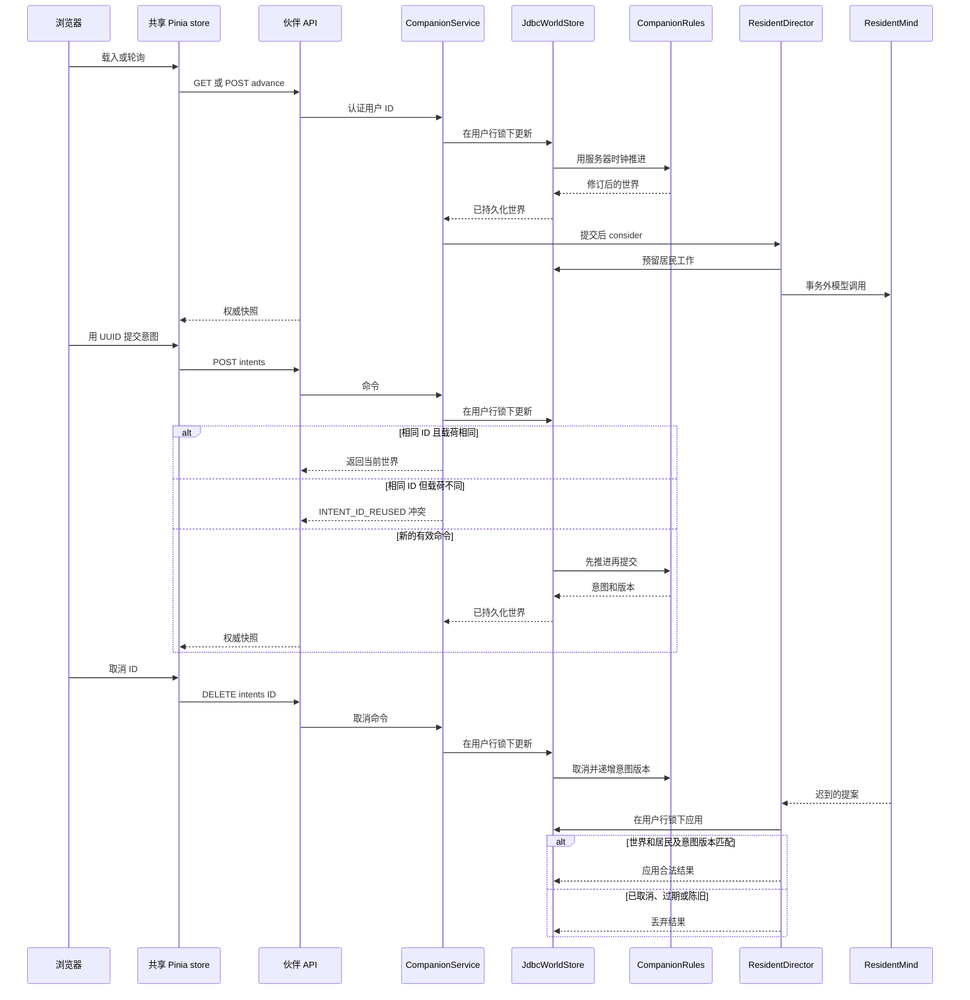

# 伙伴意图与专注

伙伴小镇是**按用户隔离、由服务器裁决**的模拟世界。浏览器只渲染返回的 `CompanionWorld` 并请求推进；它不决定模拟结果，也不会完成产品中的真实任务。本页说明从尚未加入到加入、轮询推进、提交/取消意图、专注，以及迟到的居民模型结果的完整链路。世界模型和居民/记忆设计见[伙伴小镇](/openwiki/concepts/companion-town.md)，持久化权威和 API 信封约定见[持久化与 API 合约](/openwiki/architecture/persistence-and-api-contracts.md)。

## 入口与所有权边界

`CompanionController` 位于 `/api/v1/town/companion`，通过 `@AuthenticationPrincipal CurrentUser` 取得调用者；客户端不能提供用户 ID 或世界 ID。除只读的 `/usage` 外，状态操作都返回 `Snapshot` 所在的常规 API 信封：

| 浏览器操作 | 端点 | 含义 |
| --- | --- | --- |
| 载入 | `GET /api/v1/town/companion` | 读取 `{ joined, world }`，不推进模拟时间。 |
| 入住 | `POST /join` | 仅在不存在时创建调用者的世界；重复加入返回已有世界。 |
| 推进 | `POST /advance` | 应用确定性的流逝时间规则，并让 director 考虑异步居民工作。 |
| 提交意图 | `POST /intents` | 校验并提交含客户端生成请求 ID 的化身指令。 |
| 取消意图 | `DELETE /intents/{id}` | 请求规则取消仍为活动或待处理状态的指令。 |
| 用量 | `GET /usage` | 按调用类型返回调用者本地日期的模型用量；不推进世界。 |

`CompanionService` 是应用边界：它校验加入数据和命令形状，要求 `WorldStore` 只读取/更新当前认证用户的存档，并在成功加入或推进后调用 `ResidentDirector.consider`。因此 `GET` 保持只读，而状态转移与用户归属不由前端承担。

## 加入、重载与持久化

加入时，空名称规范化为 `"我"`，提供的名称最多 24 个字符，时区必须是有效 IANA `ZoneId`。只有缺少世界时才生成 UUID 并创建初始世界；端到端测试断言初始返回有 25 名居民。再次以不同名称或时区调用 `POST /join` 必须返回原世界 ID，而非重建世界。

`JdbcWorldStore.update` 是状态转移的唯一门闩。它在事务内先以 `FOR UPDATE` 锁定所属的 `sys_user` 行，再读取世界；这会串行化同一账户的并发变更和并发首次加入。仅当提供 `initial` supplier 时才能创建行；在没有世界时推进、提交或取消会得到 `COMPANION_NOT_JOINED`。只有 `world.revision` 改变才写回 `town_companion_world.state_json`。

记忆是单独的耐久性边界：`JdbcWorldStore` 在领域操作前通过 `MemoryStore` 为居民和化身补齐记忆，并在编码不含记忆的 JSON 存档前写出它们。因此 MySQL 事务回滚不会回滚记忆文件；运维备份应同时覆盖 MySQL 和配置的伙伴记忆根目录。

## 共享浏览器世界与推进生命周期

`useTownWorld` 是常驻街道条与 `/town` 共用的唯一 Pinia 单例；`useCompanionWorld` 只是该同一 store 的、便于 `ref` 使用的兼容门面。消费者应调用 `start()` / `stop()`，而非各自创建轮询器。

首次 `load()` 后，只要已有世界，store 就调用 `/advance` 而不是 `/`。默认周期为 15 秒；文档隐藏时不轮询，重新可见时立即刷新，并在 `today` 或 `tasks` 数据变化时请求一次推进。引用计数使多个已挂载消费者仍只使用一个计时器，最后一次 `stop()` 才会清理它。若本地缓存世界存在但服务端返回 `COMPANION_NOT_JOINED`，store 会清除该世界；下一轮便退回 `GET`，能显示加入状态而不会持续推进已删除的存档。

服务端快照是权威，store 仍实现了本地顺序保护：

- 对同一世界只接受 `revision >=` 当前显示版本的快照，避免较旧的在途载入覆盖较新的变更结果。
- 账户切换会清空 store 并递增 epoch；旧账户请求完成后的结果会被忽略。
- 仅在同一世界的初始快照之后，按事件 ID 一次性发出新事件，避免重放历史事件。
- 变更与刷新分别受 `busy` 和 `refreshing` 保护，避免重复本地提交和重叠轮询读取。

`CompanionRules.advance` 是单调的：时间不晚于 `updatedAt` 时不做任何操作。较晚的服务器时钟 tick 会结束到期专注、按需完成/开始化身意图、调用居民模拟、更新环境字段并递增版本。较长离线间隔只追加有界的离线摘要，而不重建每个错过的瞬间。

## 意图、专注、取消与迟到响应

*该时序图展示了围绕异步居民思考的单一串行世界写入者，以及重复 ID、取消和迟到结果的保护。*

### 提交语义

服务端接受 `CompanionRules.KINDS` 中的 `focus`、`rest`、`walk`、`home`、`flowers`、`water`、`thought` 和 `sleep`，优先级为 `explicit` 或 `passing`。命令 ID 必须匹配 `[A-Za-z0-9_-]{8,80}`；自由文本 `thought` 必须非空且不超过 200 字符；只有 `focus` 可携带 `taskId`；时长默认 25 分钟，范围为 1–180 分钟。待处理意图最多 20 个。

请求 ID 是伙伴意图创建的应用层幂等键。若 ID 已存在且 `kind`、优先级、任务 ID、时长和文本完全一致，`submit` 原样返回当前世界；若用同一 ID 表达不同语义，则以 `INTENT_ID_REUSED` 失败，绝不悄悄改写第一次意图。前端会在临时失败后保留未确认的 `pendingIntent` UUID，并以同一 ID 重试同一语义动作。

规则会加入新意图并递增 `intentRevision`。`explicit` 请求会取消当前活动的化身工作、必要时清除专注并立即启动；`passing` 请求会等待，除非化身空闲。取消只影响 `pending` 或 `active` 意图，将其标为 `cancelled`、递增 `intentRevision`，并返回规则计算出的世界，不依赖前端乐观状态。

### 专注是陪伴，不是任务执行

`focus` 必须携带任务 ID，且 `WorldStore.ownsTask` 必须确认它是认证用户拥有的活动任务；否则服务返回 `TASK_NOT_FOUND`。该关联仅是获准的 ID 和计时链接：伙伴命令不接收任务标题、备注或其他私有任务内容，居民记忆和模型上下文也不使用这些内容。

开始专注会创建含任务 ID、`startedAt` 和 `endsAt` 的 `world.focus`，并让化身在请求时长内专注。之后一次推进到达结束时，规则清除专注、把**伙伴意图**标为完成，并记录“真实任务是否完成由用户决定”的反馈/日记；没有伙伴端点或规则路径会写入任务排程或完成模型。UI 倒计时仅用于展示：它会钳制到零，且绝不显示超过存储会话长度的时间。

这是变更时必须保持的安全边界：不可由专注到期推断真实任务已完成，也不可新增会更新真实任务完成状态的集成。端到端测试创建真实任务、启动专注并重载页面，验证专注引用仍存在、真实任务状态不变，且私有 Todo 标题不出现在持久化记忆中。

## 异步居民结果为何不会取得陈旧权威

`ResidentDirector` 在 `store.update` 内预留具体居民工作，随后在该事务提交后执行可能缓慢的 `ResidentMind` 网络调用，再通过另一次 `store.update` 尝试应用提案。每用户的 `workersByUser` 限制在飞 worker 数；独立的 `thinking` 键（`worldId|residentId`）确保同一居民没有两个未完成问题。无论 executor 拒绝、调用失败或未取得预留，`finally` 都会释放两种占用。

预留工作记录世界 ID、居民版本、意图版本和开始时间。应用路径会拒绝世界不一致、居民已变化、因新建/取消化身意图而导致意图版本改变、或超过响应年龄上限的回复。决策应用还会重新校验合法动作、地点、房间和目标，并验证模型给出的证据仅来自该次调用所提供的、按所有者划分的记忆切片。因此取消和中间模拟变化都会失败关闭：迟到提案被丢弃，而不会恢复过时的意图或世界状态。

即使响应已经陈旧，模型调用也会消耗用量，因为 token 已经支出。网络失败会进入重试退避；异步失败也不能重新创建请求飞行期间已被删除的世界。模型供应商与配置背景见[AI 与对象存储](/openwiki/integrations/ai-and-object-storage.md)。

## 定向验证与安全变更清单

相关测试刻意验证行为而非实现细节：

- `e2e/companion.spec.ts` 覆盖未加入读取、持久且幂等的加入、专注所有权、重复意图 ID、取消、重载持久化、记忆隐私和真实任务状态不变。
- `frontend/src/modules/companion/companion.store.test.ts` 固定版本顺序、失败后的同 ID 重试、权威取消响应、账户 epoch 隔离、共享轮询、可见性、删除恢复和任务数据刷新。
- `CompanionIT` 覆盖并发加入、按所有者限定的专注、复用 ID 拒绝，以及真实 JDBC store 上的持久化。
- `CompanionRulesTest` 覆盖专注到期、显式中断、领域提交幂等性和化身位置。

修改此流程时，应保持以下合约：所有变更经由 `WorldStore.update`；服务器时间与版本保持权威；每个可重试意图保留请求 ID；取消必须递增供后续异步工作检查的版本；伙伴专注绝不能改变真实任务完成状态。

## 依据

- HTTP 入口、认证用户边界与只读用量：`repo://backend/src/main/java/com/betterself/growth/town/companion/interfaces/CompanionController.java#L9-L22`
- 服务校验、加入、推进、重复意图、任务所有权和用量：`repo://backend/src/main/java/com/betterself/growth/town/companion/application/CompanionService.java#L17-L76`
- 串行 JDBC 转移、首次加入锁、任务所有权和记忆边界：`repo://backend/src/main/java/com/betterself/growth/town/companion/adapters/JdbcWorldStore.java#L18-L84`
- 单调推进、专注完成边界、优先级和取消：`repo://backend/src/main/java/com/betterself/growth/town/companion/domain/CompanionRules.java#L32-L84`
- 共享前端 API、生命周期和顺序保护：`repo://frontend/src/modules/companion/companion.api.ts#L1-L10`；`repo://frontend/src/modules/companion/companion.store.ts#L9-L193`
- 居民预留、事务外模型工作及并发限制：`repo://backend/src/main/java/com/betterself/growth/town/companion/application/ResidentDirector.java#L50-L90`；`repo://backend/src/main/java/com/betterself/growth/town/companion/application/ResidentDirector.java#L174-L250`；`repo://backend/src/main/java/com/betterself/growth/town/companion/application/ResidentDirector.java#L768-L803`
- 迟到决策的版本检查与合法应用：`repo://backend/src/main/java/com/betterself/growth/town/companion/application/ResidentDirector.java#L986-L1023`
- 端到端工作流断言：`repo://e2e/companion.spec.ts#L4-L88`
- 前端 store 行为测试：`repo://frontend/src/modules/companion/companion.store.test.ts#L11-L217`
