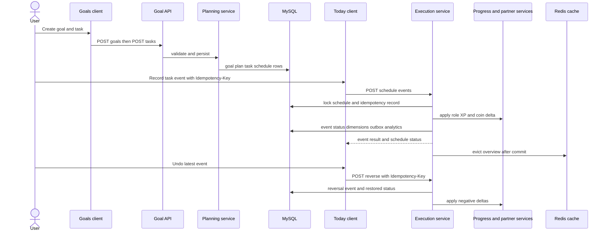
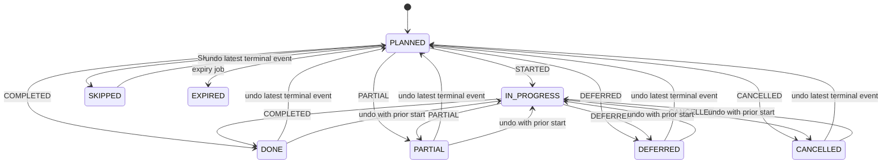

# 规划、生成、完成与撤销工作

系统将「定义工作」与「执行一次工作」分开：**目标**是关联维度且有日期范围的结果；**周计划**把目标中的工作放入一个周一开始的星期，并提供将任务本地时间转换为时间点所需的 IANA 时区；**任务**是可复用定义（标题、工时、难度、重复规则、有效日期、角色和维度权重）；**任务日程**则是可实际操作的一次出现。`task_event` 是持久化执行账本，并保存任务属性快照，因此之后修改任务不会改变历史工作的含义。

面向用户的路由位于 `/api/v1` 下：`GoalController` 管理目标，`WeeklyPlanController` 管理周计划和显式生成，`TaskController` 创建、编辑、暂停任务及独立快速任务，`TaskEventController` 列出日程并记录或撤销事件。所有控制器均从已认证的 `CurrentUser` 获取归属关系；公开 ID 不能替代该认证边界。

## 生命周期概览



该图展示事务性执行路径。规划和快速任务创建都会先写入日程行，Today 才能列出并操作它们。

## 规划工作

### 创建并约束目标

`POST /api/v1/goals` 默认创建 `ACTIVE` 目标。服务会解析可用维度、要求标题，并默认使用从今天起到 27 天后的日期范围。目标持续时间必须为 14–84 天。创建前会锁定用户的 `sys_user` 行，再统计活动目标数，因此即使并发请求也最多只能有三个活动目标。目标可在 `ACTIVE` 与 `PAUSED` 间切换，且可从两者变为 `COMPLETED` 或 `CANCELLED`；后两种终态不能恢复。

目标日期不仅是展示信息，也是上游规划边界：周计划必须与目标期间重叠，关联目标的任务有效范围必须位于目标范围内。日程列表会隐藏父任务已停用或目标不再活动时仍可操作的日程，但会保留已经不处于 `PLANNED` 或 `IN_PROGRESS` 的历史记录。

### 添加周计划或任务

`POST /api/v1/plans/weekly` 要求 `weekStartDate` 为周一，验证 IANA 时区，只接受活动或草稿状态的父目标，并通过唯一的 `(goal_id, week_start_date)` 约束拒绝重复计划。新计划为 `DRAFT`；允许的状态为 `DRAFT`、`CONFIRMED`、`COMPLETED` 与 `ARCHIVED`。更新为 `CONFIRMED` 时只首次写入 `confirmed_at`。

`POST /api/v1/tasks` 有两种父级模式：

- **关联目标的任务**提供 `goalPublicId`。服务会为有效期跨越的每个周一创建兼容周计划，将任务关联到第一个计划，并立即生成从 `activeFrom` 到 `activeUntil` 的所有出现。
- 提供 `weeklyPlanPublicId` 的任务只属于该计划，须由 `POST /api/v1/plans/weekly/{planId}/materialize` 生成。
- `POST /api/v1/tasks/quick` 创建不关联周计划或目标的独立清单任务，并立即创建可操作日程。它要求自己的幂等键，之后仍使用相同的日程/事件执行流程；该日程没有截止时间，未完成的清单项可在后续日期继续操作。

任务标题不能为空；预估时长为 5–240 分钟，难度为 1–3。维度权重必须非空、每项为 1–30，且只能引用用户启用且未归档的维度。未提供角色时从权重推断；若使用模板，模板必须已发布并与角色兼容。暂停或删除任务只会设定 `active = false`，不会删除其日程或事件历史。编辑任务会更新定义但不会重新生成既有日程；变更计划范围内的未来工作时应显式生成。

### 重复规则与生成

支持的 `rrule` 子集为 `FREQ=DAILY` 或 `FREQ=WEEKLY`，可选正整数 `INTERVAL`，`COUNT` 和 `UNTIL` 二选一；周规则必须带 `BYDAY`。系统以计划时区中的本地日期和本地时间展开出现，再同时保存 `planned_start_at`（时间点）和 `local_date`（日历日期）。无重复规则的任务只在 `activeFrom` 产生一次。

生成操作处理请求周计划周一至周日窗口内的活动任务，并将每项任务裁剪到其有效范围。它使用 `insert ignore` 写入由 `(task_id, planned_start_at)` 唯一键保护的出现记录，因此安全重试不会产生第二个日程；本次生成而未使用的公开 ID 无害。生成接口返回当前与该计划关联的全部日程，而非仅本请求新插入的行。

## 执行一次出现

Today 会加载 `GET /api/v1/task-schedules?localDate=YYYY-MM-DD`、活动目标及每日状态。客户端只对 `PLANNED` 和 `IN_PROGRESS` 日程提供操作；它会合并同一日程和事件意图的重复进行中点击，并为重试保留同一个生成的 `Idempotency-Key`。成功操作会更新本地状态，并将返回的事件作为撤销目标。



这是日程状态机。`DONE`、`PARTIAL`、`DEFERRED`、`SKIPPED`、`CANCELLED` 和 `EXPIRED` 对正常事件记录均为终态；撤销会创建账本事件，而非删除历史。

`POST /api/v1/task-schedules/{scheduleId}/events` 接受 `STARTED`、`COMPLETED`、`PARTIAL`、`DEFERRED`、`SKIPPED` 或 `CANCELLED`；调用方不能提交 `REVERSED` 或 `EXPIRED`。状态机以 `INVALID_TASK_TRANSITION` 拒绝非法转换。`PARTIAL` 必须提供严格介于 0 与 1 之间的完成比例；完成固定为 1，其他可接受事件均为 0。延期还要求未来的 `deferredStartAt`：原日程变为 `DEFERRED`，并创建由 `deferred_from_id` 关联、状态为 `PLANNED` 的子日程。子日程保留原任务，并以原日程时区计算新的本地日期。

### 幂等性、归属与锁

每个记录或撤销请求均要求非空、最长 120 字符的 `Idempotency-Key`。键的命名空间是用户加操作：记录使用 `TASK_EVENT:{scheduleId}`，撤销使用 `REVERSE_TASK_EVENT:{eventId}`。数据库创建有效期 24 小时的幂等记录，并保存规范 JSON（Map 键有序）的 SHA-256 哈希。相同且已完成的重复请求会重放已存结果；不同请求体为 `IDEMPOTENCY_KEY_REUSED`，首个请求尚未完成时为 `IDEMPOTENCY_REQUEST_IN_PROGRESS`。

在同一事务中，执行服务先以 `FOR UPDATE` 选择归属当前用户的日程，再开始或重放幂等处理。完成操作还会在计算当日经验上限前锁定用户行，从而串行化该用户的竞争完成操作。幂等唯一键与日程锁共同避免重复终态事件；并发集成测试发送十个相同完成请求，断言仅有一个事件且共享同一事件 ID。所有查询包含 `user_id`，因此已认证用户不能仅凭猜测公开 ID 记录或撤销他人的日程。

## 奖励、历史与运行效果

对于 `COMPLETED` 或 `PARTIAL`，经验为 `ceil(estimatedMinutes / 10) * difficulty`，先限制在 2–30，再乘完成比例并四舍五入，最后受该用户在日程本地日期剩余的 100 点经验限制。其他事件没有经验。执行事务会：

1. 记录不可变事件，其中含任务标题、分钟数、难度、角色及维度权重快照；
2. 推进日程状态和版本；
3. 将获得的总经验按任务维度权重分配，最后一个权重承接舍入余数，且维度经验不会低于零；
4. 应用实际受限的角色进度变化与钱包金币变化（金币约为每两点经验一个，同样受钱包限制）；
5. 写入 `TASK_SCHEDULE` outbox 事件，以及保留 13 个月的匿名化 `task_event_recorded` 产品事件；
6. 在提交后安排从 Redis 删除 `insights:overview:v2:{userId}`。

提交后删除 Redis 失败会被刻意忽略：它只是加速缓存，MySQL 才是权威来源。相反，任务事件、日程状态、经验、角色进度、钱包、outbox 和分析事件插入都在事务中完成，因此事务失败不会留下「已发奖励但无事件」的状态。

## 过期与撤销

`ScheduleExpiryJob` 以 `app.execution.expiry-delay-ms` 运行，默认 60 秒。每次运行会用 `FOR UPDATE SKIP LOCKED` 锁定已到期的 `PLANNED` 日程（`planned_end_at < now`），有条件地将仍为计划状态的行改为 `EXPIRED`、递增版本，并写入零经验的 `EXPIRED` 快照事件。`SKIP LOCKED` 使重叠的工作线程能够分配工作而不是等待同一行。过期不经过常规执行服务，因此不产生奖励、outbox/产品事件或缓存失效。

撤销接口为 `POST /api/v1/task-schedules/{scheduleId}/events/{eventId}/reverse`，使用独立的幂等键。只有该归属用户日程上**最近且未撤销的终态事件**可以撤销；`EXPIRED`、`STARTED` 和撤销事件本身都不是候选。成功时，服务加入指向目标事件的 `REVERSED` 事件，抵消其维度经验、其记录的**实际**角色变化，并以目标经验抵消金币。若目标前已有 `STARTED` 事件，日程回到 `IN_PROGRESS`，否则回到 `PLANNED`。撤销延期事件还会取消仍为 `PLANNED` 的延期子日程；已经完成的子日程不会被取消。第二次撤销或撤销较旧终态事件会失败并返回 `TASK_EVENT_NOT_REVERSIBLE`。

## 故障处理与安全变更

- 每条可变执行路由都应使用 `Idempotency-Key`。遇到网络结果不明时，用相同键重试同一请求；绝不可将其复用于改变过的请求体。
- 修改奖励或上限计算时，必须保留带归属条件的 `FOR UPDATE` 读取及用户锁；删除任一项都可能重新引入重复奖励或超出每日余量。
- 将事件快照和撤销链接视为追加式账务。不要通过删除原事件实现撤销，也不要使用今天已经编辑的任务值重新计算历史。
- 保持生成唯一性和时区转换。改变重复规则解析、有效范围裁剪或本地日期推导，可能产生重复日程、在目标外安排工作，或在错误的日期计入经验上限。
- 通过 `app.execution.expiry-delay-ms` 配置过期间隔；调度器共享四线程池，以避免缓慢的定时工作饿死过期处理或 outbox 发布。

## 聚焦验证

值得运行的后端测试是执行集成测试和小型状态机单元测试：

```bash
cd backend && ./mvnw test -Dtest=TaskExecutionIT,TaskExecutionConcurrencyIT,TaskStateMachineTest,ExperienceCalculatorTest
```

`TaskExecutionIT` 覆盖重放和键复用冲突、延期子日程创建、跳过、过期、撤销（包括角色等级边界）、归属关系及独立快速任务。`TaskExecutionConcurrencyIT` 是十个并发重复完成请求的回归测试。`TaskStateMachineTest` 记录允许的转换及第二个终态事件被拒绝的情形。前端的 `today.logic.test.ts`、`TodayView.test.ts` 覆盖重复点击合并、键复用、完成比例提交、庆祝/撤销调用，以及不存在「完成四个任务」的限制。

相关设计背景见：[成长规划与执行](/openwiki/concepts/growth-planning-and-execution.md)、[AI 引导规划](/openwiki/workflows/ai-guided-planning.md) 和[验证策略](/openwiki/testing/verification-strategy.md)。
