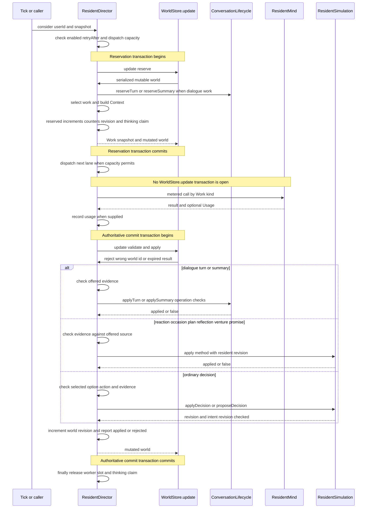

# 一次 Resident Attempt 的完整 Loop

`ResidentDirector` 不是长时间持锁等待模型的调度器。一次 attempt 是一个 `Work`：它在 `WorldStore.update` 内从当前 `CompanionWorld` 保留一个工作与其身份快照，离开事务调用 `ResidentMind`，再进入另一段短 `update` 做验证和写入。模型回复始终只是提案；世界状态由 `ConversationLifecycle`、`ResidentSimulation` 等领域方法在回写时裁决。

这页聚焦单次 attempt 的生命周期；触发来源及候选优先级见[居民触发与调度目录](resident-trigger-and-scheduling-catalog.md)，普通动作落地见[动作合法性与世界提交](action-legality-and-world-commit.md)，并发/持久化边界见[状态所有权与并发](../architecture/companion-state-ownership-and-concurrency.md)。

## 时序：两段短 `WorldStore.update` 与事务外 I/O

图中两次 `WorldStore.update` 都应很短：第一次只保留工作和快照，第二次只核验并提交；网络/供应商调用位于两者之间。生产 `JdbcWorldStore.update` 会在事务内以 `select ... for update` 锁定用户行，并且仅在 `w.revision` 改变时持久化 `state_json`。因此 reservation 和回写对同一用户串行，但多个居民的模型 I/O 可以重叠。 [ResidentDirector.java#L174-L203](repo://backend/src/main/java/com/betterself/growth/town/companion/application/ResidentDirector.java#L174-L203) [JdbcWorldStore.java#L45-L59](repo://backend/src/main/java/com/betterself/growth/town/companion/adapters/JdbcWorldStore.java#L45-L59)

## 入口、并行槽与 reservation

`consider(userId, snapshot)` 是 attempt 的入口。它先跳过 disabled mind、空/旧 simulation、仍在 `modelRetryAfter` 的世界；只有存在待处理模型对话/未完成总结、至少一名居民的决策冷却已到，或有 pending encounter/occasion 时才 dispatch。`workersByUser` 限制一个世界并行 worker 数，实际 executor 使用配置的 pool 与有界队列；队列拒绝时释放刚取得的 worker 槽，而不是抛给调用方。 [ResidentDirector.java#L74-L114](repo://backend/src/main/java/com/betterself/growth/town/companion/application/ResidentDirector.java#L74-L114) [ResidentDirector.java#L127-L138](repo://backend/src/main/java/com/betterself/growth/town/companion/application/ResidentDirector.java#L127-L138)

在 `run` 的第一段 `store.update` 中，`reserve` 按当前世界选一个 `Work`。工作种类包括对话 `turn`/`summary`、遭遇 `react`、时机问题 `consider`、`dayplan`、`explain`、`reflect`、普通 `decision`，以及 `venture` 与两类 promise 思考。每种候选都跳过正在思考的居民；对话 turn 还要求双方均不在 `thinking`，避免一方的其他模型调用与同一对话交错。保留成功后，该 worker 会链式 dispatch 下一个 worker，从而逐步填满而非由一次 tick 突发创建全部槽位。 [ResidentDirector.java#L417-L555](repo://backend/src/main/java/com/betterself/growth/town/companion/application/ResidentDirector.java#L417-L555) [ResidentDirector.java#L174-L184](repo://backend/src/main/java/com/betterself/growth/town/companion/application/ResidentDirector.java#L174-L184)

所有成功 reservation 都经过 `reserved` 这个汇合点：增加 `modelCallsToday`、`modelSequence` 与世界 `revision`，并把 `worldId|residentId` 加入 `thinking`。只有普通 `decision` 会设置该居民的 `lastDecisionRequestedAt`；除对话 turn/summary 外的工作还会设置 `lastAskedAt`。`thinking` 才是“同一居民最多一个在途调用”的互斥机制，`workersByUser` 只是世界并行度上限；二者在 `finally` 中无论无工作、成功或异常都会释放。 [ResidentDirector.java#L768-L803](repo://backend/src/main/java/com/betterself/growth/town/companion/application/ResidentDirector.java#L768-L803) [ResidentDirector.java#L394-L407](repo://backend/src/main/java/com/betterself/growth/town/companion/application/ResidentDirector.java#L394-L407)

`ResidentDirectorParallelTest` 以阻塞的 fake mind 验证了不同居民可同时思考、重复 `consider` 不会让同一居民获得第二个在途调用，并验证 `parallelism` 是并发上限；满载时最后一个 lane 偏向有界 cognition，避免反思被普通决策永久挤掉。 [ResidentDirectorParallelTest.java#L48-L135](repo://backend/src/test/java/com/betterself/growth/town/companion/application/ResidentDirectorParallelTest.java#L48-L135) [ResidentDirectorParallelTest.java#L160-L187](repo://backend/src/test/java/com/betterself/growth/town/companion/application/ResidentDirectorParallelTest.java#L160-L187)

## `Work` 快照与“迟到即丢弃”的检查链

保留时形成的 `Work` 带有 `kind`、`worldId`、居民 `residentRevision`、世界 `intentRevision`、预约时间 `at`、当时的 `Context`，以及对话的 `Operation`。`sequence` 仅保留作诊断，**不是**提交门槛：并行 reservation 会使全局 `modelSequence` 在同一居民回复前继续增长，不能再用序号相等判断新旧。冲突策略是带身份的乐观校验失败即拒绝，而不是将数据库锁跨越模型 I/O。 [ResidentDirector.java#L139-L151](repo://backend/src/main/java/com/betterself/growth/town/companion/application/ResidentDirector.java#L139-L151) [ResidentDirector.java#L986-L1010](repo://backend/src/main/java/com/betterself/growth/town/companion/application/ResidentDirector.java#L986-L1010)

回写按以下顺序/层次处理结果：

| 检查或标识 | 适用范围 | 不通过时的结果 |
|---|---|---|
| `worldId` | 所有工作 | 当前世界 id 不同则直接不写入。 |
| 结果年龄 | 所有工作 | 从 reservation 的 `at` 起超过 90 秒即过期；对话释放相应 pending operation，其余工作保留仍有效的 cue 等后续新尝试。 |
| offered evidence | 所有带证据的模型输出 | `evidenceIds` 必须属于这次请求实际提供的记忆集合；反思使用 `ReflectRequest.source`，总结使用对话记忆，而不是泛用上下文。 |
| resident revision | 会改变该居民的领域应用 | `applyDecision`、`applyReaction`、`applyDayPlan`、`applyReflection`、`proposeDecision` 等会拒绝与 reservation 不同的居民版本。 |
| intent revision | 普通 decision/proposal 与 turn operation | avatar/世界 intent 已变时，不让旧决定或旧对白覆盖较新的意图状态。 |
| conversation operation | `turn`/`summary` | operation id、speaker、`turnVersion`、pending 状态、超时及人物仍同处等都须匹配。 |

90 秒年龄检查在任何 `apply*` 前执行；即使普通 `applyDecision` 被直接调用，也会再次检查。对话 operation 的有效期更短，为 45 秒：`applyTurn` 要求 active model conversation、相同 pending operation/speaker/next speaker/turnVersion、匹配 `intentRevision` 且双方仍在场；`applySummary` 也验证 summary operation、speaker、turn version 和时限。 [ResidentDirector.java#L202-L223](repo://backend/src/main/java/com/betterself/growth/town/companion/application/ResidentDirector.java#L202-L223) [ResidentDirector.java#L1009-L1023](repo://backend/src/main/java/com/betterself/growth/town/companion/application/ResidentDirector.java#L1009-L1023) [ConversationLifecycle.java#L175-L184](repo://backend/src/main/java/com/betterself/growth/town/companion/domain/ConversationLifecycle.java#L175-L184) [ConversationLifecycle.java#L207-L231](repo://backend/src/main/java/com/betterself/growth/town/companion/domain/ConversationLifecycle.java#L207-L231)

普通 decision 首先要求模型选择本次 `Context` 中同一个 `DecisionOptionView`（或兼容旧格式时由 action/place 唯一映射）、动作仍在 `availableActions`、证据来自 `Context.memories`，且 `propose` 有非空证据；随后才调用领域层。`ResidentSimulation.applyDecision`/`proposeDecision` 再检查 resident revision，后者也检查 world intent revision。其他 kind 走各自领域方法：例如 reaction 检查 pending encounter、reaction 枚举、resident revision、证据及两人仍同处；反思检查 resident revision、非空自有证据与长度。 [ResidentDirector.java#L986-L1007](repo://backend/src/main/java/com/betterself/growth/town/companion/application/ResidentDirector.java#L986-L1007) [ResidentSimulation.java#L900-L906](repo://backend/src/main/java/com/betterself/growth/town/companion/domain/ResidentSimulation.java#L900-L906) [ResidentSimulation.java#L2225-L2275](repo://backend/src/main/java/com/betterself/growth/town/companion/domain/ResidentSimulation.java#L2225-L2275) [ResidentSimulation.java#L3286-L3308](repo://backend/src/main/java/com/betterself/growth/town/companion/domain/ResidentSimulation.java#L3286-L3308)

## 对话是独立的 operation 生命周期

对话不使用“普通 decision 插入一句话”。`reserveTurn` 为当前 speaker 写入 `pendingOperationId`、pending speaker、启动时间、pending intent revision 和当前 `turnVersion`；`applyTurn` 验证后才追加 turn、两人的带证据记忆及允许的结构化工作效果，随后清除 pending、递增 `turnVersion` 并推进 next speaker。无效、过期或异常的 turn 走 `failTurn`，把对话转为 `fallback` 而不是保留一个永不释放的 pending。 [ConversationLifecycle.java#L101-L107](repo://backend/src/main/java/com/betterself/growth/town/companion/domain/ConversationLifecycle.java#L101-L107) [ConversationLifecycle.java#L110-L153](repo://backend/src/main/java/com/betterself/growth/town/companion/domain/ConversationLifecycle.java#L110-L153) [ConversationLifecycle.java#L175-L183](repo://backend/src/main/java/com/betterself/growth/town/companion/domain/ConversationLifecycle.java#L175-L183)

结束后的每位 participant 各有一次 summary operation。成功总结必须引用该 participant 的真实 turn memory；失败时 `failSummary` 用规则生成的、基于已存在 turn 的 fallback recollection 并清除 summary operation。测试覆盖两个 speaker 各自走 turn、每人各自走 recollection，也覆盖不合法结构化工作字段不能凭文本建立经营权。 [ConversationLifecycle.java#L207-L231](repo://backend/src/main/java/com/betterself/growth/town/companion/domain/ConversationLifecycle.java#L207-L231) [ResidentDirectorDialogueTest.java#L17-L52](repo://backend/src/test/java/com/betterself/growth/town/companion/application/ResidentDirectorDialogueTest.java#L17-L52) [ResidentDirectorDialogueTest.java#L96-L112](repo://backend/src/test/java/com/betterself/growth/town/companion/application/ResidentDirectorDialogueTest.java#L96-L112)

## 回写、使用量与失败语义

模型调用成功返回后，只要 `Usage` 非空就立即经 `ModelUsageRecorder` 记账，即使结果之后因过期、revision 或验证失败而不能采纳，因为 token 已消耗。成功回写会清零连续失败并清除 `modelRetryAfter`；每一次正常回写（包括 rejected）都会增加 `w.revision`，这样消费 pending occasion/encounter 等 bookkeeping 才会被 `JdbcWorldStore` 持久化。`OutcomeListener` 在最终判定点报告 `applied` 或 `rejected`，而非从 `modelStatus` 文本反推。 [ResidentDirector.java#L184-L205](repo://backend/src/main/java/com/betterself/growth/town/companion/application/ResidentDirector.java#L184-L205) [ResidentDirector.java#L302-L313](repo://backend/src/main/java/com/betterself/growth/town/companion/application/ResidentDirector.java#L302-L313) [ResidentDirectorTest.java#L327-L365](repo://backend/src/test/java/com/betterself/growth/town/companion/application/ResidentDirectorTest.java#L327-L365)

失败分类不要混为一谈：

- **业务拒绝/陈旧回复**：模型正常返回但未通过年龄、证据、operation、版本或领域合法性检查，结果为 `rejected`；不进入失败 backoff。对 `react` 与 `consider`，无论回复是否可用都会消费这一次短暂的 pending moment，避免同一问题每 tick 重问；但普通 stale decision 可由未来新快照重新询问。 [ResidentDirector.java#L207-L249](repo://backend/src/main/java/com/betterself/growth/town/companion/application/ResidentDirector.java#L207-L249)
- **真实异常**：调用抛出异常时，turn/summary 先释放为失败/fallback；若预约日仍等于当前 `modelBudgetDay`，退回一次 `modelCallsToday` 并增加 `modelFailuresToday`。无论是否跨日，连续失败数递增，backoff 为 75、150、300、600 秒（上限 600），写入 `modelRetryAfter`，并报告 `failed`。跨本地午夜的旧请求不会退款或消耗新一天的预算/失败数。 [ResidentDirector.java#L381-L393](repo://backend/src/main/java/com/betterself/growth/town/companion/application/ResidentDirector.java#L381-L393) [ResidentDirectorTest.java#L110-L132](repo://backend/src/test/java/com/betterself/growth/town/companion/application/ResidentDirectorTest.java#L110-L132)
- **预算/熔断前置拒绝**：reservation 以世界时区换算当天；日期变化时重置 calls、failures、consecutive failures。若已达 `dailyBudget` 或当天失败数 32，或仍在 `modelRetryAfter`，不创建 `Work`，因此没有模型调用、退款或 outcome。 [ResidentDirector.java#L417-L421](repo://backend/src/main/java/com/betterself/growth/town/companion/application/ResidentDirector.java#L417-L421)
- **不支持的 capability**：`UnsupportedOperationException` 不计作网络/解析失败，不增加 backoff，并退回当前日 reservation。`react` 中性消费 encounter，不代替居民编造招呼；`dayplan` 为当天写一个空的 unavailable plan；`consider`、`explain`、`reflect`、`venture` 与 promise 则在 director 进程内标为 unavailable，停止反复 reservation，结果报告 `unsupported`。 [ResidentDirector.java#L321-L379](repo://backend/src/main/java/com/betterself/growth/town/companion/application/ResidentDirector.java#L321-L379) [ResidentSimulation.java#L2291-L2303](repo://backend/src/main/java/com/betterself/growth/town/companion/domain/ResidentSimulation.java#L2291-L2303) [ResidentDirectorTest.java#L134-L161](repo://backend/src/test/java/com/betterself/growth/town/companion/application/ResidentDirectorTest.java#L134-L161)

## 修改此 loop 时的检查清单

1. 新增 `Work.kind` 时，必须同时补齐 `reserve` 的资格/`thinking` 检查、`ResidentMind` metered 调用、成功回写的证据来源和领域 apply、异常/unsupported 分支，以及 `finally` 可释放该居民 claim 的路径。
2. 不要将 `modelSequence` 恢复为并发提交的相等门槛；为新状态写入选择合适的 resident revision、intent revision 或 operation identity 校验。
3. 所有改变了世界但看似只有 bookkeeping 的成功/拒绝/异常分支都要保证 `w.revision` 移动，否则 `JdbcWorldStore` 不会保存变更。
4. 对话工作不能只验证 transcript 或文本：须保留并核对 operation id、speaker、turn version、intent revision、时限和现场状态；失败时应释放 pending operation。
5. 为新增失败路径明确它是 `rejected`、`failed` 还是 `unsupported`，并测试预算退款、backoff 与 pending cue 是否符合该分类。现有测试已固定：取消 intent 会丢弃在途普通决定，91 秒后 explanation 不会写入，真实异常报告 `failed`，以及不支持 reaction 不会生成规则代言的招呼。 [ResidentDirectorTest.java#L32-L56](repo://backend/src/test/java/com/betterself/growth/town/companion/application/ResidentDirectorTest.java#L32-L56) [ResidentDirectorTest.java#L82-L108](repo://backend/src/test/java/com/betterself/growth/town/companion/application/ResidentDirectorTest.java#L82-L108) [ResidentDirectorTest.java#L530-L537](repo://backend/src/test/java/com/betterself/growth/town/companion/application/ResidentDirectorTest.java#L530-L537)
