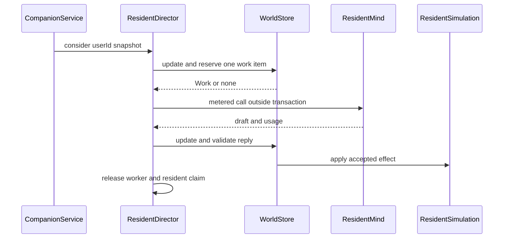
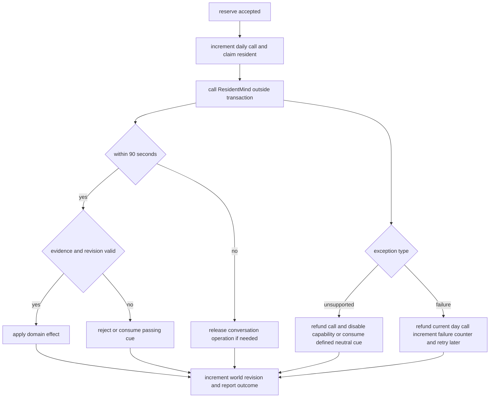

# Resident Trigger 与调度目录

`ResidentDirector` 是模型调用的短事务调度层，不是居民意图的规则引擎。每次 `CompanionService.join` 或 `advance` 得到世界快照后都会调用 `director.consider`；后者只判断是否值得派一个探针，实际的 `reserve` 在 `WorldStore.update` 内重新检查世界、选择一项工作并写入 reservation。模型 I/O 在事务外执行，回写再进入短事务并以版本、证据和时效校验为准。这样规则负责识别「何时值得问」，而模型仍负责居民要不要说、做或承诺什么。

上图展示 reservation、模型 I/O 与权威写入的边界：长耗时的 `ResidentMind` 调用不持有世界锁。

## 入口、总闸门与并发不变量

- `consider` 在 mind 未启用、快照为空或 `simulationVersion < 2` 时不做任何事；世界处于 `modelRetryAfter` 之前也不派发。活跃或尚未完成回忆的 model conversation、任一居民的 decision 冷却到期、待处理 encounter、待处理 occasion 中至少有一项存在，才会唤醒 dispatcher。
- `reserve` 使用世界时区滚动 `modelBudgetDay`，重置日调用/失败计数；若当日调用已到 `dailyBudget`、失败达到 32，或仍在全局 retry window，则不再保留工作。
- 一个世界可以有多位居民同时「想」：`workersByUser` 受 `parallelism` 限制；但 `thinking` 以 `worldId|residentId` 为键，任何分支都跳过正在调用的居民。reservation 在 `store.update` 中串行完成，worker 在 `finally` 同时释放世界 lane 与居民 claim。
- 调度按链式扩张：`consider` 先只交一个 worker；只有它成功保留工作才继续 `dispatch` 下一个。因此空闲世界只付出一次 reserve 探测，繁忙世界才逐步填满并发 lane。线程池的大小和队列与每世界 `parallelism` 是两层限制：前者限制进程执行资源，后者限制同一用户/世界的 outstanding 调用。

## 保留优先级目录

下表描述当前 `reserve` 的实际优先级，而非每种能力的抽象重要性。所有项都必须通过「非 `thinking`、resident revision 仍匹配、必要时 avatar 自由、未在活跃对话」等分支特定检查；`self` 只有 `avatarAutonomyEnabled` 且无 focus/pending/active intent 时才可由此循环驱动。

|顺序|`Work.kind` / 调用|何时产生或可保留|选择与公平性|成功、拒绝、过期|
|---|---|---|---|---|
|1|`turn` → `generateTurnMetered`|model mode 且 active 的 conversation；`ConversationLifecycle.reserveTurn` 要求双方仍同地、无 pending operation，连续 turn 至少相隔 6 秒。|按 `w.conversations` 的可保留项；双方任一正在思考即跳过，避免对话与其它调用重叠。|回复须在 90 秒内、证据属于该 speaker 的 context，并通过 pending operation、turn version、intent revision 与 45 秒 operation 校验。无效、过期或异常会 `failTurn`，将对话转为 `fallback`；fallback 只自然结束，不代居民编台词。|
|2|`summary` → `summarizeConversationMetered`|已结束的 model conversation 有 turns，且尚未为每位 participant 写 recollection。|逐 conversation、逐 participant；正在思考者跳过。|摘要必须引用该 participant 的 conversation turn memories；失败、过期或异常走 `failSummary` 的规则摘要，确保结束对话不会永远卡在未总结状态。|
|3|`react` → `reactMetered`|`ResidentSimulation` 每个 step 对公共场所同房且可问候的 pair 建立 `PendingEncounter`；来客进入住宅也可为在家的 host 建立同一机制。pair cooldown 为 40 分钟，远居 pair 减半；拒绝后以场景 fingerprint 抑制重问，离开同房范围即清除该抑制。|pending encounter 早于 occasion 和普通 decision，且不受 decision cooldown；旋转的确定性顺序避免 resident list 位置偏差。|允许 `greet`、`join`、`invite`、`none`。应用前仍须同房、无对话且 revision 相符；无论 reply 是否能应用，已回答的 encounter 都会消费。待项在离开、进入对话、revision 变化或 TTL 到期时删除。|
|4|`consider` → `considerMetered`|`Occasions.scan` 每 step 为 registry 中 `askedBy=occasion` 的时机建立 `PendingOccasion`：`lock_door`、`lock_home`、`close_cafe`、`change_work`。`invite` 注册为 `askedBy=react`，由 encounter 的 `react` 问题承载，不会额外排队。|在 encounter 之后、普通 decision 之前；同一 resident/key/scene 只问一次，`askedOccasions` 按 scene fingerprint 去重。|选择只能是登记 action 或免费 `none`；`none` 不需理由且不计失败。时机失效、TTL（锁门 5 分钟，其余 30 分钟）、revision 变化即过期。模型答过后即使无法落地也 discard，不会逐 tick 重问；不支持时仅禁用该 capability，不用规则替人锁门或换工作。|
|5|`dayplan` → `planDayMetered`|mind 宣称 `plansDays()`，居民醒着、不在惯常睡眠窗口、当天尚无 day plan。|在 occasion 后、普通 decision 前；按 `lastAskedAt` 最久者优先，平手用 `modelSequence` 旋转打破。|有效草案经 `applyDayPlan` 校验 3–6 个合法时间段、地点和 action；不能使用的非陈旧答案为当天写空的 unavailable plan，避免重复追问。能力不支持也退款并标记当天不可用。计划只是以后 decision context 的 cue；规则不会把人自动移动到计划段。|
|6|`promise_settled` → `promiseSettledMetered`|promise 到期后加 10 分钟 grace，由 simulation 依据 promiser 是否到约定地点结算为 `came` 或 `did_not_come`；参与者或 witness 在结算后 6 小时内、尚未被问过，可被问如何看待。|属于 bounded cognition；在该 lane 内优先于 reflect，按 `lastAskedAt` 与旋转平手规则。|调用后即写 `thoughtAskedIds`，即使没有文字也不反复追问；有有效文字才经 `applyReflection` 写入。promise offer 与 settlement 都不适用于 `self`。|
|7|`reflect` → `reflectMetered`|居民距上次 reflection 至少 3 小时，且自那以后 raw memory importance 总和至少 24，或跨过本地日期且有 routine cue。|bounded cognition 内排在已结算 promise 后；饱和并发时最后一个 lane 专留 cognition。`parallelism=1` 时每第六次 reservation 获得一次 cognition 机会。非 cognition lane 中普通 decision 先于 reflect。|模型只可引用 `reflectionSource` 所给的本人、未被 supersede 的最多 20 条 memory；有效结果写 `reflection` 或带 `supersedesKey` 的 `belief`。不支持时 capability 被禁用，不消耗故障 backoff。|
|8|`explain` → `explainMetered`|某居民积累至少 3 条 `unexplainedDeeds` 且不在对话中。|在普通 decision 前，但在对话、encounter、occasion 和 day plan 后；按 `lastAskedAt` 最久者选。|有效 account 清除所列 deed、写 reflection memory，并更新 `thought`；它解释行为而非由规则替居民归因。不支持会永久跳过 `explain`，使后续 decision 不被同一未消费 trigger 饿死。|
|9|`decision` → `decideMetered`|无 plan，或当前非 travel/sleep plan 出现新的 decision fingerprint（显著感知、routine、cafe schedule、暂停/可携带动作、可照看的等待服务）、日时段变化或确定性 `driftDue`。|候选排除 active conversation、`thinking`、`decisionRetryAfter` 和其 own throttle；按 `lastDecisionRequestedAt` 最久者优先，再以 `modelSequence` 旋转平手。该 cooldown 只作用于 decision，不压制 encounter/occasion。|reservation 记录诊断 trigger（`plan_ended`、`interrupted`、`body`、`time_anchor`、`environment`、`drift`）；结果必须选择 context 提供的合法 option 并引用 context memory，之后由 `applyDecision` 作最终世界合法性校验。成功才记住 fingerprint；每次回复都记录 decision outcome。|
|10|`venture` → `ventureMetered`|非 self、未在对话/睡眠/出行、8 小时未被问、自己未完成项目少于两个，且自己已知的可参与共同项目为空。|普通工作和 cognition 都没有可保留项后才问；按 `lastVentureAt` 最久者。|无论是否提出愿望都标记已问，避免逼迫居民反复许愿；只有非空 title、有效 evidence 和 optimistic revision/intent 校验通过时才创建新共享 project。|
|11|`promise_offer` → `promiseOfferMetered`|非 self、清醒且与别人同房、24 小时未问、尚无自己作出的未结算 promise，且全镇仍有未完成的多人项目。|与 venture 同在队尾，venture 先检查；按 `lastPromiseAskedAt` 最久者，且只在当前地点确有可说话对象时保留。|无论是否作出承诺均标记已问。落地时还要求对象在 request 的 `peopleHere` 内、事项与 future `inHours` 合法；`promise` 再验证双方同房、地点存在、到期不超过 24 小时及 witness。|

`explain` 位于 decision 前，但 `reflect` 并非全局高于 decision：只有预留的 cognition lane 才能在 saturated town 中提前拿到 reflect/promise 工作。这是避免 background cognition 被持续普通 decision 饿死，同时不让它延迟现场事件的折中。

## occasion 的来源与语义边界

`Occasions.ALL` 是「动作永远在普通菜单，或只在其时机单独问」的注册表。`scan` 是唯一 raise 点；它记录旁观者可见的 `fact`，将内部 `situation` 仅用于去重，二者不可混淆。当前时机为：咖啡馆只剩本人且将离开时的 `lock_door`，自家无人且将离开时的 `lock_home`，经营者在店内且已过常规打烊时间的 `close_cafe`，以及手头段落结束、无个人 project 的 `change_work`。

这类规则并不选择社交或生活意图。例如，`CafeService.scheduleCue`、等待服务和营业状态可以进入 ordinary decision 的可感知 context；营业时间的既有承诺可让店在经营者已在门口、未暂停且当日未提前关店时自动从 closed 转为 open。它们都不是规则替经营者决定「要不要继续开」「要不要招呼谁」的理由或行动。类似地，`react` 能问「眼前这个人怎么办」，但不编造 greeting；无回答的 encounter 是错过的时刻。

## 回写、过期、预算与故障

所有 `Work` 保存 world id、resident revision、intent revision、reservation 时间和本地预算日。回写先确认仍是同一 world；模型结果超过 90 秒直接拒绝。各具体 apply 方法再执行更细的 optimistic concurrency（居民 revision，必要时 world intent revision，conversation operation/turn version 或 occasion validity）。因此并发冲突的语义是「过期后丢弃结果」，不是长时间锁住世界；模型 token 即使结果过期仍会记录 usage。

该图展示的是结果分类；conversation、encounter、occasion 的具体清理规则仍由各自 domain lifecycle 所有。

- **证据边界**：turn、decision、react、occasion、dayplan、explain 和 venture 的 evidence 必须属于各自 request 所提供的 memory 集；reflect 特别以开放浏览的 `reflectionSource` 为准。无 evidence 或越界引用不会写世界。
- **真实失败**：异常会释放 conversation reservation，且只在 reservation 所属预算日将 `modelCallsToday` 回退、`modelFailuresToday` 加一。连续失败以 75、150、300、600 秒的上限退避设置 `modelRetryAfter`；该 shared backoff 暂停所有调用。
- **不支持能力**：`UnsupportedOperationException` 不算 outage、不增加失败、不设置 retry。`react` 消费 encounter 而不伪造问候；`dayplan` 标记当天不可用；`consider`、`explain`、`reflect`、`venture` 与 promise capability 在该 director 实例中置 unavailable，避免同一高优先级 trigger 每 tick 赢得竞争。相应 reservation 会退款。
- **可观测性**：每个已 dispatch call 在 apply/reject/failed/unsupported 时触发一次 `OutcomeListener`；有 usage 时通过 `ModelUsageRecorder` 按日和 call type 记 token。`decisionTriggers` 是最多 300 条的诊断历史，仅供导出检查，不反向驱动模型。

## 运行配置与安全变更点

Spring 配置项为 `app.town.companion-model-daily-budget`（默认 100000）、`app.town.companion-mind-pool-size`（8）、`app.town.companion-mind-queue-size`（64）、`app.town.companion-model-decision-throttle-seconds`（12）与 `app.town.companion-mind-parallelism`（6）；构造器将 budget/pool/queue/parallelism 至少钳为 1，throttle 至少钳为 0。executor 使用有界 `ArrayBlockingQueue` 和 `AbortPolicy`，提交被拒绝时立即归还 worker slot；关闭时 `@PreDestroy` 调用 `shutdownNow`。

新增 trigger 或 call type 时，应同时完成以下闭环：

1. 在 domain 中以可验证的世界事实产生并过期/消费 trigger；不要把 personality、责任压力或统计模式直接翻译成居民的社交意图。
2. 在 `reserve` 明确写出相对优先级、`thinking` 排除、self autonomy 与公平排序；并决定是否是 passing cue、是否应占 cognition lane。
3. 扩展 `Work`、`ResidentMind` metered 调用、apply 的 evidence/revision 校验、异常时的退款/unsupported 语义和 outcome 记录。
4. 为无效、陈旧、失败和不支持结果指定谁消费队列；不能让未实现 capability 永久霸占高优先级，也不能用规则伪造居民回答。

## 聚焦测试

`ResidentDirectorParallelTest` 固定验证并行模型调用的关键边界：同一世界可同时有多个居民调用、同一居民不会双发、`parallelism` cap 生效、最久未问的公平选择使 25 名居民先各获得一次 decision，以及饱和时有一个 lane 留给 reflect。

`ResidentExplainReflectDispatchTest` 验证 `explain` 的 priority 与实际落地、`reflect` 的 source/evidence 和 belief 写入、普通 decision 不被常规 reflect 抢占、venture 的真实 dispatch/创建，以及未实现 explain/venture 不消耗失败预算且不会饿死后续决策。对于 conversation/occasion/encounter 的生命周期变更，应补充针对 reservation、TTL、revision 过期和 neutral fallback 的 domain 测试，而不仅测试 prompt 或接口存在。
